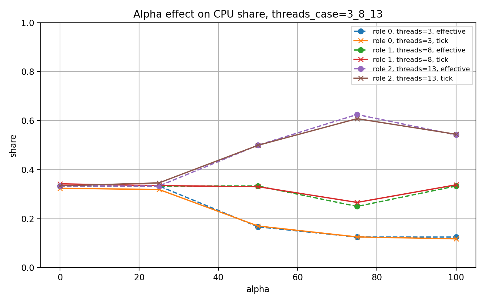
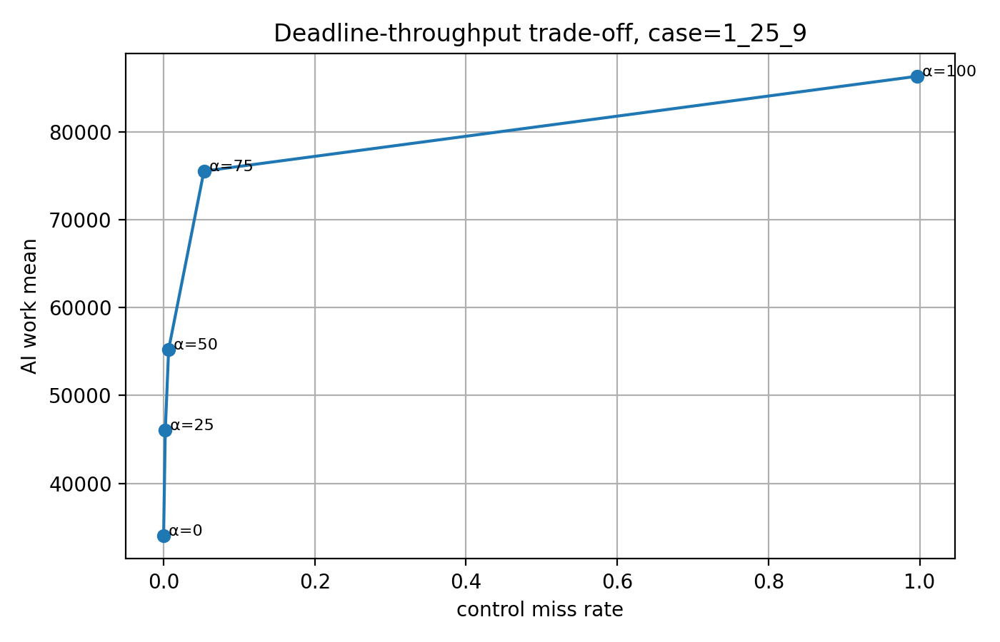
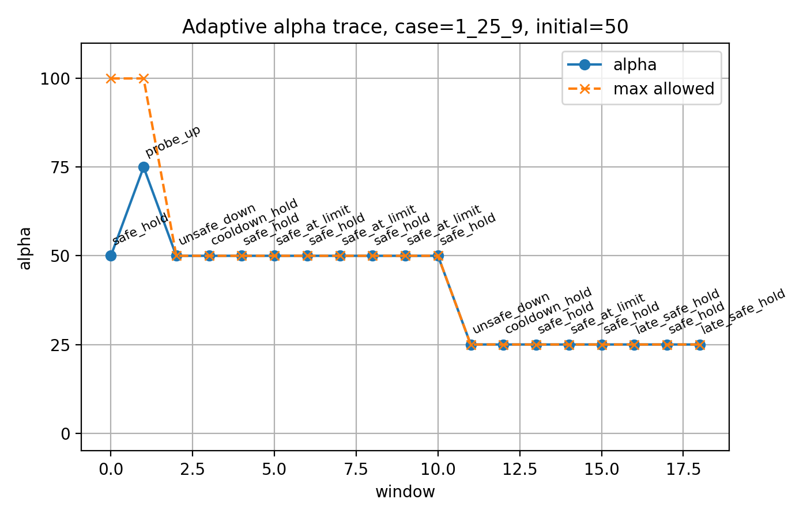
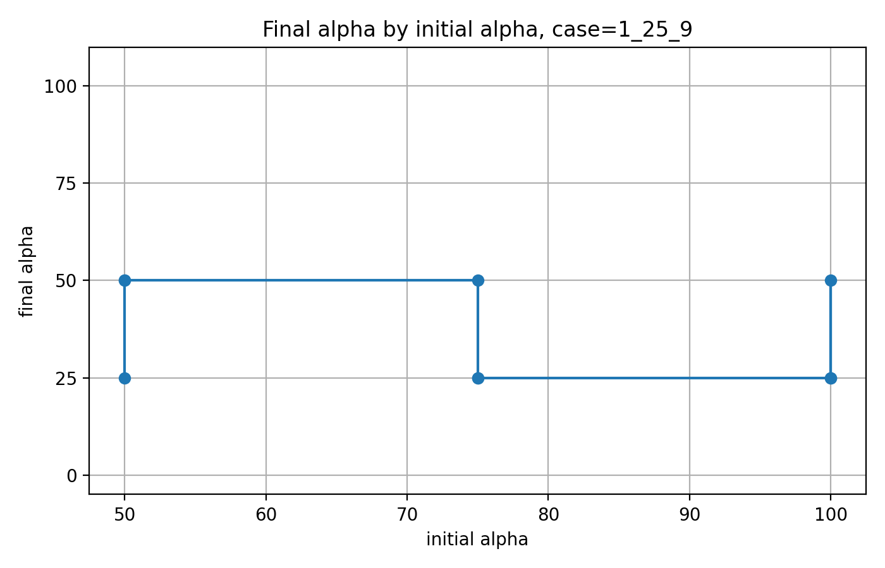
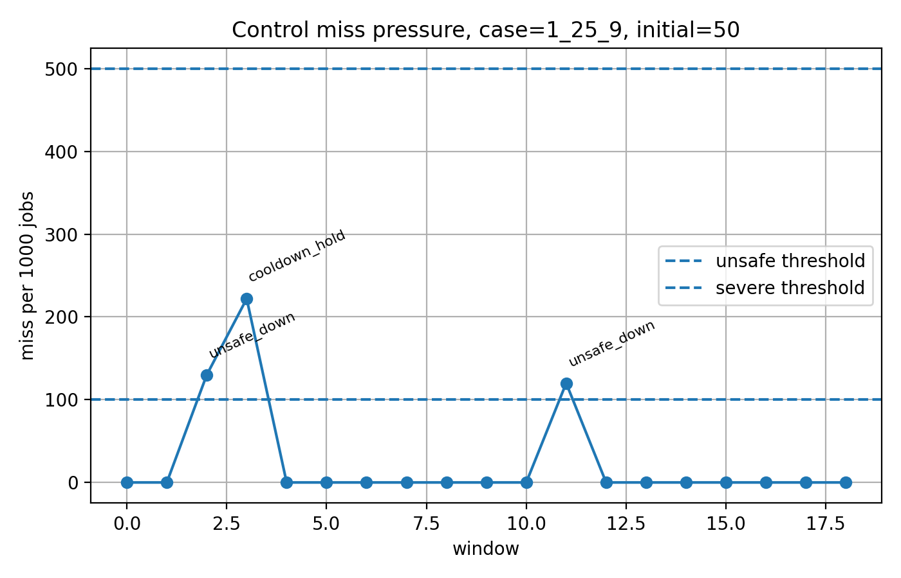

# RmikuOS

RmikuOS 是一个从零实现的教学型操作系统内核，主要用于学习操作系统、体系结构、虚拟化设备、文件系统和调度器设计。

目前 RmikuOS 支持：

* `riscv64`
* `loongarch64`

系统可以在 QEMU 上启动用户态 shell，并从真实的 virtio 块设备中加载 ext4 rootfs。当前系统已经支持用户程序加载、系统调用、进程与线程、VFS、只读 ext4 文件系统、virtio 块设备驱动、基础 shell，以及一组用于调度器实验的用户态 workload。

RmikuOS 不是一个只会打印 `Hello, world` 的玩具内核。它的目标是逐步构建一个小而完整、能运行真实用户程序、能做系统实验的教学型 OS。

```text
 ____            _ _          ___  ____
|  _ \ _ __ ___ (_) | ___   / _ \/ ___|
| |_) | '_ ` _ \| | |/ / | | | | \___ \
|  _ <| | | | | | |   <| |_| |_| |___) |
|_| \_\_| |_| |_|_|_|\_\\___/___/|____/

        RmikuOS
```

---

## Screenshots

> TODO: 将系统启动、shell、调度器实验图放到 `docs/images/` 下。

### Boot and Shell


### ext4 Rootfs


### Alpha-Scaled Scheduler



### Edge Deadline Experiment



### Adaptive Alpha Controller





---

## Features

### Multi-Architecture Support

RmikuOS 目前支持两个 64 位架构：

```text
riscv64
loongarch64
```

两个架构共用大部分内核逻辑，包括：

* 任务管理
* 进程与线程
* 虚拟内存
* 系统调用
* VFS
* ext4 rootfs
* block cache
* shell 和用户程序
* 调度器实验框架

架构相关部分主要集中在：

* trap handling
* 上下文切换
* 页表切换
* 时钟中断
* QEMU 设备发现
* virtio transport

不同架构使用不同的 virtio transport：

```text
riscv64      -> virtio-mmio
loongarch64 -> virtio-pci
```

---

### User Programs and Shell

RmikuOS 支持从 ext4 rootfs 中加载用户程序。

当前 shell 支持：

* `ls`
* `cat`
* `cd`
* `pwd`
* `stat`
* 外部命令执行
* 相对路径
* 绝对路径
* `argc / argv`
* 当前工作目录 `cwd`

示例：

```text
/ $ ls
bin
etc
home
share
tmp

/ $ cat /etc/motd
Welcome to RmikuOS real ext4 rootfs!

/ $ cd /bin
/bin $ hello
```

第一个用户进程不再依赖内核内置 app table，而是通过 VFS 从 ext4 rootfs 中加载：

```text
/bin/shell
```

---

### Process and Thread

RmikuOS 当前支持基础进程管理：

* `fork`
* `exec`
* `waitpid`
* `exit`
* 进程地址空间复制
* 用户程序 ELF 加载
* 用户态参数传递
* 进程级 fd table

同时支持用户态线程：

* `thread_create`
* `thread_exit`
* `thread_join`
* 同进程线程共享地址空间
* 同进程线程共享 fd table
* 每个线程拥有独立 trap context 和 kernel stack

线程机制使得 RmikuOS 可以构造多线程 workload，并进一步研究进程级公平、线程级并行度和 deadline workload 之间的调度关系。

---

### VFS and File Descriptors

系统实现了基础 VFS 和 fd table。

当前支持：

* `open`
* `close`
* `read`
* `write`
* `getdents`
* `stat`
* `fstat`
* `chdir`
* `getcwd`
* `exec`

标准输入输出也通过 fd 统一处理：

```text
fd 0 -> stdin
fd 1 -> stdout
```

---

### ext4 Rootfs

RmikuOS 使用 ext4 镜像作为 rootfs。

rootfs 由宿主机上的目录模板生成：

```text
user/rootfs/
```

用户可以像组织普通 Linux rootfs 一样组织目录：

```text
user/rootfs/
├── etc/
│   └── motd
├── home/
│   └── miku/
│       └── readme.txt
├── share/
│   ├── docs/
│   └── ascii/
├── tmp/
├── dev/
└── proc/
```

构建脚本会把用户程序编译产物复制到：

```text
/bin
```

因此最终 rootfs 大致形如：

```text
/
├── bin/
│   ├── shell
│   ├── hello
│   ├── ls
│   ├── cat
│   ├── alpha_arg_test
│   ├── edge_deadline_arg_test
│   └── adaptive_alpha_test
├── etc/
│   └── motd
├── home/
├── share/
├── tmp/
├── dev/
└── proc/
```

---

### Virtio Block Device

RmikuOS 当前已经不再只依赖内核内置 ramdisk，而是可以从 QEMU 挂载的真实磁盘镜像读取 ext4 rootfs。

整体路径如下：

```text
User Program
    ↓
Syscall
    ↓
VFS
    ↓
read-only ext4
    ↓
BlockCache
    ↓
BlockDevice
    ├── RamDisk
    ├── VirtioMmioBlockDevice
    └── VirtioPciBlockDevice
```

#### RISC-V virtio-mmio

在 RISC-V QEMU `virt` 机器上，系统通过 virtio-mmio 扫描 virtio block device。

流程：

```text
扫描 virtio-mmio slot
识别 virtio-blk
初始化 legacy virtio-mmio device
配置 virtqueue
提交 block read request
读取 ext4 rootfs
```

#### LoongArch64 virtio-pci

在 LoongArch64 QEMU `virt` 机器上，系统通过 PCI/PCIe 枚举 virtio block device。

流程：

```text
映射 PCI ECAM
枚举 PCI bus/device/function
找到 vendor=0x1af4 的 virtio-blk-pci
分配 BAR
解析 virtio PCI capabilities
初始化 modern virtio-pci device
配置 virtqueue
提交 block read request
读取 ext4 rootfs
```

---

## Scheduler

RmikuOS 当前实现了基于 stride scheduling 的调度器，并在此基础上加入了用于多线程 workload 的 alpha-scaled scheduling 机制。

### Stride Scheduling

基础 stride 调度器使用 ticket 表达进程权重：

```text
stride = BIG_STRIDE / tickets
```

每次调度选择 `pass` 最小的任务运行，运行后增加对应 stride。

这使得调度器可以在长期运行中近似按照 tickets 比例分配 CPU 时间。

---

### Alpha-Scaled Stride Scheduling

普通进程级 stride 调度只关注进程本身的 tickets。对于多线程进程，这会带来一个问题：

```text
一个单线程 control 进程
一个多线程 AI 进程
一个多线程 logger 进程
```

如果只按照进程 tickets 分配 CPU，多线程进程的并行度无法体现在进程级调度权重中。

RmikuOS 引入 alpha-scaled scheduling：

```text
effective_tickets = base_tickets * scale(ready_threads, alpha)
```

其中：

```text
alpha = 0   -> 更接近进程级公平
alpha = 100 -> 更接近线程数加权
```

直观理解：

```text
alpha 越小：
    多线程进程不会因为线程多而获得太多额外 CPU。
    更适合 deadline/control workload。

alpha 越大：
    多线程进程会获得更高 effective_tickets。
    更适合 AI、batch、logger 等 throughput workload。
```

alpha 不是一个固定最优参数，而是一个可解释的调度旋钮。

---

### Scheduler Syscalls

为了进行调度实验，RmikuOS 提供了若干调度相关系统调用：

```text
set_my_tickets(tickets)
set_sched_alpha(alpha)
get_sched_alpha()
get_process_sched_stat(pid, &stat)
reset_sched_stat()
```

其中 `get_process_sched_stat` 可以观察：

```text
pid
tickets
effective_tickets
ready_threads
run_ticks
stride
pass
```

这些接口使得用户态可以构造 workload、采集调度行为，并实现自适应调度策略。

---

## Scheduler Experiments

RmikuOS 的调度器实验分为三层：

```text
1. Alpha mechanism test
2. Edge deadline trade-off test
3. Adaptive alpha controller
```

---

### 1. Alpha Mechanism Test

测试程序：

```text
alpha_arg_test
```

示例：

```text
/ $ alpha_arg_test 50 1 5 7
```

该实验固定每个进程的 base tickets，只改变：

```text
alpha
进程线程数
```

目标是验证：

```text
effective_tickets 是否随 alpha 和 ready_threads 改变
实际 run_ticks 是否跟随 effective_tickets
```

示例图：


实验结论：

```text
alpha=0 时，多线程进程不会因为线程数更多而获得明显额外 CPU。
alpha 增大后，多线程进程的 effective_tickets 上升，实际 tick_share 也随之上升。
```

这说明 alpha-scaled scheduling 机制能够按预期改变进程级 CPU 分配。

---

### 2. Edge Deadline Trade-off Test

测试程序：

```text
edge_deadline_arg_test
```

示例：

```text
/ $ edge_deadline_arg_test 50 1 14 8
/ $ edge_deadline_arg_test 75 1 25 9
```

实验构造了三类 workload：

```text
control:
    周期性 deadline workload。
    关注 jobs 和 deadline miss。

AI:
    多线程 throughput workload。
    关注 work counter。

logger:
    background throughput workload。
    作为后台干扰负载。
```

该实验观察：

```text
control miss_rate
control tick_share
AI tick_share
AI work
logger work
```

示例图：


实验结论：

```text
alpha 较小时：
    control 获得较高 CPU share，deadline miss rate 较低。
    AI throughput 相对较低。

alpha 较大时：
    AI 的 effective_tickets 和 tick_share 明显上升。
    AI work 增加。
    control tick_share 下降，在高负载下 miss_rate 上升。
```

因此 alpha 形成了一个 deadline safety 和 throughput performance 之间的 trade-off。

---

### 3. Adaptive Alpha Controller

测试程序：

```text
adaptive_alpha_test
```

示例：

```text
/ $ adaptive_alpha_test 50 1 14 8
/ $ adaptive_alpha_test 75 1 25 9
```

Adaptive alpha 并不是把复杂策略硬编码进内核，而是采用 mechanism / policy separation：

```text
Kernel mechanism:
    alpha-scaled stride scheduling

Kernel observability:
    scheduling statistics syscalls

User-space policy:
    adaptive alpha controller
```

内核提供调度旋钮和统计接口，用户态 controller 根据 deadline miss 情况动态调整 alpha。

当前 adaptive controller 的目标是：

```text
在 deadline miss 约束下，搜索尽可能高的安全 alpha。
```

控制逻辑：

```text
1. 如果 control workload 连续安全，则尝试提高 alpha。
2. 如果 miss_rate 超过阈值，则降低 alpha，并更新 max_allowed_alpha。
3. 如果实验快结束，则不再向上探测，避免 late probe damage。
4. 从高 alpha 降下来后，保留 cooldown window，避免把 backlog miss 误判为当前 alpha 不安全。
```

示例 trace：


实验现象：

```text
case = 1_14_8:
    controller 通常会收敛到 alpha=75。

case = 1_25_9:
    workload 压力更大，controller 通常会收敛到 alpha=50。
```

这说明不同 workload pressure 下安全 alpha 不同，因此固定 alpha 并不通用。Adaptive controller 可以在用户态根据反馈搜索更合适的 alpha。

---

## Build and Run

### RISC-V 64

Debug：

```bash
./run.sh riscv64 debug
```

Release：

```bash
./run.sh riscv64 release
```

RISC-V 使用 QEMU `virt` 机器和 virtio-mmio 块设备。

---

### LoongArch64

Debug：

```bash
./run.sh loongarch64 debug
```

Release：

```bash
./run.sh loongarch64 release
```

LoongArch64 使用 QEMU `virt` 机器和 virtio-pci 块设备。

---

## Rootfs

rootfs 模板目录是：

```text
user/rootfs/
```

用户程序源码放在：

```text
user/src/
```

构建后用户程序会进入：

```text
user/build/<arch>/
```

随后被打包进 ext4 镜像的：

```text
/bin
```

生成的 rootfs 镜像位于：

```text
target/fs-riscv64.img
target/fs-loongarch64.img
```

修改 `user/rootfs` 或 `user/src` 后重新运行：

```bash
./run.sh riscv64 debug
```

或者：

```bash
./run.sh loongarch64 debug
```

即可在系统 shell 中看到新的文件结构和用户程序。

---

## Experiment Workflow

调度器实验通常在 LoongArch64 上运行：

```bash
./run.sh loongarch64 debug
```

进入 RmikuOS shell 后执行：

```text
/ $ alpha_arg_test 50 1 5 7
/ $ edge_deadline_arg_test 50 1 14 8
/ $ adaptive_alpha_test 50 1 25 9
```

也可以通过宿主机重定向批量输入命令：

```bash
./run.sh loongarch64 debug < logs/edge_cmds.txt 2>&1 | tee logs/edge_deadline_raw.log
```

分析脚本可以将原始日志转换为 CSV，并生成图表：

```bash
python3 scripts/analyze_edge_deadline_log.py \
  logs/edge_deadline_raw.log \
  logs

python3 scripts/plot_edge_deadline_summary.py \
  logs/edge_deadline_summary.csv \
  logs/figs_edge
```

---

## Current Architecture

```text
                    User Programs
                         │
                         ▼
                      Syscall
                         │
        ┌────────────────┼────────────────┐
        ▼                ▼                ▼
       VFS            Scheduler        Process/Thread
        │                │                │
        ▼                ▼                ▼
  read-only ext4   alpha-scaled       address space
        │          stride scheduler    fd table
        ▼
   Block Cache
        │
        ▼
   BlockDevice
   /         \
  /           \
virtio-mmio  virtio-pci
 RISC-V      LoongArch64
```

---

## Current Status

已经完成：

* RISC-V 64 内核启动
* LoongArch64 内核启动
* trap handling
* syscall
* 进程调度
* stride scheduling
* alpha-scaled scheduling
* 调度统计接口
* `fork / exec / waitpid`
* 用户态线程
* `thread_create / thread_exit / thread_join`
* 用户态 shell
* `argc / argv`
* fd table
* `open / close / read / write`
* `stat / fstat`
* `getdents`
* `cwd / chdir / getcwd`
* VFS
* read-only ext4 rootfs
* BlockDevice trait
* RamDisk
* BlockCache
* RISC-V virtio-mmio block device
* LoongArch64 virtio-pci block device
* 从 ext4 `/bin/shell` 启动 init shell
* rootfs overlay
* 文件系统压力测试
* alpha scheduler mechanism test
* edge deadline scheduler experiment
* adaptive alpha user-space controller

---

## Roadmap

### Writable Filesystem

短期目标不是直接实现完整可写 ext4，而是先实现一个简单的内存文件系统：

```text
tmpfs / ramfs
```

目标：

* `open(O_CREAT)`
* `write`
* `mkdir`
* `unlink`
* 临时可写目录

---

### Scheduler

后续可以继续扩展：

* 更平滑的 alpha scaling 近似
* per-process alpha 或调度 class
* 更细粒度的 deadline workload 统计
* 更复杂的 adaptive controller
* fixed alpha 与 adaptive alpha 的更多对照实验

---

### Network

后续可以实现 virtio-net，并逐步支持：

* Ethernet frame
* ARP
* IPv4
* ICMP
* UDP
* 简单 socket API

---

## Project Goal

RmikuOS 的目标不是追求一次性实现完整 Unix，而是逐步构建一个能真实运行、能调试、能扩展、能做实验的教学型操作系统。

当前阶段的重点是：

```text
让用户程序从真实 ext4 rootfs 中运行；
让 RISC-V 和 LoongArch64 都能通过 virtio 块设备访问 QEMU 磁盘；
在教学内核中实现可解释、可观测、可实验的调度器机制。
```

RmikuOS is small, but it is real enough to be fun.
