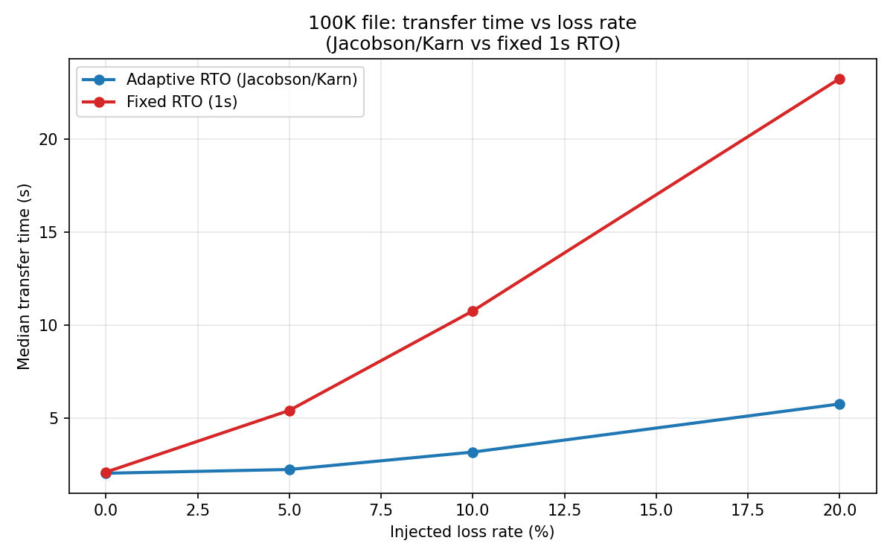
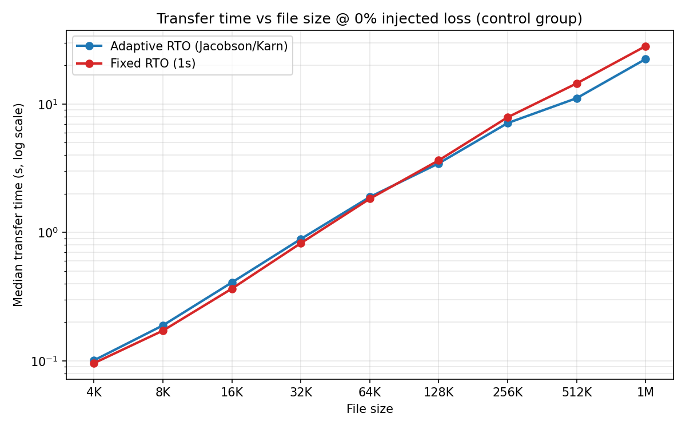
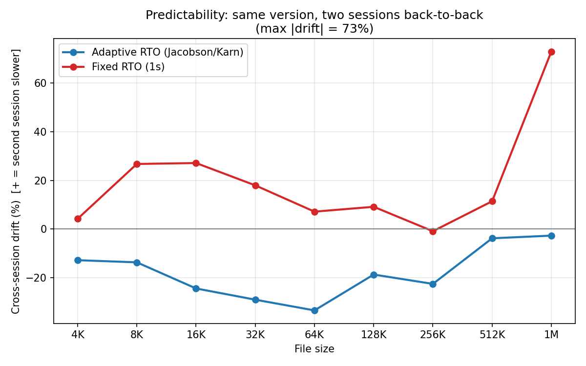
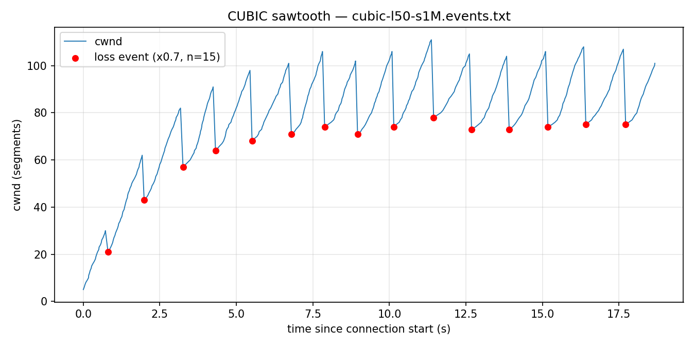
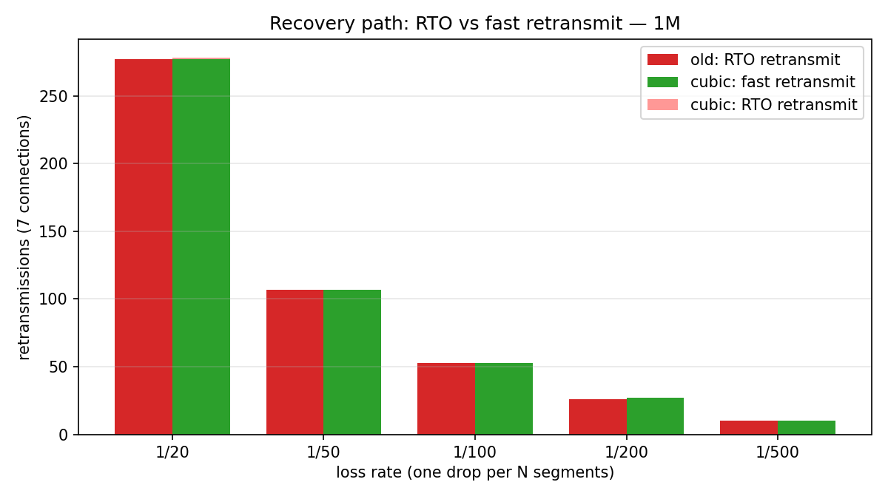
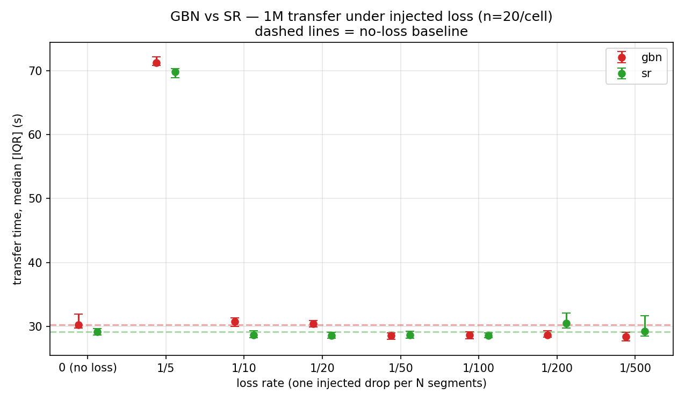
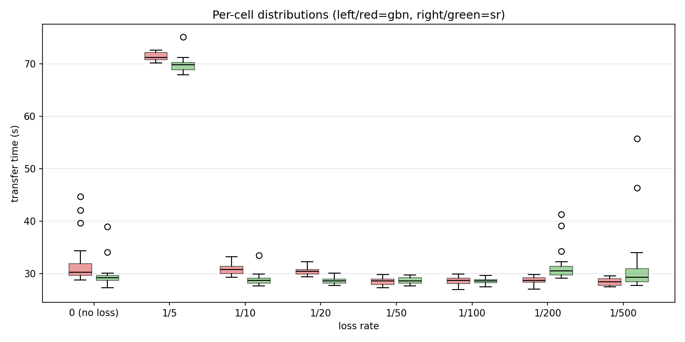
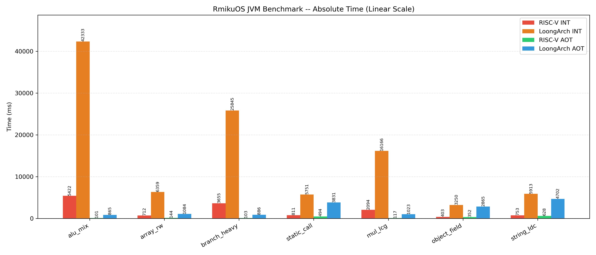

# RmikuOS

RmikuOS 是一个从零实现的教学型操作系统内核，支持 **RISC-V 64** 与 **LoongArch 64** 双架构。它可以在 QEMU 上启动用户态 shell，从真实 virtio 块设备加载 ext4 rootfs，并运行 **C / C++ / Rust / Java** 四种语言的用户程序，通过 TCP/IP 协议栈向宿主机浏览器提供真实的 HTTP 服务。

当前系统已经覆盖操作系统实验中常见的核心模块：进程与线程、虚拟内存、buddy 物理帧分配器、系统调用、VFS、多文件系统挂载、virtio 块设备、用户态 shell、管道与重定向、信号、stride / alpha-scaled 调度器、 TCP/IP 网络协议栈与用户态 HTTP 服务器、JVM（解释器 + 装载期 AOT，双架构后端），以及用于调度器实验的 workload 与自适应控制器。

RmikuOS 的目标不是停留在 `Hello, world`，而是逐步构建一个小而完整、能运行真实用户程序、能承载系统实验的教学型 OS。作为验证，独立项目 [VeryEasyGCN](https://github.com/amieon/VeryEasyGCN) 已通过 `stdcompat.h` 桥接层移植到 RmikuOS 上运行，并在真实 Cora 数据集上达到 **78.3%** 测试准确率。

```text
 ____            _ _         ___  ____
|  _ \ _ __ ___ (_) | ___   / _ \/ ___|
| |_) | '_ ` _ \| | |/ / | | | | \___ \
|  _ <| | | | | | |   <| |_| |_| |___) |
|_| \_\_| |_| |_|_|_|\_\\___/___/|____/

        RmikuOS
```

---

## Screenshots

### Boot and Shell


### ext4 Rootfs


### Arch Map


### Alpha-Scaled Scheduler


### Adaptive Alpha Controller (AIMD)


### Dynamic Load: AIMD vs Fixed Alpha


### TCP: Jacobson/Karn vs Fixed RTO（丢包率扫描）



---


## 环境搭建

### Docker(推荐)
```bash
docker build -t rmikuos-dev .
docker run -it --rm -v $(pwd):/work -p 8080:8080 rmikuos-dev
```
&gt; 构建默认使用本地 cross-tools/ 目录中的 loongarch64 工具链。
&gt; 没有的话,先从 loong64/cross-tools releases(https://github.com/loong64/cross-tools/releases)下载 x86_64 宿主版解压后将 loongarch64-unknown-linux-gnu 里的内容移至./cross-tools,

### 无 Docker
bash first_run.sh   # 自动装 apt/rustup/工具链
之后这样就行：
```bash
./run.sh riscv64
./run.sh loongarch64
```
---

## Features

### Multi-Architecture Support

RmikuOS 目前支持两个 64 位架构：

```text
riscv64
loongarch64
```

两个架构共用大部分内核逻辑，包括：

* 任务管理
* 进程与线程
* 虚拟内存
* 系统调用
* VFS 与多文件系统挂载
* ext4 rootfs / tmpfs / FAT
* block cache
* shell 和用户程序（C / C++ / Rust / Java）
* 调度器与调度实验框架
* 网络协议栈（virtio-net / ARP / IPv4 / TCP / UDP / DHCP / ICMP）

架构相关部分主要集中在：

* trap handling
* 上下文切换
* 页表切换
* 时钟中断
* QEMU 设备发现
* virtio transport
* 关机（SiFive Test / ACPI GED）

不同架构使用不同的 virtio transport：

```text
riscv64      -> virtio-mmio
loongarch64 -> virtio-pci
```

---

### Process and Thread

RmikuOS 当前支持基础进程管理：

* `fork`
* `exec`
* `waitpid`
* `exit`
* 进程地址空间复制
* 用户程序 ELF 加载
* 用户态参数传递
* 进程级 fd table

同时支持用户态线程：

* `thread_create`
* `thread_exit`
* `thread_join`
* 同进程线程共享地址空间
* 同进程线程共享 fd table
* 每个线程拥有独立 trap context 和 kernel stack

线程机制使得 RmikuOS 可以构造多线程 workload，并进一步研究进程级公平、线程级并行度和 deadline workload 之间的调度关系。

---

### Minimal General-Purpose Signal Delivery

RmikuOS 进一步实现了**进程级信号投递机制**，使内核具备向用户态进程发送异步通知的能力。这不是一个特化的"快捷键处理"（如硬编码检测 Ctrl+C 直接杀进程），而是一套**通用的 sig_pending 位图 + 延迟投递 + 默认行为**的完整框架：

```text
内核侧：
    sig_pending: u64 位图（64 个标准信号槽位）
    sys_kill(pid, sig) -> 设置目标进程位图 -> 唤醒所有线程 -> 调度器重新入队
    
投递点（返回用户态边界）：
    syscall_exit 前检查 -> do_signal()
    trap_return 前检查 -> do_signal()
    
默认行为：
    致命信号（SIGINT/SIGKILL/SIGTERM/SIGABRT/SIGFPE/SIGILL）-> 进程终止
    其他信号 -> 清掉位图，忽略（框架已留好，可扩展 sig_handler）
```

**关键设计：信号在"返回用户态边界"处理，绝不异步中断用户态执行。** 这与 Linux 的 `sigreturn` 语义一致，但实现更极简——没有用户态信号栈、没有 `sa_mask` 嵌套、没有 `sigaltstack`，只保留最核心的"投递 + 默认终止"。

**异常隔离**：用户态程序触发非法指令（`ECODE_INE` / `CAUSE_ILLEGAL_INSTRUCTION`）或浮点异常时，内核不再 panic，而是向该进程投递 `SIGILL` / `SIGFPE`，随后调度器杀死它。这实现了**"用户态错误不炸内核"**的基本隔离，是操作系统与裸机程序的分水岭。

**Shell 交互**：通过 `fcntl(fd, F_SETFL, O_NONBLOCK)` 将 stdin 设为非阻塞，shell 在 `waitpid(WNOHANG)` 轮询期间可检测键盘输入。检测到 `Ctrl+C`（ASCII 0x03）时，shell 通过 `kill(front_pid, SIGINT)` 发送信号，实现前台进程中断。子进程退出后，shell 恢复 stdin 阻塞状态，不影响后续交互。


### VFS and File Descriptors

系统实现了基础 VFS 和 fd table。

当前支持：

* `open`（Unix 风格 flags：`O_RDONLY` / `O_WRONLY` / `O_RDWR` / `O_CREAT` / `O_TRUNC` / `O_APPEND`）
* `close`
* `read`
* `write`
* `getdents`
* `stat`
* `fstat`
* `chdir`
* `getcwd`
* `exec`
* `pipe`
* `dup2`
* `mkdir`
* `create`
* `truncate`
* `unlink`
* `rmdir`
* `remove_recursive`

标准输入输出也通过 fd 统一处理：

```text
fd 0 -> stdin
fd 1 -> stdout
```

读写权限按打开模式强制：只读句柄（`O_RDONLY`）拒绝 `write`，只写句柄（`O_WRONLY`）拒绝 `read`，在 `read` / `write` 系统调用处经 `File::readable / writable` 统一检查。

---

## User Programs and Shell

RmikuOS 从 ext4 rootfs 中加载用户程序，第一个用户进程（init shell）通过 VFS 从 `/bin/shell` 加载。Shell 不是内核内置的玩具解释器，而是一个**支持交互式编辑、通配符展开、逻辑链、后台执行与脚本 source** 的完整用户态程序。

### Shell 命令体系

区分**内建命令**（改变 shell 自身状态，必须内建）与**外部命令**（独立 ELF，可被管道 / 重定向组合）：

```text
内建：  cd  pwd  exit  help  shutdown  jobs  clear
        mkdir  touch  rm  rmdir  source  .
外部：  ls  cat  echo  grep  shell  sleep ...
```

`ls` / `cat` / `echo` / `grep` 等 IO 工具被实现为独立的外部程序，因此它们能出现在管道与重定向中；`cd` / `pwd` / `exit` / `jobs` / `source` 保持内建，因为它们必须修改 shell 进程自身的状态或访问 shell 内部数据结构。

### Interactive Line Editing

Shell 支持完整的命令行编辑，无需依赖 readline 库：

```text
↑ / ↓         浏览历史命令（环形缓冲区，自动去重）
← / →         光标左右移动，支持任意位置插入与删除
Backspace     在光标处删除字符（自动重绘后续内容）
Tab           命令补全 + 路径补全
```

**Tab 补全**：

- 唯一匹配时直接补全，命令后自动追加空格；
- 多匹配时先补**最长公共前缀**（LCP），再次按 Tab 列出候选列表；
- 支持绝对路径与相对路径（`ls /bi<Tab>` → `ls /bin/`）。

### Glob, Brace Expansion & Quoting

Shell 在参数展开阶段实现了**大括号展开 → 通配符展开**的两级展开，且引号内完全保护：

```text
# 通配符
/ $ ls *.c
/ $ ls /bin/s?ell
/ $ rm [abc]*.o

# 大括号展开
/ $ echo {hello,world}
hello world
/ $ echo file{1,2,3}.txt
file1.txt file2.txt file3.txt
/ $ echo num{10..13}
num10 num11 num12 num13

# 引号保护（内部不做任何展开）
/ $ echo "*.c"
*.c
/ $ echo 'hello * ? [abc]'
hello * ? [abc]
```

**字符类** `[abc]`、`[a-z]`、`[^abc]`（或 `[!abc]`）也支持，与 `*` `?` 自由组合。

### Control Flow: `;` `&&` `||` `&`

Shell 支持完整的命令控制流：

```text
;           顺序执行（多条命令分隔）
&&          短路与（前一条成功才执行后一条）
||          短路或（前一条失败才执行后一条）
&           后台执行（不阻塞 shell，返回 job id）
```

```text
/ $ cd /bin && ls | grep shell || echo not found
/ $ echo one; echo two; echo three
/ $ sleep 5 &
[1] 3
/ $ jobs
[1] running sleep
/ $ ...（5秒后自动打印）[1] done sleep
```

`&&` / `||` 与管道 `|` 的优先级关系与 bash 一致：管道先组合命令，再参与逻辑短路。

### Script Execution: `source` / `.`

Shell 支持从文件逐行执行脚本，实现为内建命令 `source` 或 `.`：

```text
/ $ cat test.sh
echo "========== hello =========="
echo {1,2,3}
ls /bin/*.c 2>/dev/null || echo no .c files
cd /tmp && touch foo && ls foo
/ $ source test.sh
========== hello ==========
1 2 3
no .c files
foo
```

支持**续行**（行尾 `\` 将下一行拼接），支持 `#` 行内注释。脚本中可任意使用管道、重定向、逻辑链与后台执行。

### Pipeline & Redirection

`pipe()` 创建匿名管道，`dup2` 实现重定向。Shell 支持：

```text
cmd > file        stdout 覆盖写入
cmd >> file       stdout 追加
cmd < file        stdin 从文件读取
cmd1 | cmd2       单级管道
cmd1 | cmd2 | ... 多级管道
cmd < in | f1 | f2 > out   管道 + 两端重定向
```

管道与重定向的解析在**引号保护**下进行：`echo "a > b | c"` 被正确当作单个字面参数，不会触发重定向或管道。

### Lexing（词法解析）

命令行解析为原地压缩的词法分析器，单遍扫描完成：

```text
"..." / '...'   引号剥离；双引号内处理 \ 转义，单引号内全字面
\               转义：反斜杠后的字符按字面保留
#               行内注释：词首的 # 起至行尾忽略
```

引号状态在分词、管道切分、重定向解析三处一致跟踪，保证操作符在引号内无特殊含义。


---

### File System Map


## Filesystem


RmikuOS 的文件系统建立在一层统一的 VFS 抽象之上：每个文件系统节点实现 `Inode` trait（`lookup` / `open` / `getdents` / `metadata` / `truncate`，以及可写的 `create` / `mkdir` / `unlink` / `rmdir`），每个文件系统实例实现 `FileSystem` trait（提供根 inode）。在此之上，一张**挂载表**把不同文件系统挂到目录树的不同位置，使只读的 ext4、内存可写的 tmpfs、以及落盘可写的 FAT 能在同一棵目录树中共存。

```text
                    路径解析 (lookup_abs_path)
                             │
                             ▼
                      挂载表（最长前缀匹配）
            /              │               \
        "/" → ext4    "/tmp" → tmpfs    "/fat" → FAT
            │              │                 │
     read-only ext4   in-memory CRUD    writable on-disk
     (ext4_view)      (Vec/BTreeMap)    (fatfs + BlockIo)
            │                                │
        Block Cache                    BlockDevice(读/写)
            │                                │
        BlockDevice ─────────────────────────┘
          /        \
   virtio-mmio   virtio-pci
    RISC-V       LoongArch64
```

`open` 接受 Unix 风格的 flags（`O_RDONLY` / `O_WRONLY` / `O_RDWR` / `O_CREAT` / `O_TRUNC` / `O_APPEND`）：访问模式经 `File::readable / writable` 在 `read` / `write` 系统调用处强制（只读句柄拒绝写、只写句柄拒绝读），`O_CREAT` 在内核侧按「拆父目录 + 在父目录 inode 上 `create`」创建文件，`O_TRUNC` 调用 `Inode::truncate` 截断，`O_APPEND` 让写句柄每次写前定位到文件末尾。这套 flags 对所有可写文件系统（tmpfs / FAT）通用。

### Mount Layer（多文件系统挂载）

所有路径访问都汇聚到 `lookup_abs_path` 这一个入口。它先查挂载表，按**最长前缀匹配**选出该路径所属的文件系统及其根 inode，再把挂载点内的相对路径逐级 `lookup` 下去。

```text
/tmp/foo/bar
  → 挂载点 "/tmp" 命中（比 "/" 更长，优先）
  → 交给 tmpfs，相对路径 "foo/bar"
  → tmpfs.root_inode().lookup("foo").lookup("bar")

/fat/note
  → 挂载点 "/fat" 命中
  → 交给 FAT，相对路径 "note"

/etc/motd
  → 仅 "/" 命中（兜底）
  → 交给 ext4，相对路径 "etc/motd"
```

前缀匹配按**路径段**而非裸字符串进行（要求路径恰好等于挂载点，或以「挂载点 + `/`」开头），从而避免 `/tmp` 误匹配到 `/tmpfoo`。挂载机制让「加新文件系统」变成纯粹的扩展：实现 `FileSystem` + `Inode`，在启动时 `mount("/挂载点", fs)` 即可，无需改动路径解析。

挂载点本身需要在父文件系统中存在一个对应的目录作为「挂载坑」（如 ext4 rootfs 中的 `tmp` / `fat` 目录），否则该挂载点虽在挂载表中、却不会出现在 `ls /` 的目录列表里。

### Read-only ext4 Rootfs

根文件系统 `/` 是一个 ext4 镜像，作为只读 rootfs 挂载。ext4 的磁盘格式解析交给第三方 crate `ext4_view`，RmikuOS 只实现其要求的块读取回调（`Ext4Read::read`），把「读到字节」接到自己的块设备与块缓存上；格式解析、目录遍历、inode 查找由 crate 完成。

```text
User Program → Syscall → VFS → ext4 (ext4_view) → BlockCache → BlockDevice
                                                                  ├── RamDisk
                                                                  ├── VirtioMmioBlockDevice (riscv64)
                                                                  └── VirtioPciBlockDevice  (loongarch64)
```

rootfs 由宿主机上的目录模板 `user/rootfs/` 生成，用户程序的编译产物在打包时被复制进镜像。最终镜像大致形如：

```text
/
├── bin/         系统命令(shell, ls, cat, echo, grep ...)
├── tests/       C / 单文件 Rust 测试程序
├── programs/    cargo workspace 构建的 Rust 程序
├── gcn/         C++ 图神经网络程序（GCN / GAT）
├── jvm/         Java 项目的class文件
├── etc/
│   └── motd
├── home/
├── share/
├── tmp/         tmpfs 挂载点(可写,内存)
├── fat/         FAT 挂载点(可写,落盘)
├── dev/
└── proc/
```

> ext4 经由 `ext4_view` 以**只读**方式访问；运行时的可写存储由挂载在 `/tmp` 的 tmpfs（内存）与挂载在 `/fat` 的 FAT（落盘）提供（见下）。

### Writable tmpfs（可写内存文件系统）

tmpfs 是一个完全活在内存中的可写文件系统，挂载于 `/tmp`，提供完整的 CRUD。文件内容是 `Arc<Mutex<Vec<u8>>>`，目录是 `Arc<Mutex<BTreeMap<String, TmpfsNode>>>`，因此「可写」只是对内存数据结构的增删改，无需触及任何磁盘格式。

支持的操作：

```text
mkdir              创建目录
create (touch)     创建空文件
write / read       文件内容读写(每个打开的 fd 独立 offset,数据共享)
truncate           截断到 0(配合 > 覆盖)
unlink (rm)        删除文件
rmdir              删除空目录
remove_recursive   递归删除(rm -r)
```

几个语义直接由 Rust 的所有权与 `Arc` 机制自然得到：

* **目录树共享**：`lookup` 返回子节点时 clone 的是 `Arc`，多个进程拿到同一文件即操作同一份内存——一端写、另一端可读。
* **递归删除零额外代码**：`remove_recursive` 直接从父目录的 `BTreeMap` 中移除整个子树节点，`Arc` 连锁 drop 自动递归释放整棵子树的内存。
* **unlink 已打开的文件**：删除只是从目录移除「名字」，若仍有进程持有该文件的 `Arc`，内存保留到最后一个 fd 关闭——与 Unix「unlink 一个 open 的文件，数据存活到 close」一致。

写权限的隔离也随之成立：在只读 ext4 路径下（如 `/etc`）执行写操作会被正确拒绝（`Inode` 的写方法默认返回失败，ext4 不重写它们），而 tmpfs 重写为真正的增删。一组端到端测试覆盖了建树、文件读写、`rmdir` 非空目录失败、`unlink` 目录失败、递归删除、删除不存在项失败、以及「ext4 上 mkdir 失败」等用例。

> **关于可写文件系统的设计取舍**：由于 ext4 经 `ext4_view` 只读访问，自实现可写 ext4（分配 inode / 数据块、维护位图与日志）成本极高且收益有限。tmpfs 在内存中提供了「可写文件系统」的全部语义（创建、写入、删除、共享、引用计数释放），落盘可写文件系统（FAT）见下节。

### Writable FAT on Disk（可落盘的 FAT 文件系统）

tmpfs 提供了内存中的完整可写语义，但内容随重启丢失。RmikuOS 进一步接入了 **FAT16** 文件系统，挂载于 `/fat`，运行在一块**独立的 virtio 块设备**上，提供真正落盘、跨重启存活的可写存储。

FAT 的磁盘格式解析交给 vendored 的 `fatfs` crate（0.4，`no_std` + `alloc`，开启 `lfn` 长文件名）。RmikuOS 提供两层适配：

```text
VFS (Inode / File)
      │
  FatFs / FatInode / FatFile      ← 把 fatfs 的借用式 API 适配到 VFS
      │
  BlockIo                          ← 把「字节流」翻译成「扇区读写」
      │  (read-modify-write 处理非对齐写)
  BlockDevice(读写)
```

* **`BlockIo`** 实现 `fatfs` 要求的字节流 IO（`Read` / `Write` / `Seek`）：按字节偏移定位到扇区，非扇区对齐的写入用 read-modify-write（先读整扇区、改其中一段、再写回）。
* **`FatFs` / `FatInode` / `FatFile`** 把 `fatfs` 的借用式 API（`File` / `Dir` 借用 `FileSystem`）适配到 VFS 的 `Inode` / `File`。由于 fatfs 的句柄借用全局 `FileSystem` 对象，无法直接塞进 `'static` 的 VFS 节点，RmikuOS 采用「路径式 inode」：`FatInode` 只存路径，每次操作在持锁块内临时打开 fatfs 句柄、用完即弃，只让纯数据（`Vec` / 元数据 / 返回码）逃出锁作用域。这与 ext4 的设计同构。

支持的操作与 tmpfs 对齐：创建 / 读 / 写 / 截断 / 追加 / 建目录 / 删除 / 递归删除，并经由统一的 open flags 驱动（`>` 覆盖、`>>` 追加、`<` 读取）。写入经 `BlockIo` 落到 virtio 块设备的磁盘镜像，跨重启存活：

```text
/ $ echo "hello fat" > /fat/note
/ $ cat /fat/note
hello fat
   ... 重启 QEMU ...
/ $ cat /fat/note
hello fat
```

> **关于文件名大小写**：FAT 始终大小写不敏感（忽略大小写后同名即同一文件）。开启 LFN 后，新建文件**保留输入时的显示大小写**（`Note.txt` 显示为 `Note.txt`），但匹配仍不区分大小写——这是 FAT 显示名（LFN 项）与匹配名（8.3 短名，规范大写）分离的固有特性，并非 bug。

> **两文件系统对称、上层零改动**：FAT 的整条上层（`BlockIo` / `fatfs` / VFS 适配）完全建立在 `BlockDevice` trait 之上，不含任何架构分支。riscv（virtio-mmio）与 loongarch（virtio-pci）只需各自实现 `BlockDevice` 的读写，FAT 挂载层一份代码两个架构通用——这正是把架构差异收敛到 `BlockDevice` 接缝之下的回报。

---

## Virtio Block Device

RmikuOS 不再只依赖内核内置 ramdisk，而是从 QEMU 挂载的真实磁盘镜像读写数据：只读 ext4 rootfs 从一块盘加载，可写 FAT 落在另一块独立盘上。virtio 块设备驱动同时实现了**读路径与写路径**，并支持发现并初始化**多块**磁盘（按 sector 2 的 ext4 magic 区分 rootfs 盘与 FAT 盘）。

整体路径如下：

```text
User Program
    ↓
Syscall
    ↓
VFS
    ↓
ext4 (只读) / tmpfs (内存) / FAT (落盘)
    ↓
BlockCache
    ↓
BlockDevice (读 + 写)
    ├── RamDisk
    ├── VirtioMmioBlockDevice
    └── VirtioPciBlockDevice
```

#### RISC-V virtio-mmio

在 RISC-V QEMU `virt` 机器上，系统通过 virtio-mmio 扫描 virtio block device。

流程：

```text
扫描 virtio-mmio slot(发现多块盘)
识别 virtio-blk
初始化 legacy virtio-mmio device
配置 virtqueue
提交 block read / write request
按 ext4 magic 区分 rootfs 盘与 FAT 盘
```

#### LoongArch64 virtio-pci

在 LoongArch64 QEMU `virt` 机器上，系统通过 PCI/PCIe 枚举 virtio block device。

流程：

```text
映射 PCI ECAM
枚举 PCI bus/device/function
找到 vendor=0x1af4 的 virtio-blk-pci(可多块)
分配 BAR(多块盘各自分配不重叠的 BAR 地址)
解析 virtio PCI capabilities
初始化 modern virtio-pci device
配置 virtqueue
提交 block read / write request
按 ext4 magic 区分 rootfs 盘与 FAT 盘
```

---

## Network Stack

RmikuOS 自带一套 TCP/IP 协议栈：自 virtio-net 驱动起，经 Ethernet / ARP / IPv4 / ICMP / UDP / TCP 与 DHCP，到一组专用的 socket 系统调用（号段 100–109），最终在用户态跑起一个真实的 HTTP 服务器与 TFTP 客户端——宿主机浏览器经 QEMU `hostfwd` 直接访问 guest 内的页面，两台 QEMU 经 socket pair 互 ping。协议栈每一层都是内核 `drivers/net/` 下的 Rust 代码，不依赖任何外部网络 crate。

```text
用户态   httpd(静态文件 + JSON API)   tftp(文件注入)   ping / udp_test / tcp_test
            │  socket syscalls:100 SOCKET … 109 RECV(专用网络号段)
────────────┼───────────────────────────────────────────────────
内核       Socket 层(UDP / TCP 统一 socket table,端口冲突检查)
            │
            ├─ TCP   11 态状态机 · 滑动窗口 · Jacobson/Karn 自适应 RTO
            ├─ UDP   无连接收发 · 校验和
            └─ ICMP  echo request / reply(ping)
            │
            IPv4   头部校验和 · 按 protocol 字段分发(17=UDP,6=TCP,1=ICMP) · 同网段直连路由
            DHCP   四步交互(DORA)· 广播位 · options 解析,自动配置地址
            ARP    地址缓存 + 挂起队列(未命中先存整包,解析成功补发)
            │
            Ethernet → virtio-net 驱动 → QEMU slirp → 宿主机协议栈
```

QEMU 侧使用 slirp 用户态网络（`-netdev user`）：无需宿主机 root 权限，自带 DHCP 服务器（`10.0.2.2`）与 DNS（`10.0.2.3`），guest 默认落在 `10.0.2.15`。

### ARP：挂起队列（Pending Queue）

发包时 ARP 缓存未命中是常态，而地址解析是异步的。朴素实现直接丢包、把重试责任推给上层；RmikuOS 在 ARP 层内置一张 4 槽 PENDING 队列：未命中时整包入队并发出 ARP request，`on_arp_learned` 回调时补发，上层（IP / TCP / UDP）完全无感。实现上有一条锁纪律：回调点不得持有 ARP 缓存锁，否则会触发自研锁的同核重入死锁检测。

### IPv4 与校验和

* 发送时生成头部校验和、接收时验证；checksum 写回必须显式转大端——slirp 对校验失败的包**静默丢弃**（实踩的坑）；
* 本机地址原子化（`MY_IP`）：DHCP 完成前用默认值，租约落地后 `set_my_ip` 热切换；
* 按 protocol 字段分发到 UDP（17）/ TCP（6），未知协议打日志——漏写分发行曾导致 SYN-ACK 静默消失，这类坑必须能被一眼看见。

### TCP：教学版实现


* 11 态状态机（Closed → Listen → SynSent / SynReceived → Established → FinWait1 / 2 → CloseWait / Closing / LastAck → TimeWait），主动 open（connect）与被动 open（listen / accept）均支持；
* 发送侧：`tx_unacked` 重传队列（SYN / FIN 各占一个序号），**Jacobson/Karn 自适应 RTO**（RFC 6298 定点 SRTT/RTTVAR，RTO = SRTT + max(G, 4·RTTVAR)，200ms–16s，指数退避，最多 8 次；详见 Network Experiments 一节）；
* 接收侧：按序交付 + 固定窗口广告（65535），乱序段丢弃并重复 ACK；
* 定时器不依赖硬件中断：RTO / TIME_WAIT 等全部期限由 socket 层 `poll()` 内嵌的 `tick()` 驱动；
* 两条路径均已实机验证：主动 connect 经 slirp 访问宿主机 `nc -l`；被动 listen 经 hostfwd 接受宿主机浏览器连接。


### DHCP 客户端

内核态 DHCP 客户端：BOOTP 236 字节头 + magic cookie（`99,130,83,99`）+ options 编解码（53 消息类型 / 50 请求地址 / 54 服务器标识 / 55 参数请求 / 3 网关 / 6 DNS / 51 租期）。flags 置广播位 `0x8000`，使 OFFER / ACK 走二层广播——租约落地之前本机没有合法地址，单播回复无从送达。四步交互后 `set_my_ip(yiaddr)`，实测租得 `10.0.2.15`、租期 86400s。

### ICMP 与双机互 ping

ICMP echo request / reply 入栈后，两台 QEMU 可以直接对话：经 socket netdev pair（`-netdev socket,listen=` / `connect=`）二层直连、绕开 slirp，两台 guest 互设 `192.168.100.x` 后 ping 通。这一步抓出两个隐蔽 bug：

* **MAC 硬编码**：`eth.rs` 的 `MY_MAC` 写死了 slirp 模式分配的 `52:54:00:12:34:56`，而 socket pair 模式分配的是 `...0A` / `...0B`——A 机的包发出去了，B 机网卡不认这个源；
* **同网段路由**：`ip.rs` 的 `next_hop` 把同 /24 的地址也交给网关，ARP who-has 的始终是 `10.0.2.2` 而非对端——同网段应当直连，下一跳即目的地址本身。

两个 bug 都由「三段定位法」在 ARP 层现形：tcpdump 里 ARP 请求的目标地址暴露了一切。

### Socket 系统调用：100–109 专用号段

网络调用不挤占主系统调用表，独立开一段号段——主分发只多一条范围判断，后续扩充也不污染既有编号：

```text
100 SOCKET    101 BIND    102 SENDTO    103 RECVFROM    104 CLOSE
105 CONNECT   106 LISTEN  107 ACCEPT    108 SEND        109 RECV
```

用户态经 `net.h` 封装为 `net_socket()` / `net_socket_tcp()` / `net_bind()` / `net_connect()` / `net_listen()` / `net_accept()` / `net_send()` / `net_recv()` 等，体感与 POSIX 对齐。

### httpd：跑在自研协议栈上的 Web 服务器

协议栈的「真应用」验证：一个多文件 C 工程（`httpd.c` / `http.c` / `pages.c` + 头文件），顺带压测了用户态多文件编译与链接——并因此逼出并修复了头文件函数体未加 `static inline` 导致的 `multiple definition` 隐患（单文件时代不可见，多文件链接即炸）。

* **静态文件模式**：`httpd wow.html` 启动时将文件读入内存（16KB 缓冲），`/` 与 `/index.html` 发送文件内容；
* **内联路由**：`/demo` 内联演示页、`/hello`、`/api/stats`（JSON 实时请求计数）、404；
* **HTTP 细节自己扛**：TCP 是字节流，请求头边界靠扫描 `\r\n\r\n` 确定；发送超 1460 字节按 1400 切片；`Connection: close` 迭代式服务；
* **浏览器适配**：Chrome 会打开「占位不说话」的预热连接，迭代式服务器 accept 到它就会被焊死——recv 增加软超时（800ms），空连接到点踢掉，真实请求随后即被服务。

宿主机访问只需在 run.sh 的 netdev 上挂一行 port forward（**必须与 `id=net0` 同行**，拆成独立参数会被 QEMU 误认为磁盘镜像）：

```text
-netdev user,id=net0,hostfwd=tcp::8080-:8080
```

```text
/ $ httpd wow.html
[httpd] loaded wow.html, 6986 bytes, serving at /
[httpd] RmikuOS httpd listening on 10.0.2.15:8080
[httpd] #1 GET /
[httpd] #1 served, 6986 bytes, closing fd=2
```

浏览器打开 `http://127.0.0.1:8080/` 即可（内联演示页在 `/demo`）。随附的 `wow.html` 演示页每 2 秒 `fetch('/api/stats')` 刷新请求计数——页面上数字每跳一次，背后都是一次完整的 TCP 建立—传输—挥手。

### TFTP：经 slirp 的文件注入通道

rootfs 只读、重新打包 ext4 镜像太慢，实验文件（尺寸扫描用的 4K–1M 随机文件）需要一条运行时注入通道。slirp 内置 TFTP 服务器：在 netdev 上挂 `tftpboot=<绝对路径>`（必须是绝对路径，相对路径直接报 `Invalid parameter`），guest 内用户态 `tftp` 客户端（RRQ → DATA/ACK 停等）即可拉取宿主机目录里的文件：

```text
/ $ tftp hello.txt /tmp/a
tftp: hello.txt -> /tmp/a, 26 bytes
```

一个与文档印象不符的实测结论：**slirp 的 TFTP 服务器在 guest 视角是 `10.0.2.2`**（与 DHCP 网关同地址），而不是某些资料里的 `10.0.2.4`——向后者发 ARP who-has 永远无人应答，改指 `10.0.2.2` 即通。ACK 直接回 `recvfrom` 的 from 地址，TFTP 的 TID 语义天然正确。

### 排障方法学：三段定位法

网络问题一律按「guest 发没发对 → slirp 转没转发 → 宿主机谁收走」三段切分：

```text
-object filter-dump,id=f0,netdev=net0,file=/tmp/rmiku.pcap   # guest 网线上抓包
sudo tcpdump -i lo -nn -X udp port 9999                      # slirp 是否已转发到宿主机
ss -ulnp | grep 9999                                         # 宿主机端口被谁持有
```

实战战绩：曾用这套方法揪出「4 个僵尸 nc 进程同绑一个 UDP 端口、报文全进旧进程接收队列」——guest 侧报文逐字节验证完美，锅在宿主机。

---

## Network Experiments：TCP RTO 对照实验

网络栈的第二组实验回答一个问题：**重传超时（RTO）的估计方式，对真实传输性能影响多大？** 对照双方共享除估值器以外的全部代码（同一状态机、同一窗口管理、同一丢包装置），唯一变量是 RTO 算法：

```text
new:  Jacobson/Karn 自适应 RTO(RFC 6298 风格,定点实现)
      SRTT/RTTVAR 按 ×8/×4 缩放存储,除法即右移,无浮点
      RTO = SRTT + max(G, 4·RTTVAR),clamp [200ms, 16s],G = 10ms(tick 粒度)
      Karn 两条:重传段不采样(ACK 歧义);退避期间保持翻倍后的 RTO
      队首采样规则:每个 ACK 只在弹出队首段时采样(队首干净 ⟹ 样本新鲜)
      RTO-restore:有前向进展但无干净样本时恢复估值(参考 Linux)

old:  固定 RTO = 1s,指数退避,封顶 16s(实现 Jacobson 之前的原版)
```


### 实现过程中抓出的三个深邃 bug

* **陈旧样本死亡螺旋**：串行修洞（每 tick 只重传队首）下，洞修好后的累积 ACK 会连跳弹出多个老段；若对每个被确认的段都采样，`now − sent_ms` 里混入了等待修洞的时间，假样本按等比数列膨胀（实测 100→202→422→…→254659ms），RTO 一路爆炸到封顶。修复即「队首采样规则」：队首段干净意味着它发出未满一个 RTO，样本必然新鲜。
* **退避棘轮**：Karn 的「退避保持到下一个干净样本」与队首采样叠加后，排水期（数据已发完、只剩重传在飞）永远采不到干净样本，RTO 每个洞翻倍一次，几洞之内钉死在 16s。修复即「RTO-restore」：只要有前向进展就恢复估值——旧版固定 RTO 天然等价于此，这也是对照实验公平的一环。
* **无流量控制**：初版 `send_data` 只看对端窗口是否为零、不跟踪在途字节，1MB 传输瞬间灌爆宿主 64KB 接收窗，真实丢包与注入丢包混杂，实验不可解释。修复为阻塞式窗口管理（`in_flight = snd_nxt − snd_una`，窗口满则解锁 poll 等待）。

### 实验装置

* **确定性丢包**：`LOSS_EVERY = N` 时每 N 个数据段丢弃 1 个（SYN / FIN 不丢），完全可复现；
* **单变量对照**：对照版与新版共享丢包装置、流量控制与打点，只差估值器；
* **自造噪声消除**：正式测量前 30 个 4K 请求预热，每次 run 间隔 2s——否则 8 槽 socket 表被 TIME_WAIT（10s）子连接占满，SYN 被静默丢弃，宿主退避产生周期性 18s 停摆；
* 每组 5–7 次取中位数；脚本：`tcp_exp.sh`（丢包率组）/ `tcp_size_sweep.sh`（尺寸组）/ `plot_tcp.py`（绘图），数据落盘 `logs/tcp/`。

### 实验一：尺寸扫描 @ 0% 注入丢包（4K – 1M）



* ≤64K：两版差异在 ±10% 噪声带内——**do no harm**，自适应估值器在无损路径上不引入额外开销；
* ≥128K：new 在两个独立 session 中稳定更快（1M：22.4s / 21.7s vs 28.2s / 48.8s），方向可复现，幅度受宿主噪声影响，给区间不给单点。



跨 session 漂移（同版本连跑两批）：new 的 1M 中位数漂移 **−3%**，old 的 1M 漂移 **+73%**；小尺寸双方均在 ±30% 噪声带内。注意两批的运行顺序与版本相关（位置效应未消），此图作为 observation 呈现，交错重复实验见 Roadmap。

### 实验二：丢包率扫描 @ 100K（0 / 5 / 10 / 20%）


| 注入丢包率 | new（中位数） | old（中位数） | 提速 |
| ---------- | ------------- | ------------- | ---- |
| 0%（对照） | 2.052s | 2.111s | 1.03× |
| 5% | 2.253s | 5.425s | **2.41×** |
| 10% | 3.187s | 10.765s | **3.38×** |
| 20% | 5.770s | 23.243s | **4.03×** |

* 0% 对照臂两版一致（1.03×），实验台自证干净；
* old 耗时随丢包率近似线性爆炸（≈ 每 1% 丢包 +1.05s），正是固定 1s RTO「每洞罚一秒」的理论预期；new 的 RTO 收敛在 200ms 附近，曲线平缓；
* 机制佐证：逐洞恢复耗时 new ≈ 200ms/洞、old ≈ 1s+/洞（恢复比 5–9×）；且 new 的恢复时间随洞序号线性爬升——这是串行修洞的排队签名，也是 Roadmap 中快重[docs] readme更新cubic实验传 / SACK 的直接动机；
* 采样规模：new 传 1M 采 5236 个 RTT 样本，old 全程 0 个（它没有估值器）——对照的本质浓缩在这一数字里。

## TCP CUBIC 拥塞控制实验

在 RmikuOS 教学 TCP 栈上实现 **CUBIC(RFC 9438)** 拥塞控制与快速重传,并与无拥塞控制版本在确定性丢包下做 A/B 对照。

### 实验设计

- **对照组**:old 版(无 cwnd,仅接收窗口流控 + RTO 重传)
- **实验组**:CUBIC 版(慢启动 + 立方增长 + β=0.7 降窗 + 快速收敛 + 3-dupACK 快速重传)
- **丢包装置**:发送侧每 `LOSS_EVERY` 个数据段丢 1 个(确定性、可复现),档位 {0, 20, 50, 100, 200, 500}
- **负载**:guest 内 httpd 发文件,宿主机 curl 下载,尺寸 {64K, 256K, 1M},每格 7 次取中位数
- **打点**:每连接一行 `[tcp-stat]`(字节/重传/降窗计数),`[cwnd]` 逐次变窗轨迹;宿主机按日志书签切片聚合

### 结果





- 相同丢包序列下两版**重传总量一致**(fig2 柱高),证明装置公平;差异全在恢复路径:**99.6% 的重传由快速重传完成**(l20@1M:fast=277, RTO=1),单次丢包恢复代价从 ≥200ms(RTO_MIN)降至约 0。
- 实测降窗次数与理论丢包数(段数/LOSS)在全部档位吻合(见 fig3),丢包装置与打点计数自洽。
- RTT 样本数随丢包率下降(fig5),符合 Karn 规则(重传段不采样)。

### 复现

```bash
# 终端1: QEMU 输出落盘(每次重启先删旧日志)
rm -f logs/console.log && ./run.sh riscv64 debug 2>&1 | tee logs/console.log
# 终端2: 扫描(LOSS 标签需与内核编译的 LOSS_EVERY 一致)
./scripts/tcp_loss_sweep.sh old   100 7
./scripts/tcp_loss_sweep.sh cubic 100 7
# 出图
python3 scripts/plot_tcp.py
```

### 局限性

- QEMU 内 RTT≈0,协议栈受 CPU/串口限制(~27KB/s),在途数据不足 1 段,cwnd 不构成瓶颈——**计时列仅作参考**,结论以机制计数为准;窗口瓶颈实验需关闭日志并加链路延迟(设计见实验记录)。
- 耗时存在会话级漂移(每次换内核冷启动),跨行绝对值不可比。
- 接收端原为 GBN 行为(乱序丢弃),已由后续的 SR 升级(重组缓存)解决;SACK 选项未实现。


## TCP 接收端升级实验:Go-Back-N vs Selective Repeat

在 RmikuOS 教学 TCP 栈(CUBIC 拥塞控制 + 快速重传)上,将接收端从 **GBN 行为**(乱序即丢弃)升级为 **SR 行为**(乱序进重组缓存,洞补上后顺序交付),在确定性丢包下做 A/B 对照。

### 前置修复

实验前发现通告窗口 65535 与宿主机 slirp 接收缓冲(≈64KB)几乎相等,满窗口发送会打爆宿主缓冲造成**不可控真实丢包**(无损基线 34~54s 剧烈散布)。将通告窗口降至 **16384(11 段)** 后,基线收敛至 29.2s ± 1.2s。此后所有数据均为 16KB 窗口配置。

### 实验设计

- 对照:同一 CUBIC+快速重传内核,仅接收路径不同(丢弃 vs 缓存)
- 丢包:{0, 1/5, 1/6, 1/7, 1/10, 1/20, 1/50, 1/100, 1/200, 1/500} 八档 × 20 次/格,1M 文件
- 每组跑于独立冷启动会话;污染会话(宿主机并行实验导致单调爬升/钟形隆起)整组作废重跑
- 统计:中位数 + IQR,离群点不剔除但由中位数免疫

### 结果





| 丢包率 | GBN 中位(s) | SR 中位(s) | 结论 |
|---|---|---|---|
| 0 | 29.9 | 29.2 | 打平 |
| 1/5 | 71.3 | 69.8 | 共同触底 |
| 1/6 | ~35.1 | ~35.9 | 打平，中间态                  |
| **1/7** | **~35.7** | **~28.9** | **SR 快 19%,SR 回到基线水平！** |
| 1/10 | 30.7 | 28.6 | **SR 快 7%** |
| 1/20 | 30.4 | 28.6 | **SR 快 6%** |
| 1/50 ~ 1/500 | 28.4~28.7 | 28.6~30.5 | 打平 |


### 分析

1. **SR 的收益集中在 1/10~1/20 重-中丢包档**:此时丢包频繁到 GBN 级联(洞后段被丢弃、逐段等 dup ACK 链式修复)构成可测开销,而又未让 cwnd 触底。
2. **1/5 档两组共同劣化至 ~70s**:每 5 段丢 1 个使 cwnd 长期钉死在 2 段下限,吞吐 ∝ 窗口。定量验证:2/11 ≈ 0.41 ≈ 28.6/69.8——窗口下限主导一切,接收端策略无关。
3. **在 5 和 10 之间挖出了一个悬崖 **：对 SR 来说，1/6 还在 36s 的中间态，1/7 就突然跌回 28.9s 的无损基线水平，一档之差 24%。1/6→1/7 恰好跨过临界点，就是离散动力学里的 regime switch。
4. **轻丢包档打平**:丢包间隔超过窗口,GBN 级联深度 ≈ 0,丢弃与缓存无差异。
5. **SR 收益整体温和(≈7%)的原因**:本环境 RTT≈0、在途段数 ≪ 窗口,且快速重传已将级联修复的等待代价压至近零——SR 相对"GBN+快速重传"的边际收益天然有限。SR 的决定性优势需要足够大的带宽时延积(丢包瞬间洞后存在大量在途段)才能显现,列入后续工作(链路延迟队列,设计已定)。

### 实验教训(数据质量控制)

- 首轮 gbn 数据被宿主机并行任务污染(组内单调爬升 32→55s),整组重跑;教训:**对照组应尽量交错/同窗口运行,或用定标 curl 监控会话漂移**。
- sr@200/500 格仍有少量离群点(46~56s),中位数免疫,均值已标注仅供参考。

### 复现

```bash
./scripts/sr_run.sh gbn 10 20 1M     # 采集(标签须与内核 LOSS_EVERY 一致)
./scripts/sr_run.sh sr  10 20 1M
python3 scripts/plot_sr2.py          # 出图 + 汇总表
```


---

## User Programs in C, C++, Rust and Java

RmikuOS 的用户程序可以用 **C、C++、Rust and Java** 编写。前三者编译成相同格式的静态 ELF、走完全相同的系统调用 ABI（号在 `a7`/`r11`，参数在 `a0..`/`r4..`，触发 `ecall` / `syscall 0`，返回值在 `a0`/`r4`），因此在内核看来完全等价——**支持 C++ 用户程序内核侧零改动**，只是多了一条产出兼容 ELF 的编译流程。 后者通过javac编译成class文件后用cpp编写的jvm进行使用。

### syscall ABI 是语言无关的

系统调用的本质是「按约定把号和参数放进寄存器，触发陷入指令」。这套约定定义在 ELF + 寄存器层面，与源语言无关：C 用一小段汇编（`syscall_<arch>.S`）实现，C++ 复用同一套汇编，Rust 用 inline asm 实现，三者只要寄存器约定一致，内核 trap handler 取参数的方式就完全相同。这也是为什么加入 C++ 支持不需要改内核——它加载的是 ELF、执行的是机器码、通过寄存器约定交互。

### C 用户库（分层头文件）

C 侧的用户库按依赖层次拆分为一组单一职责的头文件，用户程序只需 `#include "user.h"` 即可获得全部接口：

```text
types.h     基础类型(usize / isize)
syscall.h   系统调用号 + syscall3 / syscall6
flag.h      open flags(O_RDONLY / O_WRONLY / O_RDWR / O_CREAT / O_TRUNC / O_APPEND)
io.h        strlen + read/write + open/close/create + puts/put_char
process.h   exit/fork/waitpid/getpid/yield/sleep + exec
fs.h        dirent/stat + getdents/stat/chdir/getcwd + mkdir/unlink/rmdir
mem.h       PROT_* + mmap/munmap + malloc/free/calloc
lock.h      spinlock / mutex
thread.h    thread_create/exit/join + 栈管理
sched.h     tickets / alpha / sched_proc_stat / get_ticks
ipc.h       pipe / dup2
net.h       socket 封装(socket/bind/connect/listen/accept/send/recv/sendto/recvfrom/close)
string.h    标准字符串/内存函数(strlen/strstr/memmove 等,static inline)+ trim / copy_str / read_file
fmt.h       parse_int / put_int / put_hex / uprintf / snprintf 族
```

### 用户态堆分配器（Slab + First-Fit 混合）

RmikuOS 的内核 `mmap` 只提供**裸页级匿名映射**（`mmap(len, prot)` 按页分配，`munmap(addr, len)` 局部解除），不做堆管理。用户态通过一套**混合分配器**实现细粒度 `malloc/free`，核心思想是**向内核批量要页，在用户态精细分配**。

#### 架构

```
用户程序
   │
   ▼
malloc/free ──► Slab 分配器 (小对象, O(1))
   │                │
   │                ▼
   │         首次适应分配器 (大对象, ≥1024B)
   │                │
   └────────────────┘
            │
            ▼
      syscall mmap (按页向内核申请)
            │
            ▼
      内核页分配器
```

#### 小对象快速路径：Slab 分配器

对 ≤1024 B 的对象按 size class 分档（16, 32, 48, 64, 96, 128, 192, 256, 384, 512, 768, 1024），每档维护一个自由链表：

- **分配**：O(1) 弹出一个空闲对象
- **释放**：O(1) 压回自由链表
- **批量填充**：某档耗尽时，一次性 `mmap` 一个 chunk（默认 64 KB），切成多个对象挂入链表，摊平系统调用开销

每个 slab 对象头部嵌入 `size_t` 标记（高位置 `SLAB_MAGIC`），`free` 时通过魔数识别走 slab 路径还是大对象路径，无需额外元数据结构。

#### 大对象路径：首次适应 + 分裂/合并

大于 1024 B 的请求走首次适应（First-Fit）链表：

- 在已有空闲块中找第一个足够大的块
- **分裂**：若块远大于请求，切出尾部作为新空闲块，减少内部碎片
- **扩展**：无合适块时，向内核 `mmap` 申请新 chunk（页对齐），挂入链表
- **合并**：释放时检查相邻块是否均为空闲，是则合并为更大块，减少外部碎片

#### 延迟归还策略

`free` 后内存块**不立即 `munmap` 还回内核**，而是留在用户态空闲池复用。该策略基于两个观察：

1. **工作负载局部性**：同一进程短期内重复申请/释放同尺寸内存的概率极高，缓存可避免频繁陷入内核
2. **页粒度不匹配**：`munmap` 必须以页为单位，而 `malloc` 分配的块远小于页，立即归还会导致无法复用的碎片页

进程地址空间足够时，该策略零开销；需要严格收缩时，用户可显式调用 `munmap`。

#### 线程安全

分配器全局持有一把 `mutex_t`，`malloc`/`free` 入口加锁、出口解锁。由于当前用户程序以单线程或**粗粒度同步**为主，该设计简单可预测；若后续引入 per-thread arena，可进一步消除竞争。


### C++ 用户库与 `stdcompat.h` 桥接

RmikuOS 进一步支持 **C++17**，并通过一个零侵入的桥接头文件 `stdcompat.h`，让原本依赖标准库的 C++ 项目几乎**零改动**即可在裸运行时上编译运行。

**设计：`std` 接口桥接到裸实现**

`stdcompat.h` 不实现完整的 ISO C++ 标准库，而是提供一层**兼容接口**：

```text
原代码写 std::vector<T>，实际调用 mv::Vector<T>
原代码写 std::exp(x)，实际调用 mymath::exp(x)
原代码写 std::printf(fmt, ...)，实际调用 uvprintf(fmt, ...)
```

所有桥接通过 `namespace std { using ... }` 和模板特化完成，算法代码本身无需修改。例如：

```cpp
#include "my/stdcompat.h"   // 仅此一行替换
// 以下代码与标准库版本完全一致：
std::vector<float> v;
std::exp(1.0);
std::printf("hello\n");
```

**裸运行时数学库**

`stdcompat.h` 的底层依赖一组从零实现的数学函数（`exp`/`log`/`sqrt`/`pow`/`sin`/`cos`），采用 fdlibm 风格的参数约减 + Remez 优化多项式，**不依赖任何外部 libc**：

- `exp`：双精度全精度，相对误差 `< 1e-15`
- `log`：双精度全精度，相对误差 `< 1e-15`
- `pow`：基于 `exp(log)`，整数指数走快速幂优化

AdamW 优化器中的 `pow(b1, t)` 进一步通过**递推**（`b1t *= b1`）消除每步的幂运算，避免在训练热路径上调用数学库。

**案例：VeryEasyGCN 图神经网络**

作为验证，我将独立项目 [VeryEasyGCN](https://github.com/amieon/VeryEasyGCN)（纯 C++ 实现的 GCN/GAT 图神经网络，含完整反向传播与数值梯度检验）完整移植到 RmikuOS 上运行。

**移植改动量**：仅把 `#include <vector>` 等标准库头文件替换为 `#include "my/stdcompat.h"`，**算法代码零改动**。

**运行示例**（真实 Cora 数据集，2708 节点，1433 特征，7 类）：

```text
/ $ train_cora /gcn/cora.content /gcn/cora.cites
[dataset] Cora: nodes=2708 features=1433 classes=7 nnz=13264 | train=140 val=500 test=1000

optimizer=AdamW lr=0.009999 wd=0.000500 dropout=0.500000
epoch | train_loss | train_acc | val_acc
    0 | 1.945590 | 0.464285 | 0.475999
   20 | 1.750075 | 0.835714 | 0.721999
   40 | 1.289533 | 0.942857 | 0.788000
   60 | 0.794022 | 0.971428 | 0.817999
   80 | 0.469486 | 0.978571 | 0.824000
  100 | 0.333761 | 0.992857 | 0.812000
  120 | 0.228583 | 0.992857 | 0.816000
  140 | 0.179066 | 0.992857 | 0.808000
  160 | 0.138511 | 1.000000 | 0.804000
  180 | 0.115274 | 1.000000 | 0.813999
  199 | 0.085100 | 1.000000 | 0.812000

==> final TEST accuracy = 0.783000
```

**与标准结果对比**：

| 模型 | VeryEasyGCN (标准库) | RmikuOS (裸运行时) | 差距  |
| ---- | -------------------- | ------------------ | ----- |
| GCN  | **78.5%**            | **78.3%**          | 0.2%  |
| GAT  | **76.1%**            | **77.5%**          | -1.4% |

裸运行时的数值精度与 Windows/Linux 标准库版本**逐位一致**，准确率落在同一区间。

**数值精度验证**（`gradcheck`，解析梯度 vs 中心差分，double）：

```text
/ $ gradcheck
gradient check (analytic vs numeric, central diff, double)
  W1  relative error = 2.706e-09, absolute error = 2.019e-10
  W2  relative error = 1.297e-08, absolute error = 2.058e-12
  AS1 relative error = 2.453e-09, absolute error = 2.817e-11
  AS2 relative error = 1.779e-08, absolute error = 7.565e-13
  AD1 relative error = 1.404e-08, absolute error = 1.437e-12
  AD2 relative error = 3.709e-08, absolute error = 8.988e-13
  -> PASS (backward is correct)
  -> PASS (backward is correct)
```

**标准库桥接覆盖**：`std::vector`/`std::string`/`std::unordered_map`/`std::ifstream`/`std::istringstream`/`std::exp`/`std::log`/`std::sqrt`/`std::pow`/`std::mt19937` 全部通过 `stdcompat.h` 桥接到裸运行时实现，算法代码无需任何改动。


### Rust 用户程序

Rust 用户程序以 `#![no_std]` + `#![no_main]` 编写，自定义 `_start` 入口（置于 `.text.entry` 段，匹配链接脚本的加载地址 `0x10000`），并提供 `panic_handler`。RmikuOS 支持两种 Rust 程序形态：

* **单文件 Rust**：自包含的单个 `.rs`（自带 syscall 封装与 `_start`），用 `rustc` 直接编译，适合短小的测试程序，放在 `user/src` / `user/tests`。
* **cargo workspace Rust**：依赖公共库 `ulib` 的程序，通过 `use ulib::...` 正规模块引用，用 `cargo` 构建整个 workspace，适合较大的工程，放在 `user/rust/programs/<crate>`。

公共库 `ulib` 是一个 no_std crate，按模块对应 C 的用户库分层：

```text
ulib::number    系统调用号
ulib::syscall   syscall3 / syscall6(架构分离,inline asm)
ulib::io        read/write/open/close/create/puts
ulib::process   exit/fork/waitpid/getpid/yield/exec
ulib::fs        Stat/DirEntry + stat/getdents/mkdir/unlink/rmdir/chdir/getcwd
ulib::sched     tickets/alpha/SchedProcStat/get_ticks
```

一个使用 `ulib` 的程序长这样：

```rust
#![no_std]
#![no_main]

use ulib::io::puts;
use ulib::process::exit;

#[no_mangle]
#[link_section = ".text.entry"]
pub extern "C" fn _start() -> ! {
    puts("hello from rust ulib\n");
    exit(0);
}

#[panic_handler]
fn panic(_: &core::panic::PanicInfo) -> ! {
    exit(1);
}
```

### 两个架构的链接差异

riscv64 与 loongarch64 在 Rust 程序链接上有一处必须注意的差异：

* **riscv64** 经 `rust-lld` 直接链接，链接器本身不引入 C 运行时，只需链接脚本与 `relocation-model=static`。
* **loongarch64** 经 `loongarch64-unknown-linux-gnu-gcc` 链接，该 gcc 默认引入 `crt1.o` 与 libc，会与 no_std 的自定义 `_start` 冲突（`multiple definition of _start` / 未定义的 `__libc_start_main`），因此需要额外传入 `-nostartfiles -nostdlib` 禁用标准启动文件与标准库。

此外，内核与用户程序在 loongarch 下共用 target triple `loongarch64-unknown-none`，根目录 `.cargo/config.toml` 中给内核设置的链接脚本会经 cargo 的配置层叠继承污染用户程序构建；用户程序构建改用 `RUSTFLAGS` 环境变量传链接参数（覆盖而非追加 config 中的 rustflags）以隔离。


### Java：手写 JVM 与装载期 AOT

标准库版本：[RmikuJVM](https://github.com/amieon/RmikuJVM)

Java 是 RmikuOS 的第四种用户态语言——运行时不是移植的，而是从零实现的 JVM：class 文件解析、字节码解释器，以及一个**装载期 AOT 编译器**（类加载时把方法体直接编译为宿主机器码，riscv64 与 loongarch64 各一个手写后端，发射器即指令编码器，无外部依赖）。JVM 本身也是一个经 `stdcompat.h` 桥接的 C++ 用户程序，顺带压测了桥接层的线程 / 进程 / 内存桩。

```text
Ray.class → classfile 解析（常量池 / 方法 / Code 属性）
                  │
          ┌───────┴────────┐
          ▼                ▼
     字节码解释器      装载期 AOT（逐方法编译为机器码）
                          │
      统一入口 entry(AotFrame*) · helper ABI（20 个回调）
      AotFrame 帧链挂 vm.aot_top，供 GC 保守扫描
                          │
      riscv64 后端 / loongarch64 后端（共享 aot_common 驱动）
```

Java 侧经 `Rmiku.*` native 类桥接系统调用（IO / 线程 / 内存 / 进程 / 网络），与 C / C++ / Rust 用户程序共享同一套 syscall ABI，同一份 `.class` 双架构直接运行。

**旗舰验证：RmikuRay**——100×40 ASCII 光线追踪器，纯 Java、全程 16.16 定点（**零浮点指令**）：Phong 光照、Blinn 高光、硬阴影、一次镜面反射、棋盘格地板、天空渐变 + 太阳圆盘。两个 `Rmiku.Thread` worker 各渲半幅，经 `/tmp/ray_bandN.txt` 拼帧。


### 功能

- **Class 文件解析器**：完整支持常量池、方法表、字段表、异常表
- **栈机解释器**：约 80 条指令（iadd、imul、goto、invokestatic、invokevirtual、new、数组、ldc、athrow 等）
- **Mark-Sweep GC**：单核 STW，自适应触发阈值
- **装载期 AOT**：类加载时把字节码翻译成宿主机器码（无 JIT 预热，热点方法无需回退解释器）
- **双架构后端**：RISC-V RV64GC 和 LoongArch64 共用同一套翻译器，仅代码生成函数不同
- **本地方法桥接**：Java `native` 方法通过分发表直接映射到系统调用（print、文件 IO、exit）
- **裸机友好数据结构**：手写 Treap 替代 std::map，极简 FILE 封装，不依赖 STL

---

### 架构

```
Java 源码 (.java)
       |
   javac（宿主机编译）
       v
  字节码 (.class)
       |
  +------------------+
  |  类加载器         |  <-- 解析常量池，解析符号引用
  +------------------+
       |
  +------------------+
  |  AOT 翻译器       |  <-- 字节码 → RISC-V / LoongArch 机器码
  +------------------+
       |
  +------------------+
  |  机器码           |  <-- mprotect 改 RX 权限，直接跳转执行
  +------------------+
       |
   RmikuOS 系统调用
```

### 性能

所有数据在 RmikuOS 裸机（QEMU）上实测，通过硬件时钟 `rdcycle` / `rdtime.d` 读取真实时间。

#### 绝对时间




#### 结论分析

**1. 纯整数运算：AOT 极其成功**

- `alu_mix` **50 倍+** 加速，20M 次循环从 5.4 秒降到 0.1 秒
- `branch_heavy` **30 倍+** 加速，10M 次分支从 3.6 秒降到 0.1 秒
- `mul_lcg` **16-18 倍** 加速

这是 AOT 的核心价值：把 `iadd`/`imul`/`ishl`/`goto` 等指令翻译成原生机器码，消除了解释器的 dispatch 开销。

**2. 数组访问：5-6 倍，合理**

瓶颈在内存读写，AOT 后也是 `ld`/`st` 指令，提升有限。

**3. 方法调用、对象、字符串：几乎没提升（1-1.5 倍）**

这是**问题区域**，不是"没提升"，而是 AOT 代码生成有缺陷：

- `static_call`：AOT 后 494ms vs 旧版 811ms，只快 1.6 倍。`invokestatic` 应该翻译成直接 `call` 指令，如果还是走桩函数或解释器 fallback，就会这样。
- `object_field`：100K 次 `new` + `getfield`/`putfield`，AOT 后 352ms vs 403ms。`new` 指令的 AOT 可能还在调用 `heap.alloc_object`（这个无法避免），但字段访问应该内联成偏移访问。
- `string_ldc`：1M 次字符串常量加载，AOT 后 628ms vs 753ms。`ldc` 加载字符串常量涉及 `heap.alloc_string`，这是 native 调用，AOT 优化不了。

**4. LoongArch 解释器比 RISC-V 慢 8 倍，AOT 后只慢 8.5 倍**

- 旧版 `alu_mix`：LoongArch 42s vs RISC-V 5.4s（**7.8 倍慢**）
- 新版 `alu_mix`：LoongArch 865ms vs RISC-V 101ms（**8.5 倍慢**）

AOT 没有缩小差距，说明 LoongArch 的 codegen 后端生成的机器码质量比 RISC-V 差，或者 LoongArch CPU 频率更低。

#### 加速比


| 测试项 | RISC-V 加速比 | LoongArch 加速比 | 瓶颈说明 |
|---|---|---|---|
| `alu_mix`（位运算） | **53.7 倍** | **48.9 倍** | 解释器取指/译码/分发开销 |
| `branch_heavy`（分支密集） | **35.5 倍** | **29.2 倍** | 分支预测 + switch 跳转表失效 |
| `mul_lcg`（乘加） | **17.9 倍** | **15.8 倍** | 整数 ALU |
| `array_rw`（数组读写） | 4.9 倍 | 5.9 倍 | 内存 load/store（AOT 无法优化） |
| `static_call`（静态调用） | 1.6 倍 | 1.5 倍 | 方法解析仍走解释路径 |
| `object_field`（对象字段） | 1.1 倍 | 1.1 倍 | `new` + `getfield` 被分配器主导 |
| `string_ldc`（字符串常量） | 1.2 倍 | 1.3 倍 | 每次 `ldc` 都调 `alloc_string` |

#### 跨架构对比（AOT 模式）


LoongArch64 AOT 在相同 QEMU 主机上比 RISC-V AOT 慢约 8 倍，反映的是代码生成后端质量与指令集特性差异，而非 AOT 本身问题。


核心源码（`classfile.cpp`、`heap.cpp`、`interp.cpp`）在标准库版和裸机版之间完全共享，仅外围 IO（`native.cpp`、`main.cpp`）和头文件路径不同。

---

#### 为什么选装载期 AOT（而不是 JIT）

1. **无预热**：每个方法在首次调用前已编译完成，嵌入式场景延迟可预测。
2. **无运行时编译器驻留内存**：翻译器本身极小（约 1KB），不占用持久化的 JIT 编译器堆。
3. **实现简单**：无 OSR、无去优化、无投机内联。单遍模板替换即可。
4. **双架构友好**：RISC-V 和 LoongArch 后端共用同一套翻译循环，仅 `emit_*` 函数不同。

---


### 统一构建

构建脚本 `user/build.py` 按来源与语言分派编译，一条 `./run.sh <arch>` 即可全部编好并打包进镜像：

```text
来源                          语言/方式            装入
─────────────────────────────────────────────────────
user/src/*.c                  C(系统)              /bin
user/tests/*.c                C(测试)              /tests
user/tests/*.cpp              C++(测试)            /tests
user/tests/*.rs               单文件 Rust(rustc)   /tests
user/rust/programs/*          cargo Rust(ulib)    /programs
user/c/*                      C(gcc)              /programs
user/cpp/*                    C++(g++)            /programs
user/gcn/*.cpp                C++(GCN)            /gcn
user/java/*.java              Java(javac)         /jvm
```

---

### Process&Thread Map


## Scheduler

RmikuOS 实现了基于 stride scheduling 的调度器，并在其上加入了 **alpha-scaled scheduling** 机制，用于在「进程级公平」和「线程级并行度」之间连续调节。alpha 既可以手动固定，也可以由用户态的 **AIMD 自适应控制器**根据 deadline 反馈在运行时动态调整。

### Stride Scheduling

基础 stride 调度器使用 ticket 表达进程权重：

```text
stride = BIG_STRIDE / tickets
```

每次调度选择 `pass` 最小的任务运行，运行后增加对应 stride。这使得调度器在长期运行中近似按照 tickets 比例分配 CPU 时间。

---

### Alpha-Scaled Stride Scheduling

普通进程级 stride 调度只关注进程本身的 tickets。对于多线程进程，这会带来一个问题：

```text
一个单线程 control 进程
一个多线程 AI 进程
一个多线程 logger 进程
```

如果只按照进程 tickets 分配 CPU，多线程进程的并行度无法体现在进程级调度权重中。

RmikuOS 引入 alpha-scaled scheduling：

```text
effective_tickets = base_tickets * scale(ready_threads, alpha)
```

其中缩放因子为：

```text
scale(n, alpha) = n ^ (alpha / 100)
```

即：

```text
alpha = 0   -> n^0 = 1     更接近进程级公平
alpha = 50  -> sqrt(n)     线程数的平方根加权
alpha = 100 -> n^1 = n     完全线程数加权
```

直观理解：

```text
alpha 越小：
    多线程进程不会因为线程多而获得太多额外 CPU。
    更适合 deadline / control workload。

alpha 越大：
    多线程进程会获得更高 effective_tickets。
    更适合 AI、batch、logger 等 throughput workload。
```

alpha 不是一个固定最优参数，而是一个可解释的调度旋钮。

#### Continuous Alpha (连续 alpha)

早期实现中 alpha 只能取离散五档 `{0, 25, 50, 75, 100}`，缩放因子用嵌套整数开方拼出 `n^0.25`、`n^0.75` 等几个点。为了让自适应控制器能停在档位之间的连续甜点上，RmikuOS 把 alpha 推广为 **`[0, 100]` 上的任意整数**：

* `sched_thread_scale(n, alpha)` 用**纯整数定点 + 连续开方**计算 `n^(alpha/100)`，无浮点，no_std 友好；
* 全 alpha 范围**单调不降**，端点精确（`alpha=0 -> 1`、`alpha=100 -> n`），在所有锚点上精度不低于旧的离散实现；
* 由于该函数在调度热路径上被频繁调用（每次 pick 对每个就绪进程都会算一次），内核侧用一张**按需扩容的缓存**保存当前 alpha 下各 `ready_threads` 的因子，alpha 变化时整表重算，其余时间 O(1) 查表。

---

### Scheduler Syscalls

为了进行调度实验，RmikuOS 提供了若干调度相关系统调用：

```text
set_my_tickets(tickets)
set_sched_alpha(alpha)         // alpha ∈ [0, 100]，连续
get_sched_alpha()
get_process_sched_stat(pid, &stat)
reset_sched_stat()
get_ticks()
```

其中 `get_process_sched_stat` 可以观察：

```text
pid
tickets
effective_tickets
ready_threads
run_ticks
stride
pass
```

这些接口使得用户态可以构造 workload、采集调度行为，并实现自适应调度策略。

---

## Scheduler Experiments

RmikuOS 的调度器实验分为四层，逐层递进：

```text
1. Alpha mechanism test          —— 验证机制
2. Edge deadline trade-off test  —— 刻画 trade-off
3. Adaptive alpha controller     —— AIMD 自适应（恒定负载）
4. Dynamic load experiment       —— AIMD vs 固定 alpha（突变负载）
```

实验遵循 **mechanism / policy separation**：

```text
Kernel mechanism:
    alpha-scaled stride scheduling（连续 alpha + 缓存）

Kernel observability:
    调度统计 syscalls（含 deadline / tardiness 原始量）

User-space policy:
    AIMD 自适应 alpha 控制器
```

内核只提供「连续可调的旋钮」和「可观测的统计」，所有控制策略都在用户态实现。

---

### 1. Alpha Mechanism Test

测试程序：`alpha_arg_test`

```text
/ $ alpha_arg_test 50 1 5 7
```

固定每个进程的 base tickets，只改变 alpha 和进程线程数，验证：

```text
effective_tickets 是否随 alpha 和 ready_threads 改变
实际 run_ticks 是否跟随 effective_tickets
```


结论：alpha=0 时多线程进程不会因为线程数更多而获得明显额外 CPU；alpha 增大后，多线程进程的 effective_tickets 上升，实际 tick_share 也随之上升。alpha-scaled scheduling 机制按预期工作。

---

### 2. Edge Deadline Trade-off Test

测试程序：`edge_deadline_arg_test`

```text
/ $ edge_deadline_arg_test 50 1 14 8
```

构造三类 workload：

```text
control:  周期性 deadline workload，关注 jobs / deadline miss / tardiness
AI:       多线程 throughput workload，关注 work counter
logger:   background throughput workload，作为后台干扰负载
```

#### Observability: 从二元 miss 到 tardiness / jitter

除了二元的 deadline miss，control workload 还在用户态自行统计更细的 deadline 质量指标，并以原始整数聚合量的形式打印（平均/标准差等推导留给宿主机的 Python 脚本完成）：

```text
lateness_sum / lateness_max     迟到量（tardiness）：迟了多少，而不只是迟没迟
resp_sum / resp_sumsq           响应时间的和与平方和 -> 均值与标准差（jitter）
resp_min / resp_max             响应时间范围
```

这样即使在 deadline miss 长期为 0 的负载下，响应时间 jitter 仍能反映抢占压力的变化——硬指标看不见的压力，软指标先看见。

结论：alpha 较小时 control 获得较高 CPU share、miss / tardiness 较低，AI throughput 较低；alpha 较大时 AI 的 effective_tickets 上升、work 增加，但 control 在高负载下 miss / tardiness 上升。alpha 因此形成 **deadline safety 与 throughput 之间的 trade-off**。

---

### 3. Adaptive Alpha Controller (AIMD)

测试程序：`adaptive_alpha_test`

```text
/ $ adaptive_alpha_test 50 1 14 8           # adaptive（默认）
/ $ adaptive_alpha_test 50 1 14 8 fixed     # 固定 alpha baseline
```

控制器不把策略硬编码进内核，而是在用户态以 **AIMD（加性增、乘性减）** 消费 control 的 tardiness 信号，在运行时调节连续 alpha：

```text
加性增 (Additive Increase):
    control 连续安全（窗口内无新增迟到）时，alpha += INC，小步向上探测吞吐。

乘性减 (Multiplicative Decrease):
    窗口内出现明显迟到时，按危险程度分档乘性回退（见下）。

滞回带 (Hysteresis):
    在 SAFE 与 DANGER 之间设灰区，单次偶发 miss 不触发调整，抑制抖动。

冷却 (Cooldown):
    刚回退后保留一个观察窗口，避免把上一窗口的 backlog 误判为当前 alpha 不安全。
```

#### 分档乘性退避 (Tiered Backoff)

普通 AIMD 的乘性减是固定比例的，但「轻微超载」和「瞬间全崩」用同样的退避力度并不合理。RmikuOS 让退避量正比于危险程度（按 `miss_per_1000` 分档）：

```text
miss_per_1000 >= 900   ->  alpha *= 0.4   // 几乎全崩，一步逃逸
miss_per_1000 >= 500   ->  alpha *= 0.6   // 重度
否则                    ->  alpha *= 0.8   // 轻度，温和回退
```

「伤得越重退得越狠」显著压缩了负载突变瞬间的损失窗口（见动态负载实验）。

#### 恒定负载下的结论

在恒定负载下，AIMD 在**无需预先知道最优 alpha** 的情况下，自动收敛到接近最优固定策略的工作点，并能停在离散档位够不到的连续甜点（如 alpha=49、77）上。横跨轻、中、重多种负载验证（含未参与调参的负载 case），AIMD 大多达到或超过固定策略：**用与最佳固定 alpha 相当的 deadline 质量，换取更高的吞吐**，即免去人工逐负载试参的过程。


实验说明（5 次重复，已剔除冷启动）：每个策略重复 5 次取均值。首条 AIMD 运行因系统冷启动（缓存未预热）吞吐显著偏低，作为离群样本剔除，统计基于其余样本。修复调度器 pass 跨实验未复位的问题后，数据可复现（各策略 5 次吞吐差异均在 3% 以内）。
结果显示 AIMD 是最均衡的策略，而非在所有维度全面占优：在突变负载下，AIMD 的 control miss（约 1180）仅为 fixed α=60/90（约 5800 / 5260）的五分之一；其吞吐虽低于这两个高 α 固定值，却明显高于唯一 deadline 表现更好的 fixed α=30（约 707k vs 595k）。换言之，没有任何单一固定 α 能同时兼顾低 miss 与不垫底的吞吐，而 AIMD 通过跟随负载在二者间取得了最佳折中。

---

### 4. Dynamic Load Experiment

测试程序：`dynamic_load_exp`

```text
/ $ dynamic_load_exp 50 1 100 16            # adaptive
/ $ dynamic_load_exp 90 1 100 16 fixed      # 固定 alpha baseline
```

恒定负载下「最优 alpha」不变，AIMD 找到甜点后即停，因此只能「贴着」最优固定策略。为了展示自适应的本质价值，该实验在**同一次运行内**让 AI 负载分三段突变：

```text
phase 0 (轻)：仅少量 AI 线程活跃，control 空闲 -> alpha 应爬高抢吞吐
phase 1 (重)：全部 AI 线程活跃，control 受压 -> alpha 应快速退避保 deadline
phase 2 (轻)：AI 退回少量，负载回落       -> alpha 应重新爬高
```

固定 alpha 在变化负载下必然顾此失彼：固定高在 phase 1 害死 control，固定低在 phase 0/2 浪费吞吐。AIMD 则**跟着负载呼吸**——在 phase 0/2 爬高、phase 1 瞬间分档退避。


下表为一组代表性的**早期单次**结果（control=1, ai=100, logger=16，轻→重→轻）。注意：随后改用 5 次重复并剔除冷启动后，各策略的绝对数值有所变化（见上节「恒定负载下的结论」中 1180 / 5800 / 5260 的 5 次重复数据），但「AIMD 兼顾低 miss 与不垫底吞吐」的定性结论一致。

| 策略              | control miss | max tardiness | AI work |
| ----------------- | ------------ | ------------- | ------- |
| fixed α=90        | 502 / 786    | 775           | 324656  |
| fixed α=60        | 154 / 900    | 19            | 209507  |
| fixed α=30        | 0 / 900      | 0             | 137438  |
| **AIMD (自适应)** | **92 / 900** | 94            | 207556  |

结论：与最佳折中固定值 α=60 相比，AIMD 在**吞吐基本持平**（207556 vs 209507）的同时，把 deadline miss **降低约 40%**（154 → 92）。这是固定策略做不到的帕累托改进——因为 AIMD 能在负载突变瞬间按危险程度快速退避，而任何固定 alpha 只能被动挨打。

---


## SMP and Timing Notes

RmikuOS 已经支持 RISC-V 64 与 LoongArch64 的多核启动、per-hart timer、IPI reschedule、基本 TLB shootdown 与多核调度状态维护。调度器使用 `running_on` 记录线程当前所在 hart，避免同一线程被多个 hart 同时取走；timer 与 IPI 路径用于触发抢占和唤醒空闲 hart。

在 QEMU 软件模拟环境中，尤其是 Windows / VMware / Linux / QEMU 多层嵌套时，guest 看到的 hart 数量不一定等于宿主真正并行执行的 CPU 数量。因此：

```text
-smp 8 适合验证多核正确性：
    多核启动
    timer / IPI
    waitpid / reap
    running_on 状态
    TLB shootdown
    锁与死锁检测

-smp 8 不一定适合判断真实性能扩展：
    QEMU TCG 可能只使用少量 host CPU 线程
    串口输出和调试日志会显著污染性能结果
    跨 hart 读取 raw time counter 可能不适合作为 wall-clock
```

因此，性能测试中推荐区分两类时间：

* `get_ticks()`：内核逻辑 tick，适合 sleep、timeout、调度统计和粗粒度观察；
* `read_time()` / monotonic time：基于架构时间计数器并由内核做单调化处理，适合 benchmark 计时。

多核 benchmark 建议使用只在父进程最终打印一次的 quiet 版本，避免 child 频繁 `printf` 把串口 IO 测进去。对于 CPU-bound scaling，可以分别测试「每个 worker 固定工作量」与「总工作量固定」两种模式，并结合宿主机 `top -H` / `ps -L` 观察 QEMU 是否真的有多个执行线程吃满 CPU。

---

## Build and Run

### RISC-V 64

```bash
./run.sh riscv64 debug      # Debug
./run.sh riscv64 release    # Release
```

RISC-V 使用 QEMU `virt` 机器和 virtio-mmio 块设备。

### LoongArch64

```bash
./run.sh loongarch64 debug      # Debug
./run.sh loongarch64 release    # Release
```

LoongArch64 使用 QEMU `virt` 机器和 virtio-pci 块设备。

> 注：在 QEMU 软件模拟下，loongarch64 的指令翻译、串口 IO 与多 vCPU 执行效率可能明显低于 riscv64；如果宿主环境是 Windows / VMware / Linux / QEMU 多层嵌套，`-smp 8` 也不一定代表 QEMU 会吃满 8 个宿主核心。日常开发建议以 riscv64 为主，loongarch64 用于跨架构正确性验证；真实性能扩展需要结合宿主机 `top -H` / `ps -L` 观察 QEMU 线程占用。

---

## Source Layout（用户程序与 rootfs 布局）

```text
user/
├── rootfs/                 rootfs 目录模板(etc/motd, home, share, tmp, fat ...)
├── include/                C/C++ 用户库(分层头文件)
│   ├── types.h             基础类型(usize / isize)
│   ├── syscall.h           系统调用号 + syscall3 / syscall6
│   ├── flag.h              open flags(O_RDONLY / O_WRONLY / O_RDWR / O_CREAT / O_TRUNC / O_APPEND)
│   ├── io.h                strlen + read/write + open/close/create + puts/put_char
│   ├── process.h           exit/fork/waitpid/getpid/yield/sleep + exec
│   ├── fs.h                dirent/stat + getdents/stat/chdir/getcwd + mkdir/unlink/rmdir
│   ├── mem.h               PROT_* + mmap/munmap + malloc/free/calloc
│   ├── lock.h              spinlock / mutex
│   ├── thread.h            thread_create/exit/join + 栈管理
│   ├── sched.h             tickets / alpha / sched_proc_stat / get_ticks
│   ├── ipc.h               pipe / dup2
│   ├── net.h               socket 封装(100–109 号段)
│   ├── string.h            标准字符串/内存函数(static inline)+ trim / copy_str / read_file
│   ├── fmt.h               parse_int / put_int / put_hex / append_* / str_eq + uprintf / snprintf 族
│   ├── user.h              纯汇总入口（#include 全部上述头文件）
│   └── my/                 C++ 桥接层与裸运行时库
│       ├── stdcompat.h     C++ 桥接头文件：std::vector→mv::Vector, std::exp→mymath::exp...
│       ├── cmath.h         裸运行时数学库(exp/log/sqrt/pow/sin/cos)
│       ├── vector.h        裸运行时 Vector<T>
│       ├── string.h        字符串操作 + read_file
│       ├── io.h            系统调用封装(read/write/open/close)
│       ├── random.h        随机数生成器
│       └── compat.h        类型工具 + placement new
├── lib/                    crt0 与 syscall_<arch>.S、cpp_runtime.cpp
├── src/                    C 系统程序 → /bin
│   ├── ls.c                目录列表
│   ├── cat.c               文件内容输出
│   ├── echo.c              回显参数
│   ├── grep.c              文本过滤
│   └── shell.c             交互式 shell（内建命令 + 外部命令执行）
├── tests/                  C / 单文件 Rust / 单文件 C++ 测试程序 → /tests
├── c/                      C 项目型构建目录（每个子文件夹编译为一个 ELF，如多文件工程 httpd）→ /programs
├── cpp/                    C++ 项目型构建目录（每个子文件夹编译为一个 ELF）→ /programs
├── gcn/                    C++ 图神经网络项目（GCN/GAT）→ /gcn
│   ├── Tensor.h
│   ├── GCNLayer.h
│   ├── GATLayer.h
│   ├── Func.h
│   ├── Optim.h
│   ├── Dataset.h
│   ├── train_cora.cpp
│   ├── train_cora_GTA.cpp
│   ├── gradcheck.cpp
│   └── main.cpp
├── java/                   Java 程序源码（.java → .class）→ /jvm
├── rust/                   cargo workspace
│   ├── ulib/               no_std 公共库 crate
│   └── programs/<crate>/   依赖 ulib 的 Rust 程序 → /programs
└── build.py                统一构建脚本(按来源/语言分派编译)
```

构建产物进入：

```text
user/build/<arch>/
├── bin/          # src/*.c
├── tests/        # tests/*.{c,cpp,rs}
├── programs/     # c/*/, cpp/*/, rust/programs/*
└── gcn/          # gcn/*.cpp
```

随后由 `user/mkfs_ext4.sh` 打包进 ext4 镜像；FAT 盘镜像由同一脚本单独生成（`mkfs.fat -F 16`）。

```text
target/fs-riscv64.img        ext4 rootfs(riscv)
target/fs-loongarch64.img    ext4 rootfs(loongarch)
target/fat-riscv64.img       FAT 数据盘(riscv)
target/fat-loongarch64.img   FAT 数据盘(loongarch)
```

修改 `user/rootfs`、`user/src`、`user/tests`、`user/gcn` 或 `user/rust` 后重新运行 `./run.sh <arch> debug`，即可在系统 shell 中看到新的文件结构与用户程序。

---

## Experiment Workflow

调度器实验通常在 LoongArch64 上运行：

```bash
./run.sh loongarch64 debug
```

进入 RmikuOS shell 后执行：

```text
/ $ alpha_arg_test 50 1 5 7
/ $ edge_deadline_arg_test 50 1 14 8
/ $ adaptive_alpha_test 50 1 25 9
/ $ dynamic_load_exp 50 1 100 16
```

也可以通过宿主机重定向批量输入命令并抓取日志：

```bash
./run.sh loongarch64 debug < logs/adaptive_alpha_cmds.txt 2>&1 \
  | tee logs/adaptive_alpha_raw.log
```

分析脚本将原始日志转换为 CSV 并生成图表：

```bash
# AIMD 轨迹 / 聚合统计 / tardiness / jitter
python3 scripts/plot_adaptive_alpha_log.py \
  logs/adaptive_alpha_raw.log logs/figs_adaptive

# AIMD vs 固定 alpha 的 tardiness-throughput 对照
python3 scripts/plot_aimd_vs_fixed.py \
  logs/adaptive_alpha_raw.log logs/figs_compare

# 动态负载：alpha 轨迹 + 累计 miss 对照
python3 scripts/plot_dynamic_load.py \
  logs/dynamic_raw.log logs/figs_dynamic
```

---

## Current Architecture

```text
                         User Programs (C / C++ / Rust / Java)
                                  │
                                  ▼
                               Syscall
                                  │
        ┌────────────────┬────────┴────────┬────────────────┐
        ▼                ▼                 ▼                ▼
       VFS           Scheduler       Process/Thread       IPC
        │                │                 │           pipe / dup2
        ▼                ▼                 ▼
   Mount Table     alpha-scaled       address space
  /    │    \      stride scheduler    fd table
ext4 tmpfs FAT     (continuous alpha
 │   (mem) (disk)    + AIMD policy)
 ▼          │
Block      BlockDevice(读写)
Cache       │
 │          │
 ▼          ▼
BlockDevice ───┐
 /         \   │
virtio-mmio virtio-pci
 RISC-V     LoongArch64
```

网络子系统与文件系统并列，挂在同一棵调用树下，并与块设备共享 virtio transport：

```text
User Programs (httpd / udp_test / tcp_test)
                │  socket syscalls(100–109 专用号段)
                ▼
            Socket 层(UDP / TCP 统一 socket table)
                │
        TCP(状态机/滑窗/Jacobson-Karn RTO)   UDP   ICMP
                │
        IPv4  ·  DHCP(自动配置地址)
                │
        ARP(缓存 + 挂起队列)
                │
        Ethernet → virtio-net 驱动
                │
        virtio-mmio(riscv64)/ virtio-pci(loongarch64)
```

---

## Current Status

已经完成：

* RISC-V 64 / LoongArch64 内核启动
* trap handling、syscall、进程调度
* stride scheduling
* alpha-scaled scheduling（连续 alpha `[0,100]`，纯整数幂 + 热路径缓存）
* 调度统计接口（含 deadline / tardiness / jitter 原始量）
* `fork / exec / waitpid`
* 用户态线程 `thread_create / thread_exit / thread_join`
* 用户态 shell、`argc / argv`、内建与外部命令、命令搜索路径（/bin、/tests、/programs）
* shell 词法解析：引号剥离 / 转义 / 行内注释 / 自分隔操作符 / 畸形语法报错
* fd table、`open / close / read / write`、`stat / fstat`、`getdents`、`cwd / chdir / getcwd`
* Unix 风格 **open flags**（`O_RDONLY/WRONLY/RDWR/CREAT/TRUNC/APPEND`）与读写权限强制
* 管道 `pipe`、`dup2`；shell **多级管道** `|`、重定向 `< > >>`、管道与重定向自由组合
* VFS 多文件系统挂载（最长前缀匹配）
* read-only ext4 rootfs（基于 `ext4_view`）
* 可写 tmpfs（mkdir / create / write / read / truncate / unlink / rmdir / 递归删除，挂载于 `/tmp`）
* 可写 **FAT16** 落盘文件系统（vendored `fatfs` + `BlockIo` 适配，挂载于 `/fat`，跨重启持久化，开启 LFN）
* BlockDevice trait（读 + 写）、RamDisk、BlockCache
* RISC-V virtio-mmio / LoongArch64 virtio-pci block device（读 + 写路径，多盘发现）
* virtio-net 网卡驱动，自研 TCP/IP 协议栈（Ethernet / ARP / IPv4 / UDP / TCP / DHCP）
* TCP 11 态状态机、滑动窗口、超时重传（RTO 指数退避）；connect 与 listen / accept 双路径实机验证
* DHCP 客户端四步交互（DORA），自动配置地址（实测 10.0.2.15，租期 86400s）
* socket 专用系统调用号段 100–109（socket / bind / connect / listen / accept / send / recv / sendto / recvfrom / close）
* 用户态 HTTP 服务器 `httpd`（多文件 C 工程：静态文件 + 内联路由 + JSON API），宿主机浏览器经 `hostfwd` 实机访问
* ICMP echo（ping）与双机 socket netdev pair 互连（修复 MAC 硬编码与同网段 next_hop 路由）
* 用户态 TFTP 客户端：slirp `tftpboot` 文件注入通道（服务器实测在 `10.0.2.2`）
* TCP **Jacobson/Karn 自适应 RTO**（定点 SRTT/RTTVAR、队首采样、RTO-restore、阻塞式流量控制），100K 丢包实验提速 2.4–4.0×
* 用户态 libc 补全：标准 `string.h`、`snprintf` 族（全 `static inline`，多文件链接安全）
* 从 ext4 `/bin/shell` 启动 init shell
* C 用户库（分层头文件）与 Rust 用户库 `ulib`
* Rust 用户程序支持（单文件 rustc + cargo workspace），双架构，syscall ABI 语言无关
* **C++ 用户程序支持**：`stdcompat.h` 桥接层，算法代码零改动移植
* **裸运行时数学库**（`exp`/`log`/`sqrt`/`pow`/`sin`/`cos`），fdlibm 风格，双精度全精度
* **图神经网络 GCN/GAT 在裸运行时上运行**：完整前向/反向传播、AdamW、Dropout、softmax/交叉熵、数值梯度检验（`gradcheck` 1e-8 级 PASS）
* **Java 用户程序支持**：自研 JVM（class 解析 + 解释器 + 装载期 AOT），riscv64 / loongarch64 双原生后端，`Rmiku.*` native 桥接 syscall ABI
* **RmikuRay**：纯 Java 16.16 定点光线追踪（零浮点指令），双线程分带渲染拼帧，双架构同一份 class 运行
* **buddy 物理帧分配器**（order 0–10，连续块供 DMA，dealloc 越界断言 + double-free 检查）
* 统一构建脚本 `build.py`（C / C++ / 单文件 Rust / cargo Rust 分派编译）
* 双架构关机（riscv SiFive Test finisher / loongarch ACPI GED）
* RISC-V / LoongArch64 SMP 启动与多核调度验证（per-hart timer、IPI reschedule、running_on 防重入）
* QEMU 软件模拟下的多核性能测试说明：区分 correctness 验证与真实性能 scaling，避免把 TCG / 串口 / 调试日志开销误判为内核开销
* alpha mechanism / edge deadline / AIMD 自适应 / 动态负载 四层调度实验

---

## Roadmap

### Network

virtio-net → Ethernet / ARP / IPv4 / UDP / TCP / DHCP / socket / httpd 已打通（见 Network Stack 一节），下一步：

* RTO 实验补强：交错（interleaved）重复尺寸扫描，消除跨 session 漂移图中的「版本–顺序」混杂
* socket 表扩容与 SYN 队列（当前 8 槽 + TIME_WAIT 10s，快速连发时 SYN 被静默丢弃，宿主侧表现为周期性 18s 停摆）
* DHCP 租约续期（T1 / T2）
* socket fd 与文件 fd 的统一 fd 表
* 并发 httpd：每连接一个用户态线程（`thread_create` 已就位）

### Filesystem

* FAT 当前为 FAT16 / 单分区，可扩展 FAT32 与更深的子目录用例
* 探索更通用的块设备写回缓存与 fsync 语义
* 可写文件系统的并发访问（当前 fatfs 单核 + 全局锁）

### Scheduler

* per-process alpha 或调度 class（让 control / AI / logger 各自一档，而非全局单旋钮）
* 更复杂的反馈控制器（如以 tardiness 为误差信号的 PI 控制）
* 更丰富的动态负载模式（多阶段、随机突变）

### C++ Ecosystem

* 扩展 `stdcompat.h` 覆盖更多标准库容器与算法
* 探索更复杂的 C++ 应用移植（如线性代数库、小型游戏引擎）

---

## Project Goal

为了好玩，写RmikuOS的时候，挺开心的

