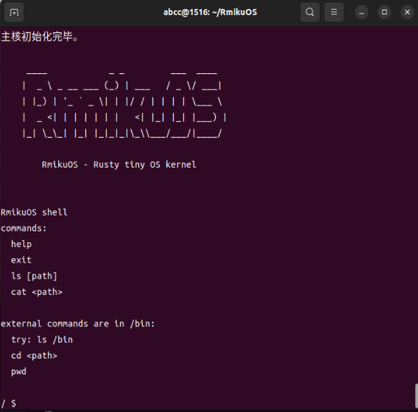
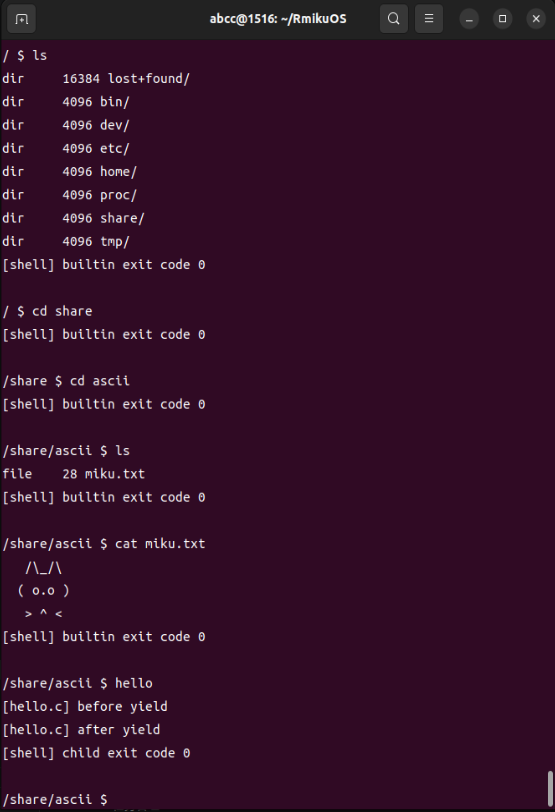
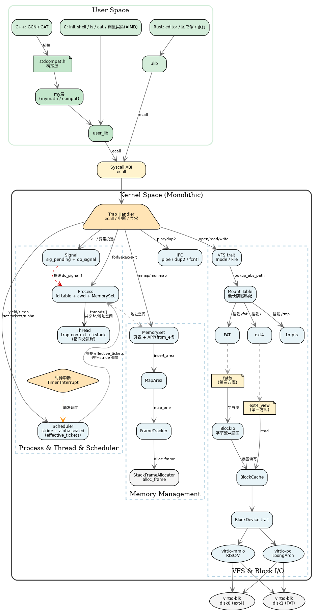
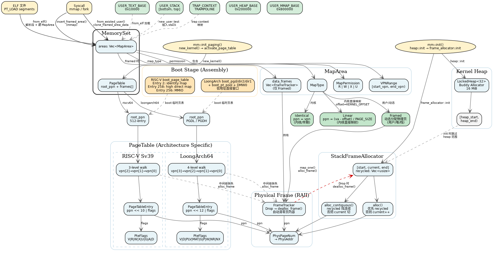
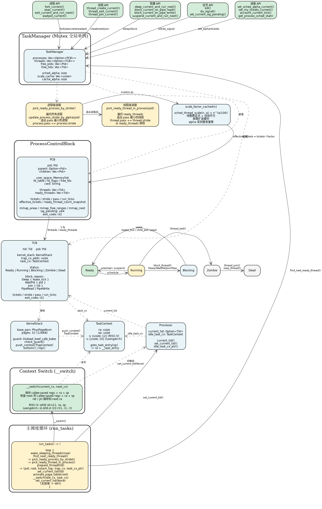
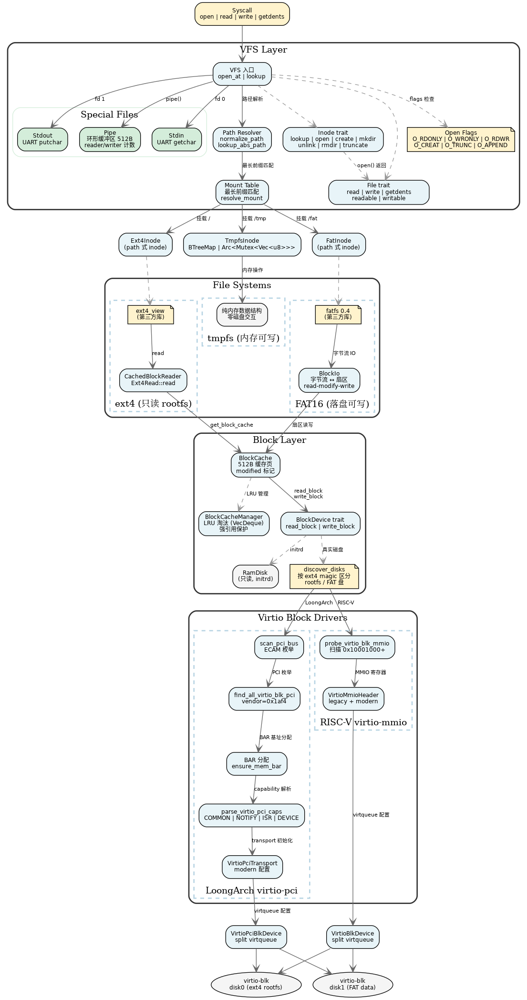
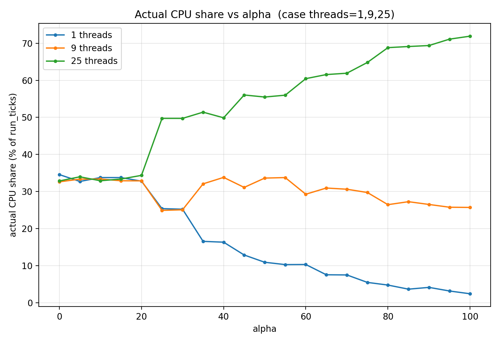
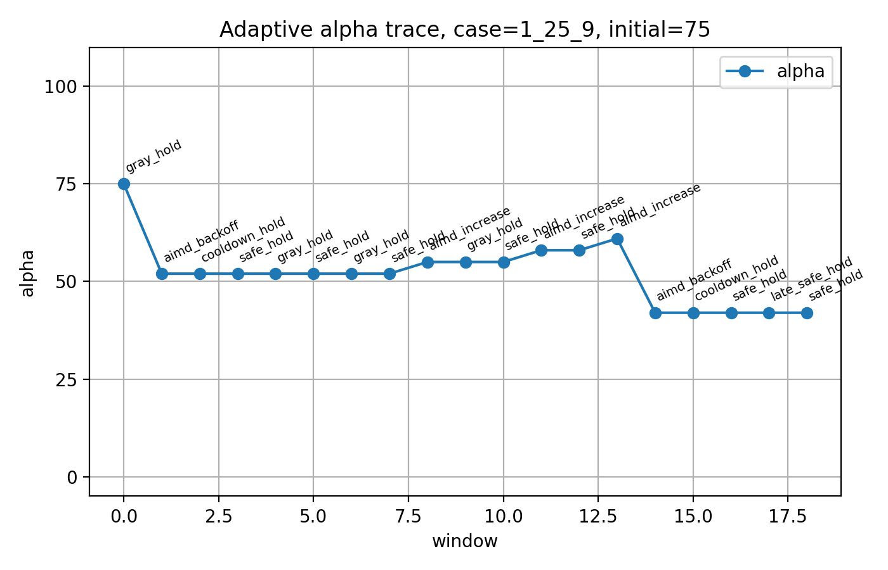
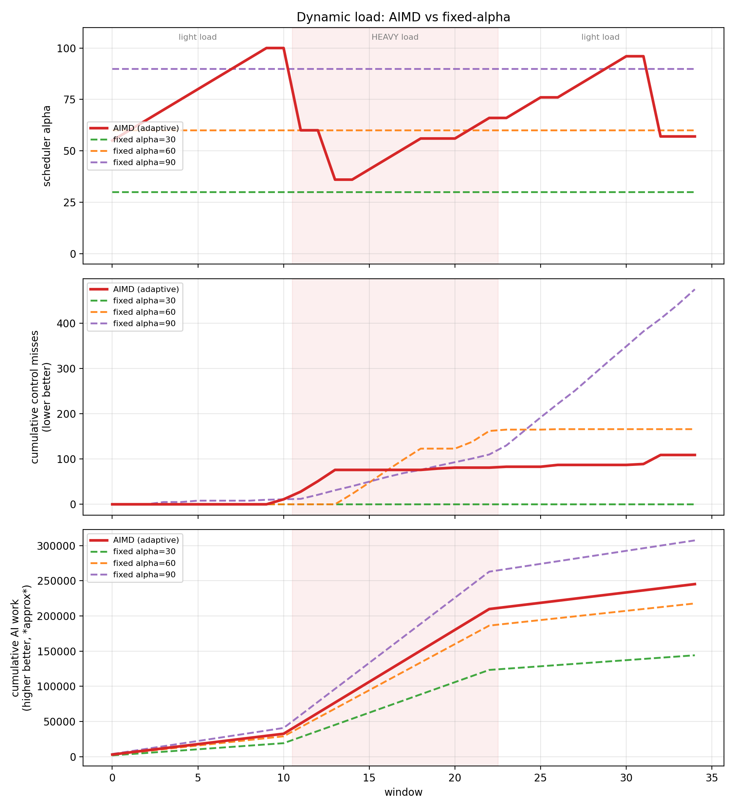
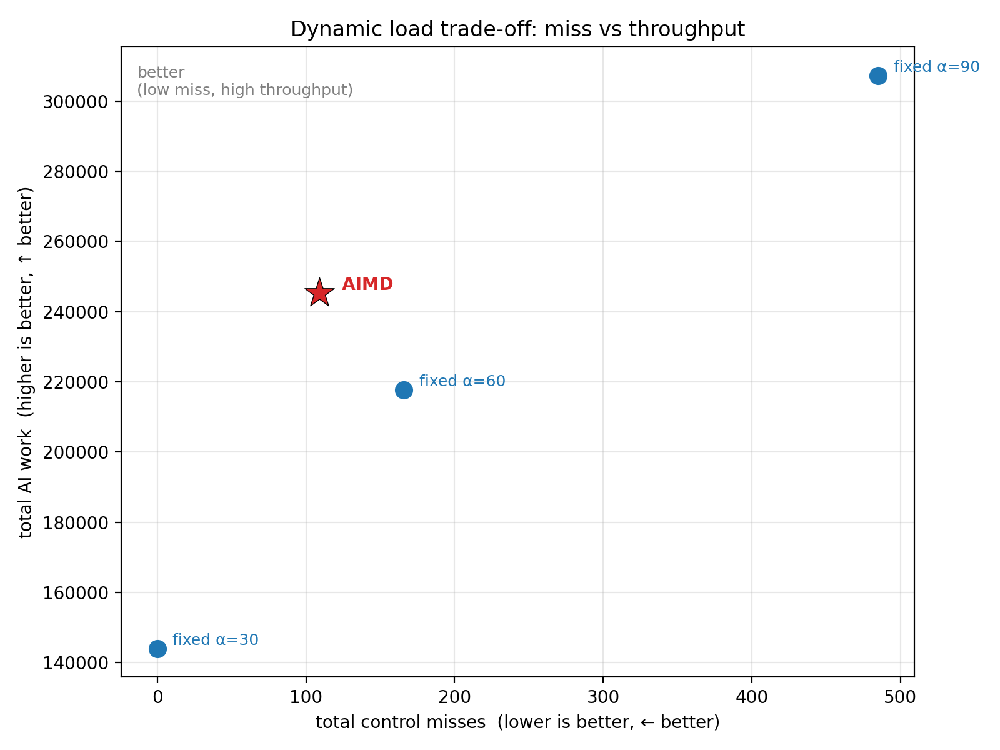

# RmikuOS

RmikuOS 是一个从零实现的教学型操作系统内核，主要用于学习操作系统、体系结构、虚拟化设备、文件系统和调度器设计。

目前 RmikuOS 支持：

* `riscv64`
* `loongarch64`

RmikuOS 是一个从零实现的教学型操作系统内核，支持 **RISC-V 64** 与 **LoongArch 64** 双架构。它可以在 QEMU 上启动用户态 shell，从真实 virtio 块设备加载 ext4 rootfs，并运行 **C / C++ / Rust** 三种语言的用户程序。

当前系统支持：进程与线程、VFS、多文件系统挂载（只读 ext4 + 可写 tmpfs + 落盘 FAT）、virtio 块设备驱动、Unix 风格 open flags、多级管道与重定向、功能完整的 shell、最小通用信号机制、以及一套用于调度器实验的 workload 与自适应调度控制器。

作为验证，独立项目 [VeryEasyGCN](https://github.com/amieon/VeryEasyGCN)（图神经网络）已通过 `stdcompat.h` 桥接层**零改动**移植到 RmikuOS 上运行，真实 Cora 数据集准确率达 **78.3%**。

RmikuOS 不是一个只会打印 `Hello, world` 的玩具内核。它的目标是逐步构建一个小而完整、能运行真实用户程序、能做系统实验的教学型 OS。

```text
 ____            _ _         ___  ____
|  _ \ _ __ ___ (_) | ___   / _ \/ ___|
| |_) | '_ ` _ \| | |/ / | | | | \___ \
|  _ <| | | | | | |   <| |_| |_| |___) |
|_| \_\_| |_| |_|_|_|\_\\___/___/|____/

        RmikuOS
```

---

## Screenshots

### Boot and Shell



### ext4 Rootfs



### Arch Map



### Memory Map



### Process&Thread Map



### File System Map



### Alpha-Scaled Scheduler



### Adaptive Alpha Controller (AIMD)



### Dynamic Load: AIMD vs Fixed Alpha



---

## Features

### Multi-Architecture Support

RmikuOS 目前支持两个 64 位架构：

```text
riscv64
loongarch64
```

两个架构共用大部分内核逻辑，包括：

* 任务管理
* 进程与线程
* 虚拟内存
* 系统调用
* VFS 与多文件系统挂载
* ext4 rootfs / tmpfs / FAT
* block cache
* shell 和用户程序（C / C++ / Rust）
* 调度器与调度实验框架

架构相关部分主要集中在：

* trap handling
* 上下文切换
* 页表切换
* 时钟中断
* QEMU 设备发现
* virtio transport
* 关机（SiFive Test / ACPI GED）

不同架构使用不同的 virtio transport：

```text
riscv64      -> virtio-mmio
loongarch64 -> virtio-pci
```

---

### Process and Thread

RmikuOS 当前支持基础进程管理：

* `fork`
* `exec`
* `waitpid`
* `exit`
* 进程地址空间复制
* 用户程序 ELF 加载
* 用户态参数传递
* 进程级 fd table

同时支持用户态线程：

* `thread_create`
* `thread_exit`
* `thread_join`
* 同进程线程共享地址空间
* 同进程线程共享 fd table
* 每个线程拥有独立 trap context 和 kernel stack

线程机制使得 RmikuOS 可以构造多线程 workload，并进一步研究进程级公平、线程级并行度和 deadline workload 之间的调度关系。

---

### Minimal General-Purpose Signal Delivery

RmikuOS 进一步实现了**进程级信号投递机制**，使内核具备向用户态进程发送异步通知的能力。这不是一个特化的"快捷键处理"（如硬编码检测 Ctrl+C 直接杀进程），而是一套**通用的 sig_pending 位图 + 延迟投递 + 默认行为**的完整框架：

```text
内核侧：
    sig_pending: u64 位图（64 个标准信号槽位）
    sys_kill(pid, sig) -> 设置目标进程位图 -> 唤醒所有线程 -> 调度器重新入队
    
投递点（返回用户态边界）：
    syscall_exit 前检查 -> do_signal()
    trap_return 前检查 -> do_signal()
    
默认行为：
    致命信号（SIGINT/SIGKILL/SIGTERM/SIGABRT/SIGFPE/SIGILL）-> 进程终止
    其他信号 -> 清掉位图，忽略（框架已留好，可扩展 sig_handler）
```

**关键设计：信号在"返回用户态边界"处理，绝不异步中断用户态执行。** 这与 Linux 的 `sigreturn` 语义一致，但实现更极简——没有用户态信号栈、没有 `sa_mask` 嵌套、没有 `sigaltstack`，只保留最核心的"投递 + 默认终止"。

**异常隔离**：用户态程序触发非法指令（`ECODE_INE` / `CAUSE_ILLEGAL_INSTRUCTION`）或浮点异常时，内核不再 panic，而是向该进程投递 `SIGILL` / `SIGFPE`，随后调度器杀死它。这实现了**"用户态错误不炸内核"**的基本隔离，是操作系统与裸机程序的分水岭。

**Shell 交互**：通过 `fcntl(fd, F_SETFL, O_NONBLOCK)` 将 stdin 设为非阻塞，shell 在 `waitpid(WNOHANG)` 轮询期间可检测键盘输入。检测到 `Ctrl+C`（ASCII 0x03）时，shell 通过 `kill(front_pid, SIGINT)` 发送信号，实现前台进程中断。子进程退出后，shell 恢复 stdin 阻塞状态，不影响后续交互。


### VFS and File Descriptors

系统实现了基础 VFS 和 fd table。

当前支持：

* `open`（Unix 风格 flags：`O_RDONLY` / `O_WRONLY` / `O_RDWR` / `O_CREAT` / `O_TRUNC` / `O_APPEND`）
* `close`
* `read`
* `write`
* `getdents`
* `stat`
* `fstat`
* `chdir`
* `getcwd`
* `exec`
* `pipe`
* `dup2`
* `mkdir`
* `create`
* `truncate`
* `unlink`
* `rmdir`
* `remove_recursive`

标准输入输出也通过 fd 统一处理：

```text
fd 0 -> stdin
fd 1 -> stdout
```

读写权限按打开模式强制：只读句柄（`O_RDONLY`）拒绝 `write`，只写句柄（`O_WRONLY`）拒绝 `read`，在 `read` / `write` 系统调用处经 `File::readable / writable` 统一检查。

---

## User Programs and Shell

RmikuOS 从 ext4 rootfs 中加载用户程序，第一个用户进程（init shell）也不依赖内核内置 app table，而是通过 VFS 从 `/bin/shell` 加载。

### Shell 命令

shell 区分**内建命令**（改变 shell 自身状态，必须内建）与**外部命令**（独立程序，可被管道 / 重定向组合）：

```text
内建：  cd  pwd  exit  help  shutdown
        mkdir  touch  rm  rmdir          (增删,内核原子判断类型)
外部：  ls  cat  echo  grep  shell ...    (位于 /bin、/tests、/programs)
```

`ls` / `cat` / `echo` / `grep` 等 IO 工具被实现为**独立的外部程序**而非内建命令，这样它们才能出现在管道与重定向中（管道两端走 `fork + exec`，内建命令无法被 exec）。`cd` / `pwd` / `exit` 则保持内建，因为它们必须修改 shell 进程自身的状态。

示例：

```text
/ $ ls
dir     4096 bin/
dir     4096 tests/
dir     4096 programs/
dir     4096 etc/
...

/ $ cat /etc/motd
Welcome to RmikuOS real ext4 rootfs!

/ $ mkdir /tmp/work
/ $ touch /tmp/work/note
/ $ ls /tmp/work
file    0 note
```

### Command Search Path（命令搜索路径）

外部命令支持在多个目录中搜索，无需输入完整路径——这相当于一个简化的 `PATH`，在`etc/path`文件中写入即可：

```text
/bin/
/tests/
/programs/
```

* `/bin`      系统命令（ls / cat / echo / grep / shell）
* `/tests`    C 与单文件 Rust 测试程序
* `/programs` cargo workspace 构建的 Rust 程序

shell 执行外部命令时按顺序遍历这些目录、逐个尝试 `exec`：由于 `exec` 失败才返回、成功则进程映像被替换，第一个能成功 `exec` 的目录即被采用，全部失败才报 `command not found`。这避免了「先 stat 检查再 exec」的额外系统调用与 TOCTOU 竞态。绝对路径（`/` 开头）则直接 `exec`，不经过搜索。

### Pipe（管道）

RmikuOS 实现了 Unix 匿名管道作为基础 IPC 原语，shell 支持 `|` 管道符。

`pipe()` 创建一对单向 fd：写端写入、读端读出，数据经由内核中一段固定大小的环形字节缓冲区（`PIPE_BUF_SIZE = 512`）传递，先进先出。管道是**字节流**而非消息流，不保留写入边界。

```text
pipe(fd)  ->  fd[0] = 读端, fd[1] = 写端
```

读写两端各实现统一的 `File` trait，因此 `read` / `write` 系统调用无需特殊处理，管道作为一种文件自动被支持。两端共享同一个 `Arc<Mutex<Pipe>>`，核心边界语义：

```text
缓冲空 + 仍有写者   -> 读者阻塞,等写入后被唤醒
缓冲满 + 仍有读者   -> 写者阻塞,等读出后被唤醒
缓冲空 + 写端全关   -> 读者得到 EOF(返回 0)
读端全关           -> 写者得到 EPIPE
```

阻塞复用调度器的 block/wake 机制（`BlockReason::PipeRead / PipeWrite`），唤醒时只标记线程 Ready 并重新入就绪队列，不切换上下文。

**引用计数**：管道的 EOF / EPIPE 依赖一对手动维护的引用计数（`reader_count` / `writer_count`），独立于 `Arc` 自身的引用计数，记录当前存活的读端 / 写端 fd 数量：

```text
make_pipe          -> 各置 1
fork / dup2        -> 复制 fd 时对应计数 +1
close / exec / exit -> 释放 fd 时对应计数 -1,归零则唤醒对端
```

三条 fd 释放路径（`close`、`exec` 时关闭非标准 fd、进程退出）统一经由 `release_file` 减计数并按需唤醒对端，保证任意多进程共享同一管道时计数始终配平。

### Redirection（重定向）

`dup2(oldfd, newfd)` 把 `newfd` 重定向到 `oldfd` 指向的对象，是管道与重定向共同的底层机制。shell 支持输出 `>`、追加 `>>`、输入 `<` 三种重定向，并且**重定向与管道可以自由组合、管道可以多级串联**：

```text
cmd > file        stdout 覆盖写入 file(不存在则创建)
cmd >> file       stdout 追加到 file
cmd < file        stdin 从 file 读取
cmd1 | cmd2 | ... 多级管道
cmd < in | f1 | f2 > out   管道 + 两端重定向自由组合
```

shell 把一行命令分三层处理（与真实 shell 一致）：

```text
1. 按 | 切成若干命令段（引号内的 | 不分段）
2. 每段独立解析自己的重定向（> >> < 是自分隔操作符，紧贴也切，
   引号内不算操作符）；操作符后必须紧跟文件名，否则报语法错误
3. 用 N-1 个管道把 N 段串联，每段的 < / > 覆盖该段的管道方向
```

执行时，shell 为每段 fork 一个子进程，在 `exec` 之前用 `dup2`：非首段的 stdin 接上一段的管道读端，非末段的 stdout 接下一段的管道写端，而该段自己的 `< file` / `> file` 再覆盖对应方向。程序本身只认 fd 0 / 1，无需任何改动即可被重定向或接入任意位置的管道。

```text
/ $ ls | grep bin
dir     4096 bin/

/ $ cat /etc/motd | grep Welcome
Welcome to RmikuOS real ext4 rootfs!

/ $ ls | grep txt | grep test          # 多级管道

/ $ grep root < /tmp/list | grep bin > /tmp/out   # 输入 + 管道 + 输出
/ $ echo log >> /fat/history           # 追加到落盘文件

/ $ pipe_writer | pipe_reader
hello from writer
line2
line3
[reader got EOF]
```

最后一例中 `[reader got EOF]` 是关键：它证明 `pipe_writer` 退出后，所有写端（writer 进程的 + shell 的）都干净关闭、`writer_count` 归零，reader 才收到 EOF——整条 EOF 链由前述引用计数驱动。

畸形语法（操作符后无文件、`>>>`、`><`、`<>`、空命令段）统一报错且整行不执行，不产生副作用。

### Lexing（词法解析）

命令行解析做成一个**原地压缩**的词法分析器，单遍扫描完成引号剥离、转义、注释与分词，且只删字符不增（写指针永不超过读指针，原地安全）：

```text
"..." / '...'   引号剥离；引号内的空格不分词、> < | # 不作特殊解释
                （双引号内处理 \ 转义，单引号内全字面）
\x              转义：反斜杠后的字符按字面保留
#               行内注释：词首的 # 起至行尾忽略
```

因为引号状态在分词、管道切分、重定向解析三处都被一致地跟踪，`echo "a > b | c"` 这类「引号里含操作符」的输入会被正确当作单个字面参数，而不会触发重定向或管道。

---

## Filesystem

RmikuOS 的文件系统建立在一层统一的 VFS 抽象之上：每个文件系统节点实现 `Inode` trait（`lookup` / `open` / `getdents` / `metadata` / `truncate`，以及可写的 `create` / `mkdir` / `unlink` / `rmdir`），每个文件系统实例实现 `FileSystem` trait（提供根 inode）。在此之上，一张**挂载表**把不同文件系统挂到目录树的不同位置，使只读的 ext4、内存可写的 tmpfs、以及落盘可写的 FAT 能在同一棵目录树中共存。

```text
                    路径解析 (lookup_abs_path)
                             │
                             ▼
                      挂载表（最长前缀匹配）
            /              │               \
        "/" → ext4    "/tmp" → tmpfs    "/fat" → FAT
            │              │                 │
     read-only ext4   in-memory CRUD    writable on-disk
     (ext4_view)      (Vec/BTreeMap)    (fatfs + BlockIo)
            │                                │
        Block Cache                    BlockDevice(读/写)
            │                                │
        BlockDevice ─────────────────────────┘
          /        \
   virtio-mmio   virtio-pci
    RISC-V       LoongArch64
```

`open` 接受 Unix 风格的 flags（`O_RDONLY` / `O_WRONLY` / `O_RDWR` / `O_CREAT` / `O_TRUNC` / `O_APPEND`）：访问模式经 `File::readable / writable` 在 `read` / `write` 系统调用处强制（只读句柄拒绝写、只写句柄拒绝读），`O_CREAT` 在内核侧按「拆父目录 + 在父目录 inode 上 `create`」创建文件，`O_TRUNC` 调用 `Inode::truncate` 截断，`O_APPEND` 让写句柄每次写前定位到文件末尾。这套 flags 对所有可写文件系统（tmpfs / FAT）通用。

### Mount Layer（多文件系统挂载）

所有路径访问都汇聚到 `lookup_abs_path` 这一个入口。它先查挂载表，按**最长前缀匹配**选出该路径所属的文件系统及其根 inode，再把挂载点内的相对路径逐级 `lookup` 下去。

```text
/tmp/foo/bar
  → 挂载点 "/tmp" 命中（比 "/" 更长，优先）
  → 交给 tmpfs，相对路径 "foo/bar"
  → tmpfs.root_inode().lookup("foo").lookup("bar")

/fat/note
  → 挂载点 "/fat" 命中
  → 交给 FAT，相对路径 "note"

/etc/motd
  → 仅 "/" 命中（兜底）
  → 交给 ext4，相对路径 "etc/motd"
```

前缀匹配按**路径段**而非裸字符串进行（要求路径恰好等于挂载点，或以「挂载点 + `/`」开头），从而避免 `/tmp` 误匹配到 `/tmpfoo`。挂载机制让「加新文件系统」变成纯粹的扩展：实现 `FileSystem` + `Inode`，在启动时 `mount("/挂载点", fs)` 即可，无需改动路径解析。

挂载点本身需要在父文件系统中存在一个对应的目录作为「挂载坑」（如 ext4 rootfs 中的 `tmp` / `fat` 目录），否则该挂载点虽在挂载表中、却不会出现在 `ls /` 的目录列表里。

### Read-only ext4 Rootfs

根文件系统 `/` 是一个 ext4 镜像，作为只读 rootfs 挂载。ext4 的磁盘格式解析交给第三方 crate `ext4_view`，RmikuOS 只实现其要求的块读取回调（`Ext4Read::read`），把「读到字节」接到自己的块设备与块缓存上；格式解析、目录遍历、inode 查找由 crate 完成。

```text
User Program → Syscall → VFS → ext4 (ext4_view) → BlockCache → BlockDevice
                                                                  ├── RamDisk
                                                                  ├── VirtioMmioBlockDevice (riscv64)
                                                                  └── VirtioPciBlockDevice  (loongarch64)
```

rootfs 由宿主机上的目录模板 `user/rootfs/` 生成，用户程序的编译产物在打包时被复制进镜像。最终镜像大致形如：

```text
/
├── bin/         系统命令(shell, ls, cat, echo, grep ...)
├── tests/       C / 单文件 Rust 测试程序
├── programs/    cargo workspace 构建的 Rust 程序
├── gcn/         C++ 图神经网络程序（GCN / GAT）
├── etc/
│   └── motd
├── home/
├── share/
├── tmp/         tmpfs 挂载点(可写,内存)
├── fat/         FAT 挂载点(可写,落盘)
├── dev/
└── proc/
```

> ext4 经由 `ext4_view` 以**只读**方式访问；运行时的可写存储由挂载在 `/tmp` 的 tmpfs（内存）与挂载在 `/fat` 的 FAT（落盘）提供（见下）。

### Writable tmpfs（可写内存文件系统）

tmpfs 是一个完全活在内存中的可写文件系统，挂载于 `/tmp`，提供完整的 CRUD。文件内容是 `Arc<Mutex<Vec<u8>>>`，目录是 `Arc<Mutex<BTreeMap<String, TmpfsNode>>>`，因此「可写」只是对内存数据结构的增删改，无需触及任何磁盘格式。

支持的操作：

```text
mkdir              创建目录
create (touch)     创建空文件
write / read       文件内容读写(每个打开的 fd 独立 offset,数据共享)
truncate           截断到 0(配合 > 覆盖)
unlink (rm)        删除文件
rmdir              删除空目录
remove_recursive   递归删除(rm -r)
```

几个语义直接由 Rust 的所有权与 `Arc` 机制自然得到：

* **目录树共享**：`lookup` 返回子节点时 clone 的是 `Arc`，多个进程拿到同一文件即操作同一份内存——一端写、另一端可读。
* **递归删除零额外代码**：`remove_recursive` 直接从父目录的 `BTreeMap` 中移除整个子树节点，`Arc` 连锁 drop 自动递归释放整棵子树的内存。
* **unlink 已打开的文件**：删除只是从目录移除「名字」，若仍有进程持有该文件的 `Arc`，内存保留到最后一个 fd 关闭——与 Unix「unlink 一个 open 的文件，数据存活到 close」一致。

写权限的隔离也随之成立：在只读 ext4 路径下（如 `/etc`）执行写操作会被正确拒绝（`Inode` 的写方法默认返回失败，ext4 不重写它们），而 tmpfs 重写为真正的增删。一组端到端测试覆盖了建树、文件读写、`rmdir` 非空目录失败、`unlink` 目录失败、递归删除、删除不存在项失败、以及「ext4 上 mkdir 失败」等用例。

> **关于可写文件系统的设计取舍**：由于 ext4 经 `ext4_view` 只读访问，自实现可写 ext4（分配 inode / 数据块、维护位图与日志）成本极高且收益有限。tmpfs 在内存中提供了「可写文件系统」的全部语义（创建、写入、删除、共享、引用计数释放），落盘可写文件系统（FAT）见下节。

### Writable FAT on Disk（可落盘的 FAT 文件系统）

tmpfs 提供了内存中的完整可写语义，但内容随重启丢失。RmikuOS 进一步接入了 **FAT16** 文件系统，挂载于 `/fat`，运行在一块**独立的 virtio 块设备**上，提供真正落盘、跨重启存活的可写存储。

FAT 的磁盘格式解析交给 vendored 的 `fatfs` crate（0.4，`no_std` + `alloc`，开启 `lfn` 长文件名）。RmikuOS 提供两层适配：

```text
VFS (Inode / File)
      │
  FatFs / FatInode / FatFile      ← 把 fatfs 的借用式 API 适配到 VFS
      │
  BlockIo                          ← 把「字节流」翻译成「扇区读写」
      │  (read-modify-write 处理非对齐写)
  BlockDevice(读写)
```

* **`BlockIo`** 实现 `fatfs` 要求的字节流 IO（`Read` / `Write` / `Seek`）：按字节偏移定位到扇区，非扇区对齐的写入用 read-modify-write（先读整扇区、改其中一段、再写回）。
* **`FatFs` / `FatInode` / `FatFile`** 把 `fatfs` 的借用式 API（`File` / `Dir` 借用 `FileSystem`）适配到 VFS 的 `Inode` / `File`。由于 fatfs 的句柄借用全局 `FileSystem` 对象，无法直接塞进 `'static` 的 VFS 节点，RmikuOS 采用「路径式 inode」：`FatInode` 只存路径，每次操作在持锁块内临时打开 fatfs 句柄、用完即弃，只让纯数据（`Vec` / 元数据 / 返回码）逃出锁作用域。这与 ext4 的设计同构。

支持的操作与 tmpfs 对齐：创建 / 读 / 写 / 截断 / 追加 / 建目录 / 删除 / 递归删除，并经由统一的 open flags 驱动（`>` 覆盖、`>>` 追加、`<` 读取）。写入经 `BlockIo` 落到 virtio 块设备的磁盘镜像，跨重启存活：

```text
/ $ echo "hello fat" > /fat/note
/ $ cat /fat/note
hello fat
   ... 重启 QEMU ...
/ $ cat /fat/note
hello fat
```

> **关于文件名大小写**：FAT 始终大小写不敏感（忽略大小写后同名即同一文件）。开启 LFN 后，新建文件**保留输入时的显示大小写**（`Note.txt` 显示为 `Note.txt`），但匹配仍不区分大小写——这是 FAT 显示名（LFN 项）与匹配名（8.3 短名，规范大写）分离的固有特性，并非 bug。

> **两文件系统对称、上层零改动**：FAT 的整条上层（`BlockIo` / `fatfs` / VFS 适配）完全建立在 `BlockDevice` trait 之上，不含任何架构分支。riscv（virtio-mmio）与 loongarch（virtio-pci）只需各自实现 `BlockDevice` 的读写，FAT 挂载层一份代码两个架构通用——这正是把架构差异收敛到 `BlockDevice` 接缝之下的回报。

---

## Virtio Block Device

RmikuOS 不再只依赖内核内置 ramdisk，而是从 QEMU 挂载的真实磁盘镜像读写数据：只读 ext4 rootfs 从一块盘加载，可写 FAT 落在另一块独立盘上。virtio 块设备驱动同时实现了**读路径与写路径**，并支持发现并初始化**多块**磁盘（按 sector 2 的 ext4 magic 区分 rootfs 盘与 FAT 盘）。

整体路径如下：

```text
User Program
    ↓
Syscall
    ↓
VFS
    ↓
ext4 (只读) / tmpfs (内存) / FAT (落盘)
    ↓
BlockCache
    ↓
BlockDevice (读 + 写)
    ├── RamDisk
    ├── VirtioMmioBlockDevice
    └── VirtioPciBlockDevice
```

#### RISC-V virtio-mmio

在 RISC-V QEMU `virt` 机器上，系统通过 virtio-mmio 扫描 virtio block device。

流程：

```text
扫描 virtio-mmio slot(发现多块盘)
识别 virtio-blk
初始化 legacy virtio-mmio device
配置 virtqueue
提交 block read / write request
按 ext4 magic 区分 rootfs 盘与 FAT 盘
```

#### LoongArch64 virtio-pci

在 LoongArch64 QEMU `virt` 机器上，系统通过 PCI/PCIe 枚举 virtio block device。

流程：

```text
映射 PCI ECAM
枚举 PCI bus/device/function
找到 vendor=0x1af4 的 virtio-blk-pci(可多块)
分配 BAR(多块盘各自分配不重叠的 BAR 地址)
解析 virtio PCI capabilities
初始化 modern virtio-pci device
配置 virtqueue
提交 block read / write request
按 ext4 magic 区分 rootfs 盘与 FAT 盘
```

---

## User Programs in C, C++ and Rust

RmikuOS 的用户程序可以用 **C、C++ 或 Rust** 编写。三者编译成相同格式的静态 ELF、走完全相同的系统调用 ABI（号在 `a7`/`r11`，参数在 `a0..`/`r4..`，触发 `ecall` / `syscall 0`，返回值在 `a0`/`r4`），因此在内核看来完全等价——**支持 C++ 用户程序内核侧零改动**，只是多了一条产出兼容 ELF 的编译流程。

### syscall ABI 是语言无关的

系统调用的本质是「按约定把号和参数放进寄存器，触发陷入指令」。这套约定定义在 ELF + 寄存器层面，与源语言无关：C 用一小段汇编（`syscall_<arch>.S`）实现，C++ 复用同一套汇编，Rust 用 inline asm 实现，三者只要寄存器约定一致，内核 trap handler 取参数的方式就完全相同。这也是为什么加入 C++ 支持不需要改内核——它加载的是 ELF、执行的是机器码、通过寄存器约定交互。

### C 用户库（分层头文件）

C 侧的用户库按依赖层次拆分为一组单一职责的头文件，用户程序只需 `#include "user.h"` 即可获得全部接口：

```text
types.h     基础类型(usize / isize)
syscall.h   系统调用号 + syscall3 / syscall6
flag.h      open flags(O_RDONLY / O_WRONLY / O_RDWR / O_CREAT / O_TRUNC / O_APPEND)
io.h        strlen + read/write + open/close/create + puts/put_char
process.h   exit/fork/waitpid/getpid/yield/sleep + exec
fs.h        dirent/stat + getdents/stat/chdir/getcwd + mkdir/unlink/rmdir
mem.h       PROT_* + mmap/munmap + malloc/free/calloc
lock.h      spinlock / mutex
thread.h    thread_create/exit/join + 栈管理
sched.h     tickets / alpha / sched_proc_stat / get_ticks
ipc.h       pipe / dup2
string.h    trim / copy_str / read_file
fmt.h       parse_int / put_int / put_hex / uprintf
```

### C++ 用户库与 `stdcompat.h` 桥接

RmikuOS 进一步支持 **C++17**，并通过一个零侵入的桥接头文件 `stdcompat.h`，让原本依赖标准库的 C++ 项目几乎**零改动**即可在裸运行时上编译运行。

**设计：`std` 接口桥接到裸实现**

`stdcompat.h` 不实现完整的 ISO C++ 标准库，而是提供一层**兼容接口**：

```text
原代码写 std::vector<T>，实际调用 mv::Vector<T>
原代码写 std::exp(x)，实际调用 mymath::exp(x)
原代码写 std::printf(fmt, ...)，实际调用 uvprintf(fmt, ...)
```

所有桥接通过 `namespace std { using ... }` 和模板特化完成，算法代码本身无需修改。例如：

```cpp
#include "my/stdcompat.h"   // 仅此一行替换
// 以下代码与标准库版本完全一致：
std::vector<float> v;
std::exp(1.0);
std::printf("hello\n");
```

**裸运行时数学库**

`stdcompat.h` 的底层依赖一组从零实现的数学函数（`exp`/`log`/`sqrt`/`pow`/`sin`/`cos`），采用 fdlibm 风格的参数约减 + Remez 优化多项式，**不依赖任何外部 libc**：

- `exp`：双精度全精度，相对误差 `< 1e-15`
- `log`：双精度全精度，相对误差 `< 1e-15`
- `pow`：基于 `exp(log)`，整数指数走快速幂优化

AdamW 优化器中的 `pow(b1, t)` 进一步通过**递推**（`b1t *= b1`）消除每步的幂运算，避免在训练热路径上调用数学库。

**案例：VeryEasyGCN 图神经网络**

作为验证，我将独立项目 [VeryEasyGCN](https://github.com/amieon/VeryEasyGCN)（纯 C++ 实现的 GCN/GAT 图神经网络，含完整反向传播与数值梯度检验）完整移植到 RmikuOS 上运行。

**移植改动量**：仅把 `#include <vector>` 等标准库头文件替换为 `#include "my/stdcompat.h"`，**算法代码零改动**。

**运行示例**（真实 Cora 数据集，2708 节点，1433 特征，7 类）：

```text
/ $ train_cora /gcn/cora.content /gcn/cora.cites
[dataset] Cora: nodes=2708 features=1433 classes=7 nnz=13264 | train=140 val=500 test=1000

optimizer=AdamW lr=0.009999 wd=0.000500 dropout=0.500000
epoch | train_loss | train_acc | val_acc
    0 | 1.945590 | 0.464285 | 0.475999
   20 | 1.750075 | 0.835714 | 0.721999
   40 | 1.289533 | 0.942857 | 0.788000
   60 | 0.794022 | 0.971428 | 0.817999
   80 | 0.469486 | 0.978571 | 0.824000
  100 | 0.333761 | 0.992857 | 0.812000
  120 | 0.228583 | 0.992857 | 0.816000
  140 | 0.179066 | 0.992857 | 0.808000
  160 | 0.138511 | 1.000000 | 0.804000
  180 | 0.115274 | 1.000000 | 0.813999
  199 | 0.085100 | 1.000000 | 0.812000

==> final TEST accuracy = 0.783000
```

**与标准结果对比**：

| 模型 | VeryEasyGCN (标准库) | RmikuOS (裸运行时) | 差距  |
| ---- | -------------------- | ------------------ | ----- |
| GCN  | **78.5%**            | **78.3%**          | 0.2%  |
| GAT  | **76.1%**            | **77.5%**          | -1.4% |

裸运行时的数值精度与 Windows/Linux 标准库版本**逐位一致**，准确率落在同一区间。

**数值精度验证**（`gradcheck`，解析梯度 vs 中心差分，double）：

```text
/ $ gradcheck
gradient check (analytic vs numeric, central diff, double)
  W1  relative error = 2.706e-09, absolute error = 2.019e-10
  W2  relative error = 1.297e-08, absolute error = 2.058e-12
  AS1 relative error = 2.453e-09, absolute error = 2.817e-11
  AS2 relative error = 1.779e-08, absolute error = 7.565e-13
  AD1 relative error = 1.404e-08, absolute error = 1.437e-12
  AD2 relative error = 3.709e-08, absolute error = 8.988e-13
  -> PASS (backward is correct)
  -> PASS (backward is correct)
```

**标准库桥接覆盖**：`std::vector`/`std::string`/`std::unordered_map`/`std::ifstream`/`std::istringstream`/`std::exp`/`std::log`/`std::sqrt`/`std::pow`/`std::mt19937` 全部通过 `stdcompat.h` 桥接到裸运行时实现，算法代码无需任何改动。


### Rust 用户程序

Rust 用户程序以 `#![no_std]` + `#![no_main]` 编写，自定义 `_start` 入口（置于 `.text.entry` 段，匹配链接脚本的加载地址 `0x10000`），并提供 `panic_handler`。RmikuOS 支持两种 Rust 程序形态：

* **单文件 Rust**：自包含的单个 `.rs`（自带 syscall 封装与 `_start`），用 `rustc` 直接编译，适合短小的测试程序，放在 `user/src` / `user/tests`。
* **cargo workspace Rust**：依赖公共库 `ulib` 的程序，通过 `use ulib::...` 正规模块引用，用 `cargo` 构建整个 workspace，适合较大的工程，放在 `user/rust/programs/<crate>`。

公共库 `ulib` 是一个 no_std crate，按模块对应 C 的用户库分层：

```text
ulib::number    系统调用号
ulib::syscall   syscall3 / syscall6(架构分离,inline asm)
ulib::io        read/write/open/close/create/puts
ulib::process   exit/fork/waitpid/getpid/yield/exec
ulib::fs        Stat/DirEntry + stat/getdents/mkdir/unlink/rmdir/chdir/getcwd
ulib::sched     tickets/alpha/SchedProcStat/get_ticks
```

一个使用 `ulib` 的程序长这样：

```rust
#![no_std]
#![no_main]

use ulib::io::puts;
use ulib::process::exit;

#[no_mangle]
#[link_section = ".text.entry"]
pub extern "C" fn _start() -> ! {
    puts("hello from rust ulib\n");
    exit(0);
}

#[panic_handler]
fn panic(_: &core::panic::PanicInfo) -> ! {
    exit(1);
}
```

### 两个架构的链接差异

riscv64 与 loongarch64 在 Rust 程序链接上有一处必须注意的差异：

* **riscv64** 经 `rust-lld` 直接链接，链接器本身不引入 C 运行时，只需链接脚本与 `relocation-model=static`。
* **loongarch64** 经 `loongarch64-unknown-linux-gnu-gcc` 链接，该 gcc 默认引入 `crt1.o` 与 libc，会与 no_std 的自定义 `_start` 冲突（`multiple definition of _start` / 未定义的 `__libc_start_main`），因此需要额外传入 `-nostartfiles -nostdlib` 禁用标准启动文件与标准库。

此外，内核与用户程序在 loongarch 下共用 target triple `loongarch64-unknown-none`，根目录 `.cargo/config.toml` 中给内核设置的链接脚本会经 cargo 的配置层叠继承污染用户程序构建；用户程序构建改用 `RUSTFLAGS` 环境变量传链接参数（覆盖而非追加 config 中的 rustflags）以隔离。

### 统一构建

构建脚本 `user/build.py` 按来源与语言分派编译，一条 `./run.sh <arch>` 即可全部编好并打包进镜像：

```text
来源                          语言/方式            装入
─────────────────────────────────────────────────────
user/src/*.c                  C(系统)              /bin
user/tests/*.c                C(测试)              /tests
user/tests/*.cpp              C++(测试)            /tests
user/tests/*.rs               单文件 Rust(rustc)   /tests
user/rust/programs/*          cargo Rust(ulib)    /programs
user/c/*                      C(gcc)              /programs
user/cpp/*                    C++(g++)            /programs
user/gcn/*.cpp                C++(GCN)            /gcn
```

---

## Scheduler

RmikuOS 实现了基于 stride scheduling 的调度器，并在其上加入了 **alpha-scaled scheduling** 机制，用于在「进程级公平」和「线程级并行度」之间连续调节。alpha 既可以手动固定，也可以由用户态的 **AIMD 自适应控制器**根据 deadline 反馈在运行时动态调整。

### Stride Scheduling

基础 stride 调度器使用 ticket 表达进程权重：

```text
stride = BIG_STRIDE / tickets
```

每次调度选择 `pass` 最小的任务运行，运行后增加对应 stride。这使得调度器在长期运行中近似按照 tickets 比例分配 CPU 时间。

---

### Alpha-Scaled Stride Scheduling

普通进程级 stride 调度只关注进程本身的 tickets。对于多线程进程，这会带来一个问题：

```text
一个单线程 control 进程
一个多线程 AI 进程
一个多线程 logger 进程
```

如果只按照进程 tickets 分配 CPU，多线程进程的并行度无法体现在进程级调度权重中。

RmikuOS 引入 alpha-scaled scheduling：

```text
effective_tickets = base_tickets * scale(ready_threads, alpha)
```

其中缩放因子为：

```text
scale(n, alpha) = n ^ (alpha / 100)
```

即：

```text
alpha = 0   -> n^0 = 1     更接近进程级公平
alpha = 50  -> sqrt(n)     线程数的平方根加权
alpha = 100 -> n^1 = n     完全线程数加权
```

直观理解：

```text
alpha 越小：
    多线程进程不会因为线程多而获得太多额外 CPU。
    更适合 deadline / control workload。

alpha 越大：
    多线程进程会获得更高 effective_tickets。
    更适合 AI、batch、logger 等 throughput workload。
```

alpha 不是一个固定最优参数，而是一个可解释的调度旋钮。

#### Continuous Alpha (连续 alpha)

早期实现中 alpha 只能取离散五档 `{0, 25, 50, 75, 100}`，缩放因子用嵌套整数开方拼出 `n^0.25`、`n^0.75` 等几个点。为了让自适应控制器能停在档位之间的连续甜点上，RmikuOS 把 alpha 推广为 **`[0, 100]` 上的任意整数**：

* `sched_thread_scale(n, alpha)` 用**纯整数定点 + 连续开方**计算 `n^(alpha/100)`，无浮点，no_std 友好；
* 全 alpha 范围**单调不降**，端点精确（`alpha=0 -> 1`、`alpha=100 -> n`），在所有锚点上精度不低于旧的离散实现；
* 由于该函数在调度热路径上被频繁调用（每次 pick 对每个就绪进程都会算一次），内核侧用一张**按需扩容的缓存**保存当前 alpha 下各 `ready_threads` 的因子，alpha 变化时整表重算，其余时间 O(1) 查表。

---

### Scheduler Syscalls

为了进行调度实验，RmikuOS 提供了若干调度相关系统调用：

```text
set_my_tickets(tickets)
set_sched_alpha(alpha)         // alpha ∈ [0, 100]，连续
get_sched_alpha()
get_process_sched_stat(pid, &stat)
reset_sched_stat()
get_ticks()
```

其中 `get_process_sched_stat` 可以观察：

```text
pid
tickets
effective_tickets
ready_threads
run_ticks
stride
pass
```

这些接口使得用户态可以构造 workload、采集调度行为，并实现自适应调度策略。

---

## Scheduler Experiments

RmikuOS 的调度器实验分为四层，逐层递进：

```text
1. Alpha mechanism test          —— 验证机制
2. Edge deadline trade-off test  —— 刻画 trade-off
3. Adaptive alpha controller     —— AIMD 自适应（恒定负载）
4. Dynamic load experiment       —— AIMD vs 固定 alpha（突变负载）
```

实验遵循 **mechanism / policy separation**：

```text
Kernel mechanism:
    alpha-scaled stride scheduling（连续 alpha + 缓存）

Kernel observability:
    调度统计 syscalls（含 deadline / tardiness 原始量）

User-space policy:
    AIMD 自适应 alpha 控制器
```

内核只提供「连续可调的旋钮」和「可观测的统计」，所有控制策略都在用户态实现。

---

### 1. Alpha Mechanism Test

测试程序：`alpha_arg_test`

```text
/ $ alpha_arg_test 50 1 5 7
```

固定每个进程的 base tickets，只改变 alpha 和进程线程数，验证：

```text
effective_tickets 是否随 alpha 和 ready_threads 改变
实际 run_ticks 是否跟随 effective_tickets
```


结论：alpha=0 时多线程进程不会因为线程数更多而获得明显额外 CPU；alpha 增大后，多线程进程的 effective_tickets 上升，实际 tick_share 也随之上升。alpha-scaled scheduling 机制按预期工作。

---

### 2. Edge Deadline Trade-off Test

测试程序：`edge_deadline_arg_test`

```text
/ $ edge_deadline_arg_test 50 1 14 8
```

构造三类 workload：

```text
control:  周期性 deadline workload，关注 jobs / deadline miss / tardiness
AI:       多线程 throughput workload，关注 work counter
logger:   background throughput workload，作为后台干扰负载
```

#### Observability: 从二元 miss 到 tardiness / jitter

除了二元的 deadline miss，control workload 还在用户态自行统计更细的 deadline 质量指标，并以原始整数聚合量的形式打印（平均/标准差等推导留给宿主机的 Python 脚本完成）：

```text
lateness_sum / lateness_max     迟到量（tardiness）：迟了多少，而不只是迟没迟
resp_sum / resp_sumsq           响应时间的和与平方和 -> 均值与标准差（jitter）
resp_min / resp_max             响应时间范围
```

这样即使在 deadline miss 长期为 0 的负载下，响应时间 jitter 仍能反映抢占压力的变化——硬指标看不见的压力，软指标先看见。

结论：alpha 较小时 control 获得较高 CPU share、miss / tardiness 较低，AI throughput 较低；alpha 较大时 AI 的 effective_tickets 上升、work 增加，但 control 在高负载下 miss / tardiness 上升。alpha 因此形成 **deadline safety 与 throughput 之间的 trade-off**。

---

### 3. Adaptive Alpha Controller (AIMD)

测试程序：`adaptive_alpha_test`

```text
/ $ adaptive_alpha_test 50 1 14 8           # adaptive（默认）
/ $ adaptive_alpha_test 50 1 14 8 fixed     # 固定 alpha baseline
```

控制器不把策略硬编码进内核，而是在用户态以 **AIMD（加性增、乘性减）** 消费 control 的 tardiness 信号，在运行时调节连续 alpha：

```text
加性增 (Additive Increase):
    control 连续安全（窗口内无新增迟到）时，alpha += INC，小步向上探测吞吐。

乘性减 (Multiplicative Decrease):
    窗口内出现明显迟到时，按危险程度分档乘性回退（见下）。

滞回带 (Hysteresis):
    在 SAFE 与 DANGER 之间设灰区，单次偶发 miss 不触发调整，抑制抖动。

冷却 (Cooldown):
    刚回退后保留一个观察窗口，避免把上一窗口的 backlog 误判为当前 alpha 不安全。
```

#### 分档乘性退避 (Tiered Backoff)

普通 AIMD 的乘性减是固定比例的，但「轻微超载」和「瞬间全崩」用同样的退避力度并不合理。RmikuOS 让退避量正比于危险程度（按 `miss_per_1000` 分档）：

```text
miss_per_1000 >= 900   ->  alpha *= 0.4   // 几乎全崩，一步逃逸
miss_per_1000 >= 500   ->  alpha *= 0.6   // 重度
否则                    ->  alpha *= 0.8   // 轻度，温和回退
```

「伤得越重退得越狠」显著压缩了负载突变瞬间的损失窗口（见动态负载实验）。

#### 恒定负载下的结论

在恒定负载下，AIMD 在**无需预先知道最优 alpha** 的情况下，自动收敛到接近最优固定策略的工作点，并能停在离散档位够不到的连续甜点（如 alpha=49、77）上。横跨轻、中、重多种负载验证（含未参与调参的负载 case），AIMD 大多达到或超过固定策略：**用与最佳固定 alpha 相当的 deadline 质量，换取更高的吞吐**，即免去人工逐负载试参的过程。


实验说明（5 次重复，已剔除冷启动）：每个策略重复 5 次取均值。首条 AIMD 运行因系统冷启动（缓存未预热）吞吐显著偏低，作为离群样本剔除，统计基于其余样本。修复调度器 pass 跨实验未复位的问题后，数据可复现（各策略 5 次吞吐差异均在 3% 以内）。
结果显示 AIMD 是最均衡的策略，而非在所有维度全面占优：在突变负载下，AIMD 的 control miss（约 1180）仅为 fixed α=60/90（约 5800 / 5260）的五分之一；其吞吐虽低于这两个高 α 固定值，却明显高于唯一 deadline 表现更好的 fixed α=30（约 707k vs 595k）。换言之，没有任何单一固定 α 能同时兼顾低 miss 与不垫底的吞吐，而 AIMD 通过跟随负载在二者间取得了最佳折中。

---

### 4. Dynamic Load Experiment

测试程序：`dynamic_load_exp`

```text
/ $ dynamic_load_exp 50 1 100 16            # adaptive
/ $ dynamic_load_exp 90 1 100 16 fixed      # 固定 alpha baseline
```

恒定负载下「最优 alpha」不变，AIMD 找到甜点后即停，因此只能「贴着」最优固定策略。为了展示自适应的本质价值，该实验在**同一次运行内**让 AI 负载分三段突变：

```text
phase 0 (轻)：仅少量 AI 线程活跃，control 空闲 -> alpha 应爬高抢吞吐
phase 1 (重)：全部 AI 线程活跃，control 受压 -> alpha 应快速退避保 deadline
phase 2 (轻)：AI 退回少量，负载回落       -> alpha 应重新爬高
```

固定 alpha 在变化负载下必然顾此失彼：固定高在 phase 1 害死 control，固定低在 phase 0/2 浪费吞吐。AIMD 则**跟着负载呼吸**——在 phase 0/2 爬高、phase 1 瞬间分档退避。




下表为一组代表性的**早期单次**结果（control=1, ai=100, logger=16，轻→重→轻）。注意：随后改用 5 次重复并剔除冷启动后，各策略的绝对数值有所变化（见上节「恒定负载下的结论」中 1180 / 5800 / 5260 的 5 次重复数据），但「AIMD 兼顾低 miss 与不垫底吞吐」的定性结论一致。

| 策略              | control miss | max tardiness | AI work |
| ----------------- | ------------ | ------------- | ------- |
| fixed α=90        | 502 / 786    | 775           | 324656  |
| fixed α=60        | 154 / 900    | 19            | 209507  |
| fixed α=30        | 0 / 900      | 0             | 137438  |
| **AIMD (自适应)** | **92 / 900** | 94            | 207556  |

结论：与最佳折中固定值 α=60 相比，AIMD 在**吞吐基本持平**（207556 vs 209507）的同时，把 deadline miss **降低约 40%**（154 → 92）。这是固定策略做不到的帕累托改进——因为 AIMD 能在负载突变瞬间按危险程度快速退避，而任何固定 alpha 只能被动挨打。

---

## Build and Run

### RISC-V 64

```bash
./run.sh riscv64 debug      # Debug
./run.sh riscv64 release    # Release
```

RISC-V 使用 QEMU `virt` 机器和 virtio-mmio 块设备。

### LoongArch64

```bash
./run.sh loongarch64 debug      # Debug
./run.sh loongarch64 release    # Release
```

LoongArch64 使用 QEMU `virt` 机器和 virtio-pci 块设备。

> 注：在 QEMU 软件模拟下，loongarch64 的指令翻译与串口 IO 效率低于 riscv64，交互体感更慢；这是仿真环境特性，与内核逻辑无关。日常开发建议以 riscv64 为主，loongarch64 用于跨架构验证。

---

## Source Layout（用户程序与 rootfs 布局）

```text
user/
├── rootfs/                 rootfs 目录模板(etc/motd, home, share, tmp, fat ...)
├── include/                C/C++ 用户库(分层头文件)
│   ├── types.h             基础类型(usize / isize)
│   ├── syscall.h           系统调用号 + syscall3 / syscall6
│   ├── flag.h              open flags(O_RDONLY / O_WRONLY / O_RDWR / O_CREAT / O_TRUNC / O_APPEND)
│   ├── io.h                strlen + read/write + open/close/create + puts/put_char
│   ├── process.h           exit/fork/waitpid/getpid/yield/sleep + exec
│   ├── fs.h                dirent/stat + getdents/stat/chdir/getcwd + mkdir/unlink/rmdir
│   ├── mem.h               PROT_* + mmap/munmap + malloc/free/calloc
│   ├── lock.h              spinlock / mutex
│   ├── thread.h            thread_create/exit/join + 栈管理
│   ├── sched.h             tickets / alpha / sched_proc_stat / get_ticks
│   ├── ipc.h               pipe / dup2
│   ├── string.h            trim / copy_str / read_file
│   ├── fmt.h               parse_int / put_int / put_hex / append_* / str_eq + uprintf
│   ├── user.h              纯汇总入口（#include 全部上述头文件）
│   └── my/                 C++ 桥接层与裸运行时库
│       ├── stdcompat.h     C++ 桥接头文件：std::vector→mv::Vector, std::exp→mymath::exp...
│       ├── cmath.h         裸运行时数学库(exp/log/sqrt/pow/sin/cos)
│       ├── vector.h        裸运行时 Vector<T>
│       ├── string.h        字符串操作 + read_file
│       ├── io.h            系统调用封装(read/write/open/close)
│       ├── random.h        随机数生成器
│       └── compat.h        类型工具 + placement new
├── lib/                    crt0 与 syscall_<arch>.S、cpp_runtime.cpp
├── src/                    C 系统程序 → /bin
│   ├── ls.c                目录列表
│   ├── cat.c               文件内容输出
│   ├── echo.c              回显参数
│   ├── grep.c              文本过滤
│   └── shell.c             交互式 shell（内建命令 + 外部命令执行）
├── tests/                  C / 单文件 Rust / 单文件 C++ 测试程序 → /tests
├── c/                      C 项目型构建目录（每个子文件夹编译为一个 ELF）→ /programs
├── cpp/                    C++ 项目型构建目录（每个子文件夹编译为一个 ELF）→ /programs
├── gcn/                    C++ 图神经网络项目（GCN/GAT）→ /gcn
│   ├── Tensor.h
│   ├── GCNLayer.h
│   ├── GATLayer.h
│   ├── Func.h
│   ├── Optim.h
│   ├── Dataset.h
│   ├── train_cora.cpp
│   ├── train_cora_GTA.cpp
│   ├── gradcheck.cpp
│   └── main.cpp
├── rust/                   cargo workspace
│   ├── ulib/               no_std 公共库 crate
│   └── programs/<crate>/   依赖 ulib 的 Rust 程序 → /programs
└── build.py                统一构建脚本(按来源/语言分派编译)
```

构建产物进入：

```text
user/build/<arch>/
├── bin/          # src/*.c
├── tests/        # tests/*.{c,cpp,rs}
├── programs/     # c/*/, cpp/*/, rust/programs/*
└── gcn/          # gcn/*.cpp
```

随后由 `user/mkfs_ext4.sh` 打包进 ext4 镜像；FAT 盘镜像由同一脚本单独生成（`mkfs.fat -F 16`）。

```text
target/fs-riscv64.img        ext4 rootfs(riscv)
target/fs-loongarch64.img    ext4 rootfs(loongarch)
target/fat-riscv64.img       FAT 数据盘(riscv)
target/fat-loongarch64.img   FAT 数据盘(loongarch)
```

修改 `user/rootfs`、`user/src`、`user/tests`、`user/gcn` 或 `user/rust` 后重新运行 `./run.sh <arch> debug`，即可在系统 shell 中看到新的文件结构与用户程序。

---

## Experiment Workflow

调度器实验通常在 LoongArch64 上运行：

```bash
./run.sh loongarch64 debug
```

进入 RmikuOS shell 后执行：

```text
/ $ alpha_arg_test 50 1 5 7
/ $ edge_deadline_arg_test 50 1 14 8
/ $ adaptive_alpha_test 50 1 25 9
/ $ dynamic_load_exp 50 1 100 16
```

也可以通过宿主机重定向批量输入命令并抓取日志：

```bash
./run.sh loongarch64 debug < logs/adaptive_alpha_cmds.txt 2>&1 \
  | tee logs/adaptive_alpha_raw.log
```

分析脚本将原始日志转换为 CSV 并生成图表：

```bash
# AIMD 轨迹 / 聚合统计 / tardiness / jitter
python3 scripts/plot_adaptive_alpha_log.py \
  logs/adaptive_alpha_raw.log logs/figs_adaptive

# AIMD vs 固定 alpha 的 tardiness-throughput 对照
python3 scripts/plot_aimd_vs_fixed.py \
  logs/adaptive_alpha_raw.log logs/figs_compare

# 动态负载：alpha 轨迹 + 累计 miss 对照
python3 scripts/plot_dynamic_load.py \
  logs/dynamic_raw.log logs/figs_dynamic
```

---

## Current Architecture

```text
                         User Programs (C / C++ / Rust)
                                  │
                                  ▼
                               Syscall
                                  │
        ┌────────────────┬────────┴────────┬────────────────┐
        ▼                ▼                 ▼                ▼
       VFS           Scheduler       Process/Thread       IPC
        │                │                 │           pipe / dup2
        ▼                ▼                 ▼
   Mount Table     alpha-scaled       address space
  /    │    \      stride scheduler    fd table
ext4 tmpfs FAT     (continuous alpha
 │   (mem) (disk)    + AIMD policy)
 ▼          │
Block      BlockDevice(读写)
Cache       │
 │          │
 ▼          ▼
BlockDevice ───┐
 /         \   │
virtio-mmio virtio-pci
 RISC-V     LoongArch64
```

---

## Current Status

已经完成：

* RISC-V 64 / LoongArch64 内核启动
* trap handling、syscall、进程调度
* stride scheduling
* alpha-scaled scheduling（连续 alpha `[0,100]`，纯整数幂 + 热路径缓存）
* 调度统计接口（含 deadline / tardiness / jitter 原始量）
* `fork / exec / waitpid`
* 用户态线程 `thread_create / thread_exit / thread_join`
* 用户态 shell、`argc / argv`、内建与外部命令、命令搜索路径（/bin、/tests、/programs）
* shell 词法解析：引号剥离 / 转义 / 行内注释 / 自分隔操作符 / 畸形语法报错
* fd table、`open / close / read / write`、`stat / fstat`、`getdents`、`cwd / chdir / getcwd`
* Unix 风格 **open flags**（`O_RDONLY/WRONLY/RDWR/CREAT/TRUNC/APPEND`）与读写权限强制
* 管道 `pipe`、`dup2`；shell **多级管道** `|`、重定向 `< > >>`、管道与重定向自由组合
* VFS 多文件系统挂载（最长前缀匹配）
* read-only ext4 rootfs（基于 `ext4_view`）
* 可写 tmpfs（mkdir / create / write / read / truncate / unlink / rmdir / 递归删除，挂载于 `/tmp`）
* 可写 **FAT16** 落盘文件系统（vendored `fatfs` + `BlockIo` 适配，挂载于 `/fat`，跨重启持久化，开启 LFN）
* BlockDevice trait（读 + 写）、RamDisk、BlockCache
* RISC-V virtio-mmio / LoongArch64 virtio-pci block device（读 + 写路径，多盘发现）
* 从 ext4 `/bin/shell` 启动 init shell
* C 用户库（分层头文件）与 Rust 用户库 `ulib`
* Rust 用户程序支持（单文件 rustc + cargo workspace），双架构，syscall ABI 语言无关
* **C++ 用户程序支持**：`stdcompat.h` 桥接层，算法代码零改动移植
* **裸运行时数学库**（`exp`/`log`/`sqrt`/`pow`/`sin`/`cos`），fdlibm 风格，双精度全精度
* **图神经网络 GCN/GAT 在裸运行时上运行**：完整前向/反向传播、AdamW、Dropout、softmax/交叉熵、数值梯度检验（`gradcheck` 1e-8 级 PASS）
* 统一构建脚本 `build.py`（C / C++ / 单文件 Rust / cargo Rust 分派编译）
* 双架构关机（riscv SiFive Test finisher / loongarch ACPI GED）
* alpha mechanism / edge deadline / AIMD 自适应 / 动态负载 四层调度实验

---

## Roadmap

### Network

后续实现 virtio-net，并逐步支持 Ethernet frame / ARP / IPv4 / ICMP / UDP / 简单 socket API。

### Filesystem

* FAT 当前为 FAT16 / 单分区，可扩展 FAT32 与更深的子目录用例
* 探索更通用的块设备写回缓存与 fsync 语义
* 可写文件系统的并发访问（当前 fatfs 单核 + 全局锁）

### Scheduler

* per-process alpha 或调度 class（让 control / AI / logger 各自一档，而非全局单旋钮）
* 更复杂的反馈控制器（如以 tardiness 为误差信号的 PI 控制）
* 更丰富的动态负载模式（多阶段、随机突变）

### C++ Ecosystem

* 扩展 `stdcompat.h` 覆盖更多标准库容器与算法
* 探索更复杂的 C++ 应用移植（如线性代数库、小型游戏引擎）

---

## Project Goal

为了好玩，写RmikuOS的时候，挺开心的

