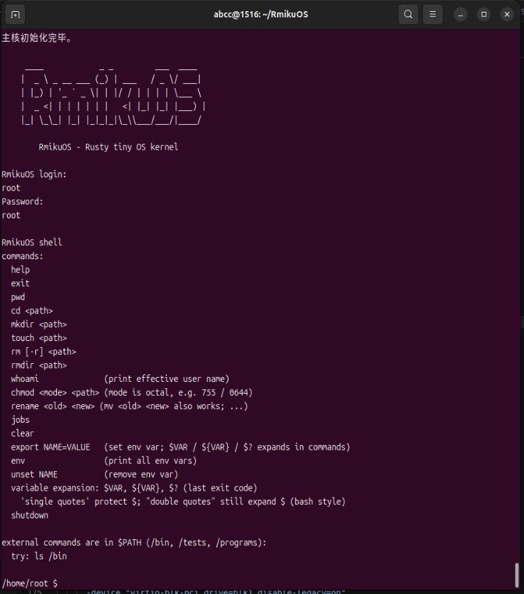
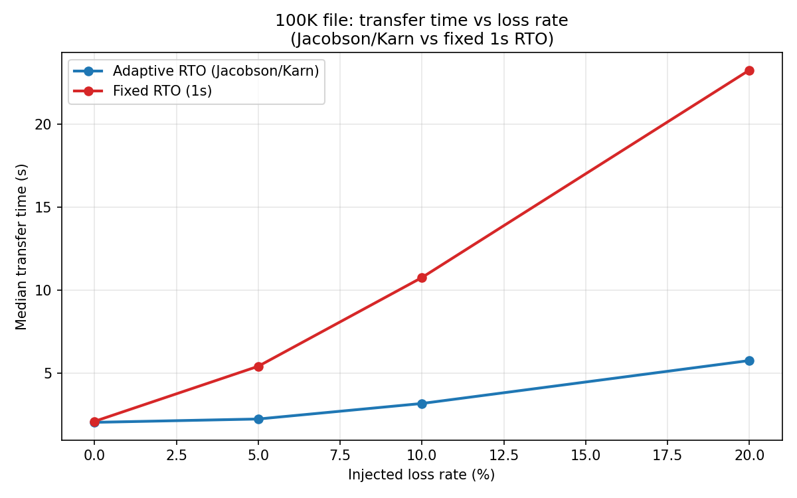
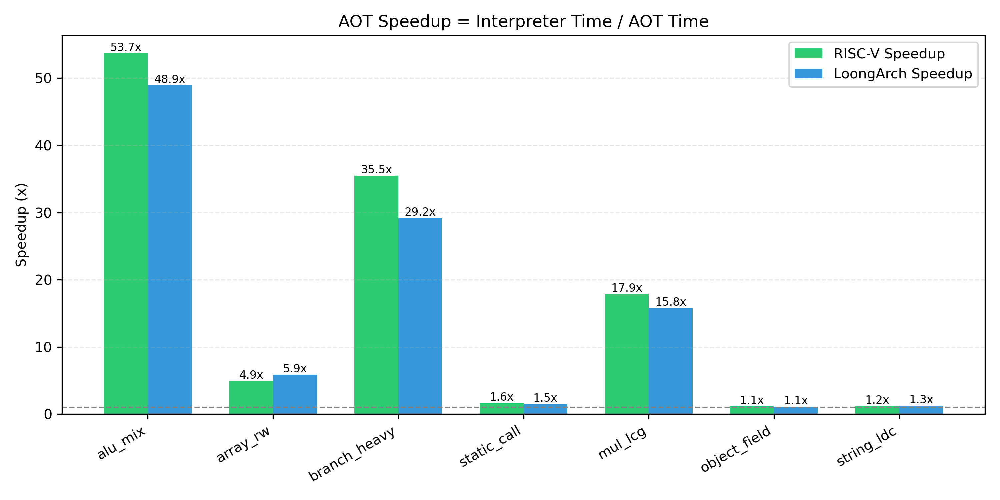

# RmikuOS

[](https://github.com/amieon/RmikuOS/actions/workflows/ci.yml) [](https://opensource.org/licenses/MIT)

RmikuOS 是一个从零实现的教学型操作系统内核，支持 **RISC-V 64** 与 **LoongArch 64** 双架构。它可以在 QEMU 上启动用户态 shell，从真实 virtio 块设备加载 ext4 rootfs，并运行 **C / C++ / Rust / Java / Lua / Scheme** 六种语言的用户程序，内置 **TCC（Tiny C Compiler）** 可在系统内现场编译并运行 C 程序（AOT + JIT 双模式），配备 **kilo 全屏编辑器**（ANSI 终端、语法高亮）——编辑、编译、运行完整闭环，还内置 **SQLite 3.50 交互式数据库**（自定义 VFS 落盘，数据可持久化到 FAT 磁盘），并通过 TCP/IP 协议栈向宿主机浏览器提供真实的 HTTP 服务。

RmikuOS 的目标不是停留在 `Hello, world`，而是逐步构建一个小而完整、能运行真实用户程序、能承载系统实验的教学型 OS。作为验证，独立项目 [VeryEasyGCN](https://github.com/amieon/VeryEasyGCN) 已通过 `stdcompat.h` 桥接层移植到 RmikuOS 上运行，并在真实 Cora 数据集上达到 **78.3%** 测试准确率。

```text
 ____            _ _         ___  ____
|  _ \ _ __ ___ (_) | ___   / _ \/ ___|
| |_) | '_ ` _ \| | |/ / | | | | \___ \
|  _ <| | | | | | |   <| |_| |_| |___) |
|_| \_\_| |_| |_|_|_|\_\\___/___/|____/

        RmikuOS
```

---

## Screenshots



*Boot and Shell*



*TCP: Jacobson/Karn vs Fixed RTO（丢包率扫描）*



*JVM: 装载期 AOT*

---

## 功能总览

| 子系统 | 能力 | 备注 |
|--------|------|------|
| 双架构 | RISC-V 64 + LoongArch 64,SMP 多核 | virtio-mmio / virtio-pci |
| 进程与线程 | `fork` / `exec` / `waitpid`、`thread_create` / `thread_exit` / `thread_join` | 进程级 fd table,线程共享地址空间 |
| 信号 | 通用 `sig_pending` 位图 + 延迟投递 | 用户态 SIGILL/SIGFPE 不炸内核,shell Ctrl+C |
| 虚拟内存 | buddy 帧分配器、多级页表、ELF 加载、mmap | |
| 文件系统 | VFS 多挂载:ext4 rootfs / tmpfs / FAT16(落盘) | `lseek` / `ftruncate` / `fsync` / `rename`(号段 64–68) |
| 调度器 | stride + alpha-scaled + AIMD / SPSA-AdamW 自适应 | 内置调度实验框架(exp00–exp06,见 docs) |
| 网络 | 自研 TCP/IP:Ethernet / ARP / IPv4 / UDP / TCP / DHCP / ICMP | TCP 11 态 + Jacobson/Karn RTO + 用户态 httpd |
| 用户程序 | C / C++ / Rust / Java(JVM + 装载期 AOT)/ Lua 5.4 / Scheme | syscall ABI 语言无关 |
| 系统内工具链 | TCC 0.9.28(AOT + JIT)、SQLite 3.50(自定义 VFS 落盘)、kilo 编辑器 | 编辑-编译-运行闭环 |
| 应用验证 | VeryEasyGCN(78.3% 准确率)、RmikuRay(定点光线追踪)、GCN/GAT | |

---

## 文档索引

主 README 只保留门面与索引,深度内容按主题拆到 `docs/`:

| 文档 | 内容 |
|------|------|
| [docs/shell.md](docs/shell.md) | Shell 词法 / 管道 / 重定向 / 环境变量 / `$?` 展开,TCC 自托管工具链,kilo 编辑器 |
| [docs/filesystem.md](docs/filesystem.md) | VFS 与 fd table,ext4 / tmpfs / FAT16,文件系统调用 64–68,virtio 块设备 |
| [docs/network.md](docs/network.md) | 自研协议栈(ARP / IPv4 / TCP / UDP / DHCP / ICMP / NTP),socket 100–109,httpd,wget;TCP RTO / CUBIC / Go-Back-N 三组网络实验 |
| [docs/user-programs.md](docs/user-programs.md) | C 分层库 / C++ `stdcompat.h` 桥接 / Rust `ulib` / 自研 JVM / Lua 5.4 / Scheme,堆分配器与裸运行时数学库 |
| [docs/scheduler.md](docs/scheduler.md) | stride 与 alpha-scaled 调度机制,调度统计接口,SMP 与计时注意事项 |
| [docs/experiments/](docs/experiments/) | 调度实验框架(schedlab)+ 7 篇完整实验报告:EDF 基线 / α 机制 / Edge Deadline / AIMD / 动态负载 / 相位 / SPSA-AdamW |

---

## CI/CD 持续集成

每次提交后,GitHub Actions 自动验证双架构(手动触发,可选架构):

```text
双架构交叉编译 -> rootfs 制作 -> QEMU 启动 -> 自动登录 -> 36 项回归测试 -> 检查汇总 -> shutdown 关机
```

* 流水线文件:`.github/workflows/ci.yml`,冒烟脚本:`scripts/smoke_test.sh`
* 触发方式:仓库 **Actions** 页 → 左侧 **CI/CD** → 右侧 **Run workflow**,选择 `riscv64` / `loongarch64` / `both`
* 构建产物(内核 ELF + rootfs + FAT 镜像)自动缓存,二次运行大幅提速
* 回归测试:进系统后 `run_all` 一键执行 36 个测试(断言库 `user/include/test.h`,覆盖进程/线程/内存/文件系统/管道/syscall/SQLite 落盘/数学库/printf/setjmp/C++ 容器/语言运行时),任一失败即流水线红
* 打 `v` 开头的标签(如 `v1.0`)时,自动构建双架构 release 产物并上传 GitHub Release

---

## 环境搭建

### Docker(推荐)

```bash
docker build -t rmikuos-dev .
docker run -it --rm -v $(pwd):/work -p 8080:8080 rmikuos-dev
```

> 构建默认使用本地 cross-tools/ 目录中的 loongarch64 工具链。
> 没有的话,先从 loong64/cross-tools releases(https://github.com/loong64/cross-tools/releases)下载 x86_64 宿主版,解压后将 loongarch64-unknown-linux-gnu 里的内容移至 ./cross-tools。

### 无 Docker

```bash
bash first_run.sh   # 自动装 apt/rustup/工具链
```

之后这样就行:

```bash
./run.sh riscv64
./run.sh loongarch64
```

---

## Build and Run

### RISC-V 64

```bash
./run.sh riscv64 debug      # Debug
./run.sh riscv64 release    # Release
```

RISC-V 使用 QEMU `virt` 机器和 virtio-mmio 块设备。

### LoongArch64

```bash
./run.sh loongarch64 debug      # Debug
./run.sh loongarch64 release    # Release
```

LoongArch64 使用 QEMU `virt` 机器和 virtio-pci 块设备。

> 注:在 QEMU 软件模拟下,loongarch64 的指令翻译、串口 IO 与多 vCPU 执行效率可能明显低于 riscv64;日常开发建议以 riscv64 为主,loongarch64 用于跨架构正确性验证。

---

## Source Layout(用户程序与 rootfs 布局)

```text
user/
├── rootfs/                 rootfs 目录模板(etc/motd, home, share, tmp, fat ...)
├── include/                C/C++ 用户库(分层头文件,types/syscall/flag/io/process/fs/mem/lock/thread/sched/ipc/net/string/fmt/env + user.h 汇总)
│   └── my/                 C++ 桥接层与裸运行时库(stdcompat.h / cmath.h / vector.h ...)
├── lib/                    crt0 与 syscall_<arch>.S、cpp_runtime.cpp
├── src/                    C 系统程序 → /bin(ls / cat / echo / grep / shell)
├── tests/                  C / 单文件 Rust / 单文件 C++ 测试程序 → /tests
├── c/                      C 项目型构建目录(多文件工程 httpd、lua)→ /programs
├── cpp/                    C++ 项目型构建目录(装载期 AOT 的 JVM)→ /programs
├── gcn/                    C++ 图神经网络项目(GCN/GAT)→ /gcn
├── java/                   Java 程序源码(.java → .class)→ /jvm
├── rust/                   cargo workspace(ulib no_std 公共库 + programs)
└── build.py                统一构建脚本(按来源/语言分派编译)
```

构建产物进入 `user/build/<arch>/`(bin / samples / programs / gcn),由 `user/mkfs_ext4.sh` 打包进 ext4 镜像,FAT 盘镜像由同一脚本生成(`mkfs.fat -F 16`):

```text
target/fs-riscv64.img        ext4 rootfs(riscv)
target/fs-loongarch64.img    ext4 rootfs(loongarch)
target/fat-riscv64.img       FAT 数据盘(riscv)
target/fat-loongarch64.img   FAT 数据盘(loongarch)
```

修改 `user/rootfs`、`user/src`、`user/tests`、`user/gcn` 或 `user/rust` 后重新运行 `./run.sh <arch> debug`,即可在系统 shell 中看到新的文件结构与用户程序。

---

## Current Architecture

```text
                         User Programs (C / C++ / Rust / Java / lua)
                                  │
                                  ▼
                               Syscall
                                  │
        ┌────────────────┬────────┴────────┬────────────────┐
        ▼                ▼                 ▼                ▼
       VFS           Scheduler       Process/Thread       IPC
        │                │                 │           pipe / dup2
        ▼                ▼                 ▼
   Mount Table     alpha-scaled       address space
  /    │    \      stride scheduler    fd table
ext4 tmpfs FAT     (continuous alpha
 │   (mem) (disk)    + AIMD policy)
 ▼          │
Block      BlockDevice(读写)
Cache       │
 │          │
 ▼          ▼
BlockDevice ───┐
 /         \   │
virtio-mmio virtio-pci
 RISC-V     LoongArch64
```

网络子系统与文件系统并列,挂在同一棵调用树下,并与块设备共享 virtio transport:

```text
User Programs (httpd / udp_test / tcp_test)
                │  socket syscalls(100–109 专用号段)
                ▼
            Socket 层(UDP / TCP 统一 socket table)
                │
        TCP(状态机/滑窗/Jacobson-Karn RTO)   UDP   ICMP
                │
        IPv4  ·  DHCP(自动配置地址)
                │
        ARP(缓存 + 挂起队列)
                │
        Ethernet → virtio-net 驱动
                │
        virtio-mmio(riscv64)/ virtio-pci(loongarch64)
```

---

## Current Status

已经完成:

* **内核基础**:双架构启动 / trap / syscall / 进程线程 / 信号投递与用户态隔离 / buddy 帧分配器 / SMP 多核(per-hart timer、IPI reschedule、TLB shootdown)
* **调度器**:stride scheduling + alpha-scaled(连续 alpha `[0,100]`,纯整数幂)+ AIMD / SPSA-AdamW 自适应策略,完整调度实验框架与 7 篇实验报告(见 [docs/experiments/](docs/experiments/))
* **文件系统**:VFS 多挂载 / ext4 rootfs / 可写 tmpfs / 可落盘 FAT16(跨重启持久化)/ 管道与重定向 / 环境变量(`$VAR` / `${VAR}` / `$?` 展开)/ 文件定位裁剪刷盘改名(号段 64–68)
* **网络**:自研 TCP/IP 协议栈(Ethernet / ARP / IPv4 / UDP / TCP / DHCP / ICMP)、socket 100–109、用户态 httpd(宿主机浏览器访问)、TFTP / NTP / wget、TCP Jacobson/Karn 自适应 RTO(100K 丢包实验提速 2.4–4.0×)
* **语言与工具链**:C 分层库 + Rust `ulib` + C++ `stdcompat.h` 桥接 + 自研 JVM(装载期 AOT,双架构后端)+ Lua 5.4 零改动 + Scheme;系统内 TCC(AOT + JIT)、SQLite 3.50(自定义 VFS 落盘)、kilo 编辑器
* **验证**:36 项 CI 回归测试、VeryEasyGCN 78.3%、RmikuRay 定点光追、GCN/GAT gradcheck 1e-8 级 PASS

---

## Roadmap

### Network

* RTO 实验补强:交错（interleaved）重复尺寸扫描,消除跨 session 漂移图中的「版本–顺序」混杂
* socket 表扩容与 SYN 队列(当前 8 槽 + TIME_WAIT 10s,快速连发时 SYN 被静默丢弃)
* DHCP 租约续期(T1 / T2)
* socket fd 与文件 fd 的统一 fd 表
* 并发 httpd:每连接一个用户态线程(`thread_create` 已就位)

### Filesystem

* FAT 当前为 FAT16 / 单分区,可扩展 FAT32 与更深的子目录用例
* 更通用的**块设备写回缓存**(延迟写 + 脏页回收),统一各后端持久化语义
* 可写文件系统的并发访问(当前 fatfs 单核 + 全局锁)

### Scheduler

* per-process alpha 或调度 class(让 control / AI / logger 各自一档,而非全局单旋钮)
* 更复杂的反馈控制器(如以 tardiness 为误差信号的 PI 控制)
* 更丰富的动态负载模式(多阶段、随机突变)

### C++ Ecosystem

* 扩展 `stdcompat.h` 覆盖更多标准库容器与算法
* 探索更复杂的 C++ 应用移植(如线性代数库、小型游戏引擎)

---

## Project Goal

为了好玩,写 RmikuOS 的时候,挺开心的
