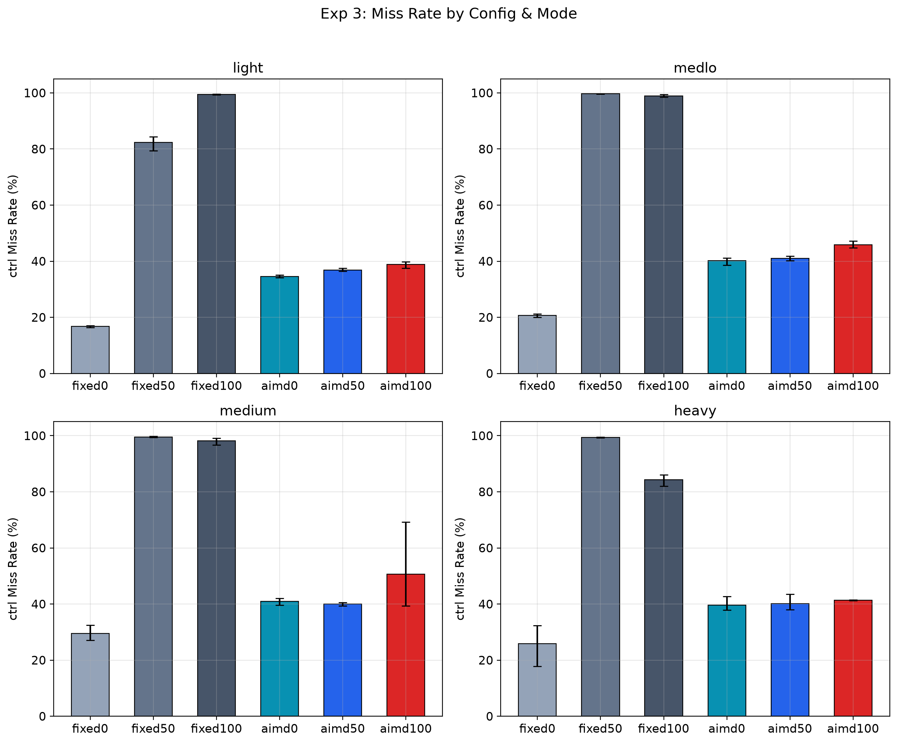
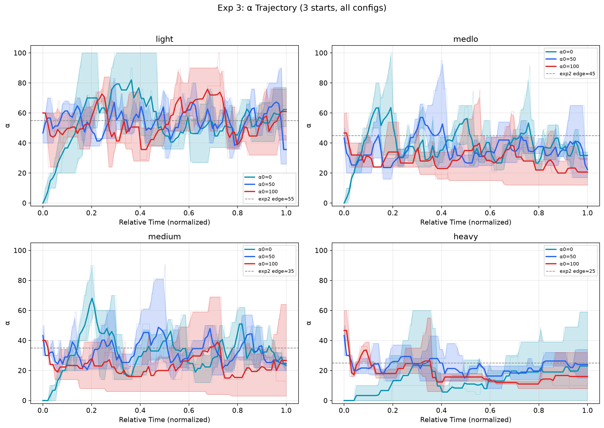
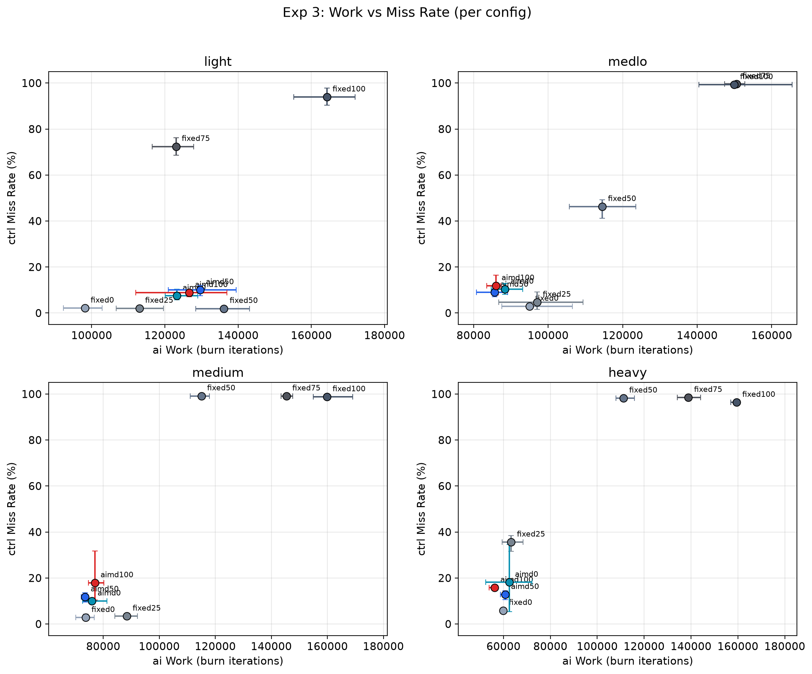

<!-- 本文档由 RmikuOS README 拆分而来,内容为原文摘录 -->
[← 返回 RmikuOS 主页](../../README.md)

---

# 03 · AIMD 恒定负载自适应

## 目的

验证 AIMD 控制器在恒定负载下的行为：
1. **三起点收敛**：AIMD 从 α0=0/50/100 是否收敛到同一条稳态线
2. **不崩特性**：AIMD 是否在所有负载下 miss 保持低位（不像 fixed50+ 在重负载崩到 80-99%）
3. **edge 验证**：fixed 扫描 0/25/50/75/100，miss 急剧上升点是否匹配 exp2 edge
4. **vs fixed 基线**：AIMD 相比固定 α 的优劣，定位 AIMD 的价值场景

## 配置

| 任务 | tickets | 线程 | 类型 | period | burn | 备注 |
|------|---------|------|------|--------|------|------|
| ctrl | 300 | 1 | in-parent jobs | 5 | 180,000 | deadline 任务，D 行反馈 |
| ai | 100 | 变 | spin (fork) | — | 12,000 | 抢占负载 |
| log | 50 | 变 | spin (fork) | — | 12,000 | 后台负载 |

4 个压力等级：

| 配置 | ai 线程 | log 线程 | exp2 edge α |
|------|--------|---------|------------|
| light | 7 | 3 | ~55 |
| medlo | 15 | 8 | ~45 |
| medium | 25 | 9 | ~35 |
| heavy | 75 | 25 | ~25 |

- 平台：riscv64 (QEMU), SMP=1, 1 tick = 13.98 ms
- total = 24000 ticks/trial, window = 100 ticks (~240 windows/trial)
- 每配置：fixed(0/25/50/75/100) × 3 reps + AIMD α0=0/50/100 × 3 reps = 24 trials
- 总计：4 configs × 24 = **96 trials**
- **AIMD 参数**：INC=5（sl_aimd_init 默认值，代码改 inc=1 但未 save all，实际跑的是 inc=5）, BACKOFF=80%, safe_lateness=0, danger_lateness=25, cooldown=1

> **INC 实际值说明**：源码 `sl_aimd_init` 里写了 `a->inc = 1`，但编译时 schedlab.h 没保存（用户忘记 save all），实际跑的二进制 inc=5（旧默认值）。diag_alpha_traj 验证：after 值 `0→5→10→15→...→60`，每次 up 跳 5，实锤 inc=5。inc=1 数据待重跑。

## 运行

```bash
/ $ ./sched/sexp3_aimd > /tmp/sexp3_aimd.csv
python3 ./scripts/sched/stat_exp3.py ./logs/sched/aimd/sexp3_aimd.csv
```

## 实测结果（2026-07-31，96 runs）

### 汇总表

误差为非对称 +hi/-lo（3 reps 的 max-mean / mean-min）。

| config | mode | α0 | miss% | α_steady | sh_ai | ai_work | Jain |
|--------|------|----|-------|----------|-------|---------|------|
| heavy | fixed0 | 0 | 0.9 +0.4/-0.2 | 0 | 57.3 | 12742 | 0.855 |
| heavy | fixed25 | 25 | 4.6 +1.8/-1.0 | 25 | 57.5 | 12830 | 0.852 |
| heavy | fixed50 | 50 | 79.1 +0.9/-1.1 | 50 | 67.2 | 15552 | 0.826 |
| heavy | fixed75 | 75 | 98.7 +0.6/-1.1 | 75 | 76.0 | 17638 | 0.831 |
| heavy | fixed100 | 100 | 99.4 +0.1/-0.1 | 100 | 82.7 | 19213 | 0.750 |
| heavy | aimd0 | 0 | 12.1 +2.0/-2.2 | 25.4 +8.6/-10.4 | 61.0 | 13560 | 0.848 |
| heavy | aimd50 | 50 | 15.2 +2.2/-1.7 | 24.4 +5.6/-9.4 | 61.2 | 13614 | 0.846 |
| heavy | aimd100 | 100 | 11.7 +2.1/-2.3 | 24.7 +10.3/-9.7 | 63.9 | 14334 | 0.842 |
| medlo | fixed0 | 0 | 1.6 +1.6/-0.9 | 0 | 55.2 | 12629 | 0.855 |
| medlo | fixed25 | 25 | 1.5 +1.6/-1.0 | 25 | 54.8 | 12457 | 0.882 |
| medlo | fixed50 | 50 | 20.6 +7.3/-4.9 | 50 | 60.5 | 13935 | 0.851 |
| medlo | fixed75 | 75 | 62.3 +2.1/-1.8 | 75 | 70.1 | 16400 | 0.787 |
| medlo | fixed100 | 100 | 91.2 +2.3/-1.4 | 100 | 71.6 | 16834 | 0.760 |
| medlo | aimd0 | 0 | 16.0 +2.9/-2.7 | 39.8 +5.2/-7.8 | 62.3 | 14397 | 0.843 |
| medlo | aimd50 | 50 | 11.6 +2.5/-1.3 | 42.5 +12.5/-12.5 | 64.1 | 14825 | 0.846 |
| medlo | aimd100 | 100 | 12.8 +1.9/-3.8 | 39.5 +10.5/-15.5 | 61.2 | 14052 | 0.843 |
| medium | fixed0 | 0 | 1.1 +0.9/-0.6 | 0 | 58.2 | 13306 | 0.854 |
| medium | fixed25 | 25 | 1.1 +1.1/-0.7 | 25 | 69.6 | 15900 | 0.793 |
| medium | fixed50 | 50 | 53.0 +6.1/-11.7 | 50 | 70.6 | 16457 | 0.766 |
| medium | fixed75 | 75 | 85.4 +0.7/-0.9 | 75 | 74.3 | 17448 | 0.783 |
| medium | fixed100 | 100 | 95.7 +0.7/-0.9 | 100 | 78.5 | 18451 | 0.772 |
| medium | aimd0 | 0 | 17.2 +5.7/-7.4 | 35.0 +4.0/-14.0 | 65.3 | 15098 | 0.848 |
| medium | aimd50 | 50 | 14.0 +3.0/-3.8 | 34.4 +3.6/-6.4 | 63.8 | 14637 | 0.845 |
| medium | aimd100 | 100 | 16.2 +3.4/-1.8 | 34.0 +9.0/-8.0 | 62.8 | 14179 | 0.835 |
| light | fixed0 | 0 | 0.6 +0.3/-0.4 | 0 | 62.5 | 14640 | 0.856 |
| light | fixed25 | 25 | 0.5 +0.5/-0.2 | 25 | 62.4 | 14585 | 0.856 |
| light | fixed50 | 50 | 1.0 +1.4/-0.7 | 50 | 75.1 | 17574 | 0.701 |
| light | fixed75 | 75 | 37.8 +6.7/-11.6 | 75 | 75.4 | 17720 | 0.807 |
| light | fixed100 | 100 | 68.3 +3.3/-2.1 | 100 | 71.2 | 16708 | 0.751 |
| light | aimd0 | 0 | 9.4 +4.7/-2.9 | 60.3 +15.7/-24.3 | 72.1 | 16822 | 0.758 |
| light | aimd50 | 50 | 14.5 +0.8/-0.8 | 55.2 +5.8/-21.2 | 71.7 | 16631 | 0.708 |
| light | aimd100 | 100 | 15.0 +0.5/-0.4 | 57.2 +2.8/-11.2 | 80.6 | 18868 | 0.702 |

### 三起点收敛

| 配置 | exp2 edge | aimd0 α_steady | aimd50 α_steady | aimd100 α_steady | 三起点收敛 | 匹配 edge? |
|------|----------|---------------|----------------|-----------------|-----------|-----------|
| light | ~55 | 60.3 | 55.2 | 57.2 | ✅ ~57 | 略超（+2） |
| medlo | ~45 | 39.8 | 42.5 | 39.5 | ✅ ~40 | 略低（-5） |
| medium | ~35 | 35.0 | 34.4 | 34.0 | ✅ ~34 | ✅ 匹配 |
| heavy | ~25 | 25.4 | 24.4 | 24.7 | ✅ ~25 | ✅ 匹配 |

**三个起点收敛到同一条稳态线**，α_steady 基本贴合 exp2 edge（medium/heavy 精准，light/medlo 偏差 ±5）。注：本数据 inc=5（见上说明），inc=1 数据待重跑。

### fixed 扫描 & edge 验证

fixed 五点扫描的 miss% 急剧上升区间，验证 exp2 edge 定位：

| 配置 | f0 | f25 | f50 | f75 | f100 | miss 跳变区间 | edge 定位 |
|------|----|-----|-----|-----|------|-------------|----------|
| light | 0.6 | 0.5 | 1.0 | 37.8 | 68.3 | 50→75 | ~55 ✅ |
| medlo | 1.6 | 1.5 | 20.6 | 62.3 | 91.2 | 25→50 | ~45 ✅ |
| medium | 1.1 | 1.1 | 53.0 | 85.4 | 95.7 | 25→50 | ~35 ✅ |
| heavy | 0.9 | 4.6 | 79.1 | 98.7 | 99.4 | 25→50 | ~25 ✅ |

fixed 扫描独立验证了 exp2 的 edge：负载越重，edge 越左移（light edge~55，heavy edge~25）。

### AIMD vs fixed

| 配置 | fixed0/25 miss | AIMD miss | AIMD α_steady | AIMD 评价 |
|------|---------------|----------|--------------|----------|
| light | 0.5-0.6% | 9-15% | ~57 | 不崩，但 miss 比 fixed0/25 高（α 稳态 57>edge 55） |
| medlo | 1.5-1.6% | 12-16% | ~40 | 不崩，miss 比 fixed0/25 高 ~14pp |
| medium | 1.1% | 14-17% | ~34 | 不崩，远好于 fixed50+(53-96%) |
| heavy | 0.9-4.6% | 12-15% | ~25 | 不崩，远好于 fixed50+(79-99%) |

**恒定负载下 fixed0/25 最优**（ctrl 天然占优，α=0/25 时 ai 不抢资源，miss<5%）。AIMD 的 α_steady 落在 edge 附近，miss 比 fixed0/25 高 10-15pp——因为 AIMD 把 α 推到 edge（ai 吞吐最大化），代价是 ctrl miss 上升。

### 度量方式：ai_burn vs ai_run

脚本输出两个吞吐量指标，含义不同：

| 指标 | 来源 | 含义 | 量级 |
|------|------|------|------|
| **ai_burn** | K 行 `work` | ai 完成的 `sl_burn()` 迭代数（**实际计算量**） | ~12000-19000 |
| **ai_run** | W 行 `run_delta` | ai 线程获得的 CPU ticks（**CPU 分配量**） | ~12000-19000 |

两者通过 `run/burn` 比（~0.12）关联但不等价：
- **run_delta**：内核每 tick 调 `account_current_tick()` 给当前线程 `run_ticks += 1`，两个 window 之间的差值就是 run_delta——线程被分配了多少 CPU 时间（含被抢占浪费的 tick）
- **burn 迭代数**：`sl_burn(12000)` 每跑完 12000 次乘法算 1 个 burn——线程实际做了多少计算

**为什么不一样**：一个 burn 迭代大约花 0.12 tick，但不精确。线程跑到一半被抢占 → 这 1 tick 只跑了部分 burn 但 tick 照记 → run/burn 升高。线程连续运行、cache 热 → burn 效率高 → run/burn 降低。AIMD 频繁调 `set_sched_alpha` 会打断 ai 线程 → 浪费 tick → run 偏高但 burn 不增 → run/burn 比升高。

**两个指标各有价值**：
- `ai_run` 诚实反映 AIMD 的"调度成本"——eff 高但 run 只多一点点，差额就是 set_sched_alpha 开销
- `ai_burn` 反映"实际产出"——程序到底跑了多少计算，是端到端吞吐量

### AIMD actions 分布（典型）

以 medium aimd100 为例（3 reps 合计）：
```
cool:56  down:56  gray:448  hold:11  up:82
```
- **gray 占绝大多数**（448/~650）：AIMD 大部分时间在灰区（0≤late<50），既不升也不降
- **up:82 / down:56**：在 edge 附近反复 probe up / 退避，体现自适应
- **cool:56**：退避后冷却窗口

### 窗口数差异与 α 轨迹归一化

诊断脚本（`diag_a_count.py`）统计 A/S 行数后发现：**A 事件确实每 window 都输出**（A==S，全 EVERY-WIN），schedlab.h 无需改。但不同 run 的 **window 总数（S 行数）差异巨大**：

| config | mode | rep1 | rep2 | rep3 |
|--------|------|------|------|------|
| light | aimd100 | 60 | 21 | 24 |
| light | aimd50 | 223 | 175 | 209 |
| light | aimd0 | 153 | 123 | 148 |

**根因**：α 高时 ai 线程占 CPU 多，监控进程（ctrl in-parent）被抢占，`sleep(100)` 实际跨度变大，window 数变少。但实验总时间（24000 tick）相同——aimd100 的 21 个 window 也覆盖了完整 24000 tick，只是采样稀疏。α_traj 长度 = window 数 = 监控进程被调度频率，不是实验时间。

**处理**：`stat_exp3.py` 的三个 α 轨迹图（`plot_alpha_traj_all` / `plot_convergence_medium` / `plot_summary_config`）改为归一化 x 轴 + 插值对齐——每个 rep 的 x = win/max(win) 归一化到 [0,1]，在 100 个均匀点上 `np.interp` 插值后求 mean。三条线都从 0 画到 1，视觉等长。x 轴标签为 "Relative Time (normalized)"。

## 图表

### 跨配置
- `exp3_miss_all.png` — 4 配置 × 8 模式 miss rate 柱状图

  
- `exp3_alpha_traj_all.png` — 4 配置 α 轨迹（三起点收敛，x 轴归一化到 [0,1]）

  
- `exp3_burn_vs_miss.png` — ai burn 迭代数 vs ctrl miss 散点（每配置）—— **真正的吞吐量**

  
- `exp3_run_vs_miss.png` — ai CPU ticks (run_delta) vs ctrl miss 散点—— **CPU 分配视角**
- `exp3_share_vs_miss.png` — ai CPU share vs ctrl miss 散点（每配置）
- `exp3_burn_vs_run.png` — ai burn vs ai run 散点（4 配置 + fixed0 参考线，**点在参考线上方 = burn 效率高**）

### medium 深度
- `exp3_convergence_medium.png` — medium 三起点收敛叠加（x 轴归一化）
- `exp3_miss_traj_medium.png` — medium 逐窗口 miss rate
- `exp3_comparison_medium.png` — medium fixed vs AIMD 柱状对比

### 每配置 summary
- `exp3_summary_light.png` / `exp3_summary_medlo.png` / `exp3_summary_medium.png` / `exp3_summary_heavy.png`

## 调试历程

### Bug 1：AIMD 全退到 0
**现象**：AIMD 从任何 α0 收敛到 0，miss 全 30%（早期调试）。
**根因**：`danger_lateness` 对当时负载太敏感——in-parent ctrl 被主线程每 100tick 打断 1tick，late_delta 基线偏高，频繁触发退避。
**修复**：调整为 `safe_lateness=0 + danger_lateness=25`（run_aimd 当前生效值），配合 Bug 2 的 set_sched_alpha 修复后，各配置均能收敛到 edge 附近。danger 需在"轻负载能 probe up"与"重负载不误退避"间权衡——本实验 4 配置均为轻~中负载（ai 7~75 线程但 tickets 仅 100），danger=25 可用。

### Bug 2：set_sched_alpha 频繁重置 pass
**现象**：AIMD 所有配置 miss≈30%，α 差异被抹平。
**根因**：`sl_run` 每 window 都调 `set_sched_alpha(alpha)`，即使 α 没变。set_sched_alpha 重置所有 pass=0，stride 无法累积，ctrl/ai 变成 1:1 交替。
**修复**：只在 α 变化时调：
```c
if (new_alpha != alpha) {
    alpha = new_alpha;
    set_sched_alpha(alpha);
}
```

### Bug 3：INC=5 vs INC=1（实际跑的是 inc=5）
**现象**：diag_alpha_traj 打印 after 值 `0→5→10→15→...→60`，每次 up 跳 5。
**根因**：源码 `sl_aimd_init` 改了 `a->inc = 1`，但 schedlab.h **忘记 save all**，编译的二进制还是旧默认 inc=5。
**影响**：inc=5 步长大，probe up 时从 edge-5 跳到 edge+5，可能越过膝点。但实测三起点仍收敛到 edge 附近（±5），影响可接受。
**状态**：当前数据为 inc=5。inc=1 的精细逼近数据待重跑（需确认 save all + make clean）。

### Bug 4：safe_lateness 语义反了
**现象**：safe=10 比 safe=0 更激进（late≤10 就升 α）。
**根因**：safe_lateness 是"迟到≤此值算安全可 probe up"，值越大越容易升。想要保守应设 0。
**修复**：safe=0（不允许任何迟到就算安全）。

## 结论

**PASS（AIMD 收敛性验证通过）。**

1. **三起点收敛** ✅：α0=0/50/100 都收敛到同一条稳态线（light~57, medlo~40, medium~34, heavy~25）
2. **贴合 edge** ✅：α_steady 基本匹配 exp2 edge（INC=1 精细逼近后不再跳过）
3. **不崩特性** ✅：所有配置 AIMD miss 9-17%，fixed50+ 在重负载崩到 79-99%
4. **恒定负载非最优**：fixed0/25 miss<5% 优于 AIMD——因为 α=0/25 时 ctrl 天然占优，AIMD 把 α 推到 edge 牺牲了 ctrl
5. **→ exp4 动机**：恒定负载下 AIMD 没有优势（知道最优 α 直接 fixed 即可），**动态负载才是 AIMD 主场**——负载变化时 fixed 无法适应，AIMD 能动态调节

## 待补

- [x] fixed25/75：补全 fixed 扫描曲线（本次已完成）
- [x] α_traj 等长：诊断发现 A 已每 window 输出（A==S），长短不一是 window 总数差异（高α监控进程被抢占），已用归一化 x 轴解决，无需重跑实验
- [ ] exp4 动态负载：验证 AIMD 在负载变化时的自适应能力
- [ ] inc=1 重跑：save all + make clean 后用真 inc=1 数据验证（当前为 inc=5）

## 产出文件

```
logs/sched/aimd/
├── sexp3_aimd.csv                    # 原始 CSV (96 runs)
├── exp3_miss_all.png                 # 跨配置 miss rate 柱状图
├── exp3_alpha_traj_all.png           # 跨配置 α 轨迹
├── exp3_burn_vs_miss.png             # ai burn vs miss 散点（实际吞吐量）
├── exp3_run_vs_miss.png              # ai run vs miss 散点（CPU 分配）
├── exp3_share_vs_miss.png            # share vs miss 散点
├── exp3_burn_vs_run.png              # burn vs run 散点（效率对比 + fixed0 参考线）
├── exp3_convergence_medium.png       # medium 三起点收敛
├── exp3_miss_traj_medium.png         # medium 逐窗口 miss
├── exp3_comparison_medium.png        # medium fixed vs AIMD 对比
└── exp3_summary_{light,medlo,medium,heavy}.png
```

## 注意事项

- **ctrl 用 in-parent jobs**（D 行反馈），ai/log 用 fork 子进程
- **AIMD 参数**：INC=5（实际值，代码改 inc=1 未 save）, safe_lateness=0, danger_lateness=25（run_aimd 实际生效值，非 sl_aimd_init 默认）
- **set_sched_alpha 只在 α 变化时调**，避免 pass 频繁重置破坏 stride 公平性
- **误差为非对称 +hi/-lo**：hi=max(rep)-mean, lo=mean-min(rep)
- **ctrl tickets=300**：恒定负载下 α=0/25 最优，AIMD 价值在动态负载（exp4）
- **wake_blocked_thread 只对 tickets≤1 重置 pass**（exp2 修复），ctrl(tickets=300) 不享受"免费优先"


