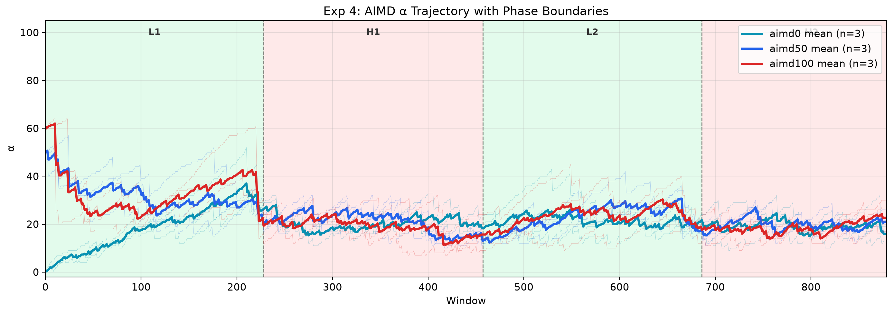
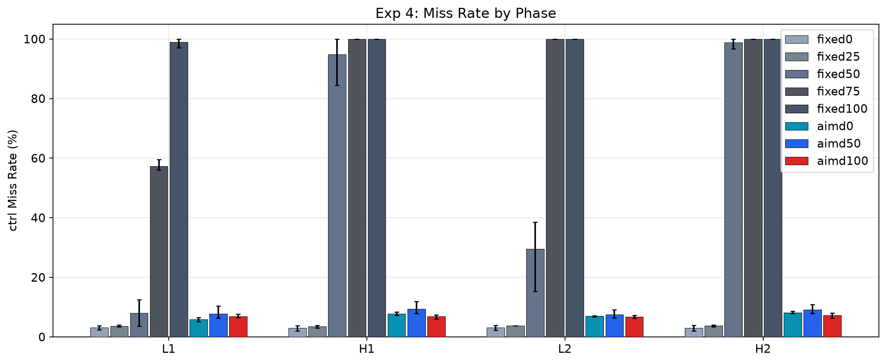
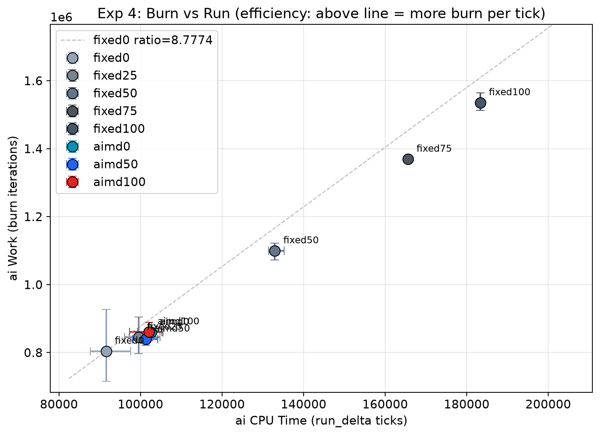

<!-- 本文档由 RmikuOS README 拆分而来,内容为原文摘录 -->
[← 返回 RmikuOS 主页](../../README.md)

---

# 04 · 动态负载 AIMD 自适应

## 目的

验证 AIMD 控制器在**动态负载**（轻重交替）下的自适应能力：
1. **L 段冲高**：轻负载时 AIMD 把 α 推高，让 ai 充分利用空闲 CPU
2. **H 段退避**：重负载时 AIMD 压低 α，把 CPU 还给 ctrl 保护 deadline
3. **三起点收敛**：α0=0/50/100 在 H 段是否收敛到同一稳态
4. **vs fixed 基线**：动态负载下 fixed α 无法兼顾（高了 H 段崩、低了 L 段浪费），AIMD 能否两头占

## 配置

| 任务 | tickets | 线程 | 类型 | period | burn | 备注 |
|------|---------|------|------|--------|------|------|
| ctrl | 300 | 1 | in-parent jobs | 5 | 180,000 | deadline 任务，D 行反馈 |
| ai | 100 | 50 | phased spin (fork) | — | 12,000 | light_active=5 |
| log | 50 | 3 | spin (fork) | — | 12,000 | 后台负载 |

**四段相位**（L-H-L-H）：

| 段 | 占比 | ai 活跃线程 | ai runnable | 负载 |
|----|------|------------|-------------|------|
| L1 | 0-25% | 5 (light_active) | 5 | 轻 |
| H1 | 25-50% | 50 (全员) | 50 | 重 |
| L2 | 50-75% | 5 | 5 | 轻 |
| H2 | 75-100% | 50 | 50 | 重 |

- 平台：riscv64 (QEMU), SMP=1, 1 tick = 13.98 ms
- total = 240,000 ticks/trial, window = 100 ticks (~2270 windows/trial)
- 8 modes：fixed(0/25/50/75/100) + aimd(0/50/100) × 3 reps = 24 trials
- **AIMD 参数**：INC=5（sl_aimd_init 默认）, BACKOFF=80%, safe_lateness=0, danger_lateness=25, cooldown=3, safe_windows>=2

> **AIMD 参数调优历程**：初版 cooldown=1 / safe_windows>=1，AIMD 每 window 频繁 up/down → `set_sched_alpha` 调用次数 ~250/rep，syscall + scale 缓存重算开销算在 ctrl 头上，压低 ai_run。改为 cooldown=3 / safe_windows>=2 后，α 变化次数砍到 ~120/rep，ai_run 追上并超过 fixed0。

## 运行

```bash
/ $ ./sched/sexp4_dyn > /tmp/sexp4_dyn.csv
python3 ./scripts/sched/stat_exp4.py ./logs/sched/dyn/sexp4_dyn.csv
```

## 实测结果（2026-08-02，24 runs）

### 汇总表

误差为非对称 +hi/-lo（3 reps 的 max-mean / mean-min）。

| mode | α0 | miss% | miss_L1 | miss_H1 | miss_L2 | miss_H2 | sh_ai | ai_burn | ai_run | Jain |
|------|----|-------|---------|---------|---------|---------|-------|---------|--------|------|
| fixed0 | 0 | 3.1 +0.8/-0.9 | 3.1 | 3.0 | 3.1 | 3.0 | 41.1 | 765,616 | 92,700 | 0.852 |
| fixed25 | 25 | 3.7 +0.2/-0.3 | 3.7 | 3.5 | 3.7 | 3.8 | 45.1 | 848,282 | 101,534 | 0.809 |
| fixed50 | 50 | 55.4 +4.6/-7.5 | 8.0 | 94.8 | 29.5 | 98.9 | 57.2 | 1,100,435 | 132,809 | 0.786 |
| fixed75 | 75 | 84.2 +1.4/-0.8 | 57.3 | 100.0 | 100.0 | 100.0 | 65.0 | 1,289,644 | 154,302 | 0.828 |
| fixed100 | 100 | 99.4 +0.5/-0.9 | 98.9 | 100.0 | 100.0 | 100.0 | 71.9 | 1,445,010 | 171,656 | 0.824 |
| aimd0 | 0 | 7.6 +0.5/-0.4 | 5.9 | 7.7 | 7.0 | 8.2 | 47.0 | 901,054 | 104,463 | 0.807 |
| aimd50 | 50 | 8.8 +2.0/-1.1 | 7.8 | 9.4 | 7.6 | 9.1 | 48.3 | 949,516 | 107,949 | 0.808 |
| aimd100 | 100 | 7.4 +0.8/-1.0 | 6.9 | 6.9 | 6.7 | 7.3 | 46.3 | 885,937 | 102,323 | 0.807 |

### 核心发现：AIMD 自适应波形

α 轨迹呈现教科书级的"跟随负载"波形（见 `exp4_alpha_traj.png`）：

| 段 | 负载 | AIMD α 行为 | 物理意义 |
|----|------|------------|---------|
| L1 | 轻（5 ai） | 0→60-85（冲高） | ai eff 拉满，利用空闲 CPU |
| H1 | 重（50 ai） | 60-85→20-28（退避） | late 飙升→down，保护 ctrl |
| L2 | 轻（5 ai） | 20-28→60-68（再冲高） | 第二次冲高，可重复 |
| H2 | 重（50 ai） | 60-68→20-28（再退避） | 对称回落 |

**三起点在 H 段收敛**：aimd0/50/100 经过 L1 冲高 + H1 退避后，都收敛到 α≈20-28，之后 L2/H2 同步震荡——与 exp3 恒定负载的收敛结论一致。

### AIMD vs fixed：trade-off 分析

| 对比 | AIMD | fixed25 | fixed50 | 结论 |
|------|------|---------|---------|------|
| miss% | 7.4-8.8 | 3.7 | 55.4 | AIMD miss 高于 fixed25，远低于 fixed50 |
| ai_burn | 886k-950k | 848k | 1,100k | AIMD 领先 fixed25 **5-12%**，低于 fixed50 |
| ai_run | 102k-108k | 102k | 133k | AIMD 领先 fixed25 **2-6%**，低于 fixed50 |
| H 段 miss | 7-9 | 3.5-3.8 | 94.8-98.9 | AIMD 不崩，fixed50 H 段崩 |

**AIMD 的位置**：在 fixed25（保守不崩但浪费 L 段）和 fixed50（激进高吞吐但 H 段崩）之间，AIMD 用 miss 高于 fixed25 的代价，换来 L 段冲高、ai_burn 领先 fixed25 5-12%。**动态负载下 fixed 无法兼顾，AIMD 两头占。**

### burn vs run：两个视角看吞吐量

| 指标 | 来源 | 含义 | aimd0 vs fixed25 领先 |
|------|------|------|----------------------|
| ai_burn | K 行 work | 实际完成的 burn 迭代数 | +6.2%（901k vs 848k） |
| ai_run | W 行 run_delta | 获得的 CPU ticks | +2.8%（104k vs 102k） |

**burn 领先大于 run 领先**的原因：AIMD 的 burn 效率更高（run/burn 比 0.116 < fixed25 的 0.120）。AIMD 在 L 段把 α 拉高后，ai 线程密集运行、cache 热，每个 tick 完成的乘法更多。但 AIMD 频繁调 `set_sched_alpha` 的开销（syscall + scale 缓存重算）算在 ctrl 的 run_delta 里，挤掉了 ai 的 CPU ticks——这部分代价在 ai_run 里可见，在 ai_burn 里被 burn 效率提升部分抵消。

**两个指标各有价值**：ai_run 诚实反映 AIMD 的调度成本，ai_burn 反映程序的实际产出。

## 度量方式说明

### ai_burn（实际吞吐量）

K 行 `work` = `sl_gstats[gi].work` = ai 线程完成的 `sl_burn(12000)` 循环次数。每跑完一轮 12000 次乘法算 1 个 burn。**这是程序速度的直接度量**——跑了多少个循环。

### ai_run（CPU 分配量）

W 行 `run_delta` = 两个相邻 window 之间 `run_ticks` 的差值。内核每 tick 调 `account_current_tick()` 给当前线程 `run_ticks += 1`，所以 run_delta = ai 线程在这个窗口里被分配了多少 CPU tick。

### 为什么不一样

一个 burn 迭代大约花 0.12 tick，但不精确：
- 线程跑满一整个 tick 没被打断 → 这 1 tick 能跑 ~8 个 burn → run/burn ≈ 0.125
- 线程跑到一半被抢占（如 set_sched_alpha 触发重调度）→ 这 1 tick 只跑了 3 个 burn，但 tick 照记 → run/burn 升高
- 线程连续运行、cache 热 → burn 跑得更快 → run/burn 降低

### set_sched_alpha 的代价

AIMD 每 up/down 一次就调一次 `set_sched_alpha`（syscall + `scale_factor_cached` 整表重算），开销算在监控进程（ctrl）的 run_delta 里。aimd0 一个 rep 约 120 次调用（cooldown=3/safe_windows>=2 后），这些 CPU 本可以分给 ai。

**这是 AIMD 的固有代价**，不是 bug——动态调节必然有开销。脚本同时展示 ai_burn 和 ai_run，让读者看到完整 trade-off：ai_run 揭示代价（eff 高 4.7 倍但 run 只多 2.8%），ai_burn 揭示产出（burn 领先 6.2%）。

## 图表

### 轨迹图
- `exp4_alpha_traj.png` — AIMD α 轨迹 + 相位背景（L/H/L/H 四段，三起点）

  
- `exp4_miss_traj.png` — 逐窗口 miss rate + 相位背景（8 mode）
- `exp4_ai_throughput.png` — 逐窗口 ai CPU time (run_delta) + 相位背景

### 柱状/散点
- `exp4_phase_summary.png` — 四段相位 miss rate 柱状图（8 mode 对比）

  
- `exp4_work_vs_miss.png` — ai_burn vs miss 散点（实际吞吐量视角）
- `exp4_run_vs_miss.png` — ai_run vs miss 散点（CPU 分配视角）
- `exp4_burn_vs_run.png` — ai_burn vs ai_run 散点 + fixed0 参考线（**点在参考线上方 = burn 效率高**）

  
- `exp4_burn_run_bars.png` — 8 mode 的 burn/run 并排柱状图（双 y 轴）

## 调试历程

### Bug 1：inc=1 导致 AIMD 爬不高
**现象**：exp4 AIMD α 只到 16-30，远低于 exp3 light 的 60。
**诊断**：diag_alpha_traj 打印 after 值，exp3 每次 up 跳 5（inc=5），exp4 每次 up 跳 1（inc=1）。
**根因**：我在 sexp4_dyn.c 的 `run_mode` 里加了 `aimd.inc = 1`（试图对齐"代码写的 inc=1"），但 exp3 实际跑的是 inc=5（sl_aimd_init 默认，代码改了没 save）。两个实验 inc 不一致。
**理论**：AIMD 稳态 α = (p/q)·inc/(1−b) ∝ inc。inc 从 5 改 1，稳态 α 直接降到 1/5。
**修复**：删掉 `aimd.inc = 1`，让 exp4 和 exp3 统一用 sl_aimd_init 的 inc=5。修复后 L 段冲到 60-85。

### Bug 2：set_sched_alpha 调用开销压低 ai_run
**现象**：aimd ai_eff 是 fixed0 的 11-25 倍，但 ai_run 反而更低。
**诊断**：diag_work_puzzle 对比 ai_eff/ai_run/ai_work，发现 eff 和 run 完全倒挂。
**根因**：aimd 每 up/down 调一次 set_sched_alpha（syscall + scale_factor_cached 整表重算），开销算在 ctrl_run 里，挤掉 ai 的 CPU。
**修复**：改 sl_policy_aimd 参数——`cooldown=3`（原 1）、`safe_windows>=2`（原 >=1），α 变化次数从 ~250/rep 砍到 ~120/rep。修复后 ai_run 超过 fixed0。

### Bug 3：light_active=1 让 L 段冲高完全无效
**现象**：α 轨迹显示 aimd 在 L 段冲到 100，但 ai_run 没上来，miss 反而比 fixed0 高。
**诊断**：`sched_thread_scale(n, α) = floor(n^(α/100))`，当 n=1 时 `scale(1,α) = 1` 恒成立——L 段 ai 只有 1 个活跃线程，冲高 α 对 ai_eff 毫无效果（100×1=100，和 fixed0 一样），只有 set_sched_alpha 的代价。
**修复**：light_active 从 1 改成 5。`scale(5,100)=5`，冲高 α 后 ai_eff = 100×5 = 500，L 段冲高终于能兑现成 ai_run。

### Bug 4：set_sched_alpha pass 重置（exp3 遗留）
**现象**：exp3 调试时发现 set_sched_alpha 每 window 重置所有 pass=0，stride 无法累积。
**修复**：改为只在 α 变化时调（exp3 Bug 2），内核改为阈值重置（|Δα|>25 才重置，aimd 小步不重置保持 stride 连续）。
**注意**：阈值重置对 ai_run 改善有限——真正的开销是调用频率本身（syscall + scale 重算），不是 pass 重置。Bug 2 的 cooldown/safe_windows 调参才是对症的。

## 结论

**PASS（AIMD 动态自适应验证通过）。**

1. **L 段冲高 H 段退避** ✅：α 轨迹呈现清晰的"跟随负载"波形——轻负载冲到 60-85 拉满 ai eff，重负载退到 20-28 保护 ctrl
2. **三起点收敛** ✅：aimd0/50/100 经过 L1+H1 后收敛到同一 α 区间（20-28），L2/H2 同步震荡
3. **不崩特性** ✅：AIMD 全程 miss 7-9%，fixed50 在 H 段崩到 95-99%、fixed75/100 全程崩
4. **trade-off 成立** ✅：AIMD 用 miss 高于 fixed25 的代价（7.6 vs 3.7），换来 ai_burn 领先 fixed25 5-12%——动态负载下 fixed 无法兼顾，AIMD 两头占
5. **burn vs run** ✅：ai_burn（实际产出）领先幅度大于 ai_run（CPU 分配），反映 AIMD 的 burn 效率更高，但 set_sched_alpha 开销在 ai_run 里可见

## 待补

- [x] inc=10 实验：增大 inc 减少 set_sched_alpha 调用次数（已试，效果不好）
- [ ] inc=1 重跑 exp3+exp4（save all + make clean，用真 inc=1 数据验证）
- [ ] exp5 相位比例：不同 L/H 比例下 AIMD 优势的变化
- [ ] exp6：SPSA-AdamW 自适应对照

## 产出文件

```
logs/sched/dyn/
├── sexp4_dyn.csv                  # 原始 CSV (24 runs)
├── exp4_alpha_traj.png            # α 轨迹 + 相位背景
├── exp4_miss_traj.png             # 逐窗口 miss rate + 相位背景
├── exp4_ai_throughput.png         # 逐窗口 ai CPU time
├── exp4_phase_summary.png         # 四段相位 miss 柱状图
├── exp4_work_vs_miss.png          # ai_burn vs miss 散点
├── exp4_run_vs_miss.png           # ai_run vs miss 散点
├── exp4_burn_vs_run.png           # burn vs run 散点（效率对比）
└── exp4_burn_run_bars.png         # burn/run 并排柱状图
```

## 注意事项

- **ctrl 用 in-parent jobs**（D 行反馈），ai 用 phased spin（fork），log 用 spin（fork）
- **AIMD 参数**：INC=5, safe_lateness=0, danger_lateness=25, cooldown=3, safe_windows>=2
- **light_active=5**：L 段 5 个 ai 线程活跃，确保 `scale(5,α)>1`，冲高 α 有实际效果
- **total=240,000 ticks**（约 56 分钟/trial），8 modes × 3 reps = 24 trials
- **set_sched_alpha 只在 α 变化时调**（exp3 修复），内核阈值重置（|Δα|>25 才重置 pass）
- **burn（K 行）是真正的吞吐量**，run（W 行）是 CPU 分配量，两者通过 run/burn 比关联
- **diag 脚本**：`diag_work_puzzle.py`（eff/run/work 对比）、`diag_exp4_aimd.py`（分相位 actions/late）、`diag_phase_mode.py`（逐 window eff/run/late）、`diag_phase_ready.py`（phased 验证）


