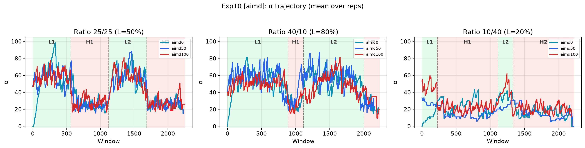
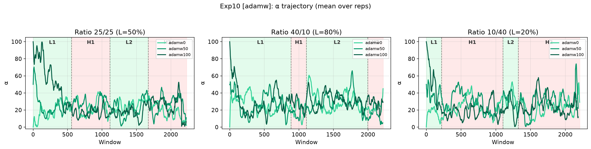
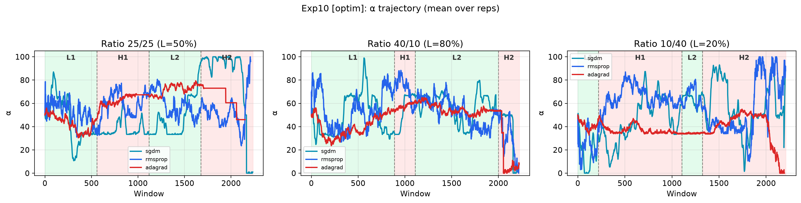
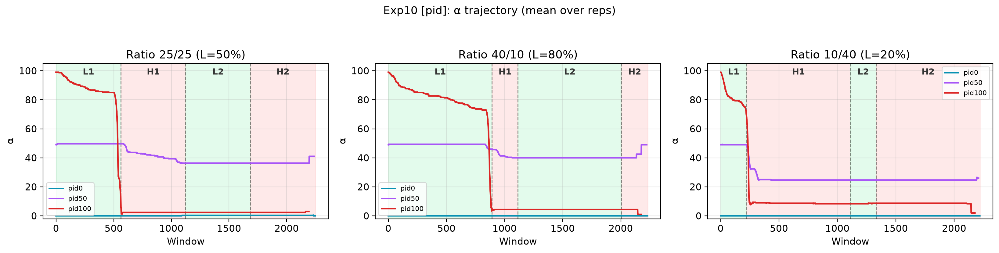
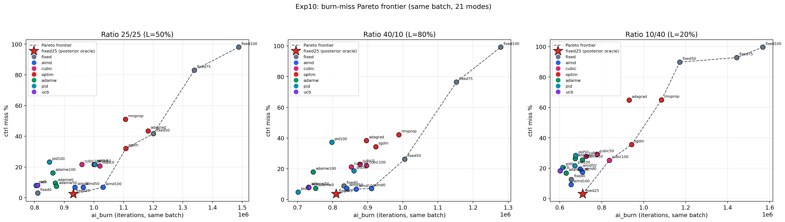
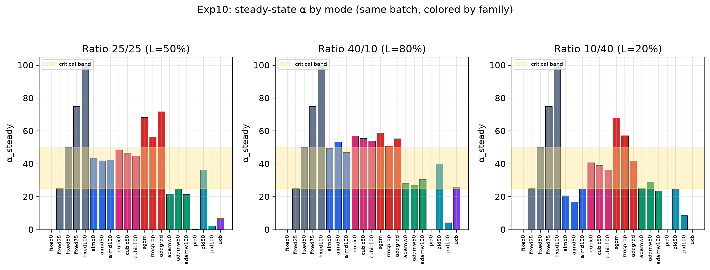

[← 返回 RmikuOS 主页](../../README.md)

---

# 10 · 五流派同批统一矩阵（all）

> 本文档是实验记录（目的 / 配置 / 运行 / 结果 / 结论）。
> 机制分析、形式框架（P1–P4）、tradeoff 账本与相关工作见研究报告 [../report.md](../report.md)。

## 目的

exp0–9 各自分批运行，而 `ai_burn`（K 行吞吐）依赖主机速度、`ai_run` 有跨批次调度噪声——
跨批次比较被环境漂移污染（exp7 排查实证：旧 adamw ~1.0M vs 新批次 ~800k，20% 是漂移不是差异，
一度误判为「AdamW 全面碾压 AIMD」）。

exp10 把**全部控制器放在同一批次、同一主机、同一 QEMU 参数下**重跑，回答三个问题：

1. 五个方法家族（启发式 / 网络协议 / 深度优化器 / 经典控制 / 在线学习）的稳态落点差异，
   能否由「信号结构 + 先验/探索」两个维度解释，而与更新公式复杂度无关；
2. 在「不知道负载」的自适应控制器内部，谁帕累托最优；
3. miss–吞吐交易的定量账：每付 1pp miss 能换回多少吞吐（exchange），谁的交易是正的。

## 配置

### 负载（与 exp4–9 完全一致，一个字不改）

| 任务 | tickets | 线程 | 类型 | period | burn | 备注 |
|------|---------|------|------|--------|------|------|
| ctrl | 300 | 1 | in-parent jobs | 5 | 180,000 | deadline 任务，D 行反馈 |
| ai | 100 | 50 | phased spin | — | 12,000 | 轻相位保底 5 线程活跃 |
| log | 50 | 3 | spin | — | 12,000 | 后台负载 |

### 模式矩阵（21 种，命名与旧实验一致，stat 脚本直接复用）

| 家族 | 模式 | 起点 | 说明 |
|------|------|------|------|
| fixed | 0/25/50/75/100 | — | 固定基线（policy=NULL，无控制器） |
| aimd | 0/50/100 | 三起点 | 启发式 |
| cubic | 0/50/100 | 三起点 | 网络协议（RFC 8312 思路） |
| sgdm / rmsprop / adagrad | 各 1 | 单起点 50 | 优化器消融（比更新公式） |
| adamw | 0/50/100 | 三起点 | 优化器完整版（含 decay 先验） |
| pid | 0/50/100 | 三起点 | 经典控制（pid50 为 exp8 未测的新增） |
| ucb | 50 | 单起点 | 在线学习（冷启动逐臂扫，起点结构上无意义） |

### 控制器参数（全部沿用各单家族实验标定，一个不改）

```
aimd : inc=5, backoff=80%, safe=0, danger=25, down 后 cooldown=3
cubic: beta=70%, C=0.06(fp61), danger=25
optim/adamw: SPSA delta=5, lr=3, G_REF=10240; adamw target=25
pid  : kp=150, ki=64(fp1024), target=10
ucb  : 11 arms(0,10,…,100), tau=32 滑窗, c_explore=1000, reward=10000-loss
```

### 相位与规模

- 3 种相位比例（L-H-L-H，`sl_l_ratio_permil`）：500（25/25，L=50%）、800（40/10，L=80%）、200（10/40，L=20%）
- 平台：riscv64 (QEMU), SMP=1, 1 tick = 13.98 ms（标定见 framework.md）
- total = 240,000 ticks/run，window = 100 ticks（~2,400 窗口/run，~56 min/run）
- **3 ratios × 21 modes × (1 warmup + 3 reps) = 252 runs ≈ 235 小时 ≈ 10 天**
- warmup 与正式 reps 参数完全一致（吸取 exp3 教训）；warmup 数据被 stat 脚本丢弃，只起预热作用

## 运行

```bash
# 在 RmikuOS shell 里（一次跑完整个矩阵）
/ $ ./sched/sexp10_all > /tmp/sexp10_all.csv

# 或宿主机重定向
./run.sh riscv64 debug < <(echo "./sched/sexp10_all") 2>&1 \
  | tee ./logs/sched/all/sexp10_all.csv
```

## 统计

```bash
python3 ./scripts/sched/stat_exp10_all.py ./logs/sched/all/sexp10_all.csv
```

流式解析（`schedlab_stat.compute_file` 逐段 compute），~300 万行 CSV 不驻内存。

### 同批 QC（通过标准）

| 判据 | 期望 | 实测 |
|------|------|------|
| `burn/run` 同 ratio 内跨模式落窄带 | 远窄于跨批次漂移（~9.5 vs ~8.7） | ✅ 25/25: 8.4~9.2；40/10: 8.9~9.7；10/40: 8.4~9.4 |
| CSV 结构完整 | W/D/A/S/J/K 行齐全，189 个 formal run | ✅ |
| 每模式 3 reps | rep 间趋势一致 | ✅（10/40 高方差见注意事项） |

同批成立 ⟹ `ai_burn` 可在**同 ratio 内**跨方法直接比较（跨 ratio 不行，`burn/run` 随负载形态系统漂移）。

## 实测结果（2026-08，189 formal runs）

### ratio 25/25（L=50%）全量汇总

| mode | miss% | ai_burn | ai_run | α_steady |
|------|-------|---------|--------|----------|
| fixed0 | 3.0 | 810,490 | 96,358 | 0.0 |
| fixed25 | **2.4** | 931,026 | 106,699 | 25.0 |
| fixed50 | 41.7 | 1,200,710 | 135,644 | 50.0 |
| fixed75 | 83.0 | 1,338,634 | 155,009 | 75.0 |
| fixed100 | 98.0 | 1,488,288 | 172,002 | 100.0 |
| aimd0/50/100 | **6.8~6.9** | 936k~1,031k | 106k~111k | 42.0~43.5 |
| cubic0/50/100 | 20.7~21.6 | 959k~1,020k | 107k~112k | 44.8~48.6 |
| sgdm | 32.0 | 1,107,659 | 124,921 | 68.3 |
| rmsprop | 51.0 | 1,106,307 | 124,424 | 56.6 |
| adagrad | 43.5 | 1,182,836 | 133,751 | 71.8 |
| adamw0/50/100 | 7.5~16.1 | 861k~873k | 94.1k~99.9k | 21.5~24.9 |
| pid0 | 8.0 | 805,021 | 89,112 | 0.3 |
| pid50 | 21.7 | 1,003,401 | 111,621 | **36.3** |
| pid100 | 23.2 | 850,048 | 95,655 | 2.3 |
| ucb | 8.1 | 810,074 | 89,370 | 6.7 |

（40/10、10/40 完整表见 [../report.md](../report.md) 附录 A；趋势大体一致，落点跨 ratio 漂移见报告 §5.2.2。）

### 同起点 α0=50 的稳态落点轴（25/25）

```
UCB 6.7 → AdamW 24.9 → PI 36.3 → AIMD 42.0 → CUBIC 46.4 → 三兄弟 57~72
```

落点从 6.7 排到 72，**与更新公式复杂度无关，与「信号结构 + 先验/探索」清晰对应**：
有非零先验/探索的（UCB、AdamW、AIMD）落在 6.7~42 稳定区；没有的（CUBIC、三兄弟）漂高；
PI 落入双吸引子（见下）。跨 ratio 轴会压缩乃至乱序（10/40 下 UCB 崩至 0.2），
但漂移形态仍由先验刻画：带 decay 锚点的 AdamW 三 ratio 全部落在 21.5~30.6，
纯信号驱动的 UCB 摆动最大（0.2~26.0）。



*AIMD 三起点在 3 ratios 下快速汇流到同一包络带——起点鲁棒性的直接可视化。*



*AdamW 三起点全部被 decay 拉回锚点 25 附近（adamw0 是被从下方拉起的：先验既是刹车也是油门）。*



*同批同图的三兄弟集体漂在高位下不来——与上图的对照即「家族分裂」本身。*



*同一个 PI 控制器的三种命运：pid100 砸穿至钳位边界 0，pid50 滑入 α≈36 平衡点，pid0 贴地不动。*



*全 21 模式的 burn-miss 平面（虚线 = 帕累托前沿，红星 = 后验 oracle fixed25）。AIMD 家族贴着前沿，AdamW/UCB/PI 落在前沿左下方的被支配区。另一视角的散点见 exp10_tradeoff_scatter.png。*



### tradeoff 账（25/25，以后验 oracle fixed25 为基准）

exchange = Δburn% / Δmiss(pp)，每付 1pp miss 换回多少 % 吞吐：

| 模式 | Δburn% | Δmiss(pp) | exch | 评价 |
|------|--------|-----------|------|------|
| aimd100 | **+10.7** | +4.4 | **+2.43** | 全场最划算 |
| aimd50 | +3.5 | +4.5 | +0.78 | 正收益 |
| aimd0 | +0.5 | +4.5 | +0.11 | 几乎白付 |
| adamw50 | −6.2 | +5.1 | −1.21 | 双输 |
| ucb | −13.0 | +5.7 | −2.27 | 双输 |

分相位账：吞吐红利几乎全部赚自 L 段冲高兑现，miss 账单大部分付在 H 段悬崖逗留
（机制分解见报告 §5.2.5 / §6.5）。

## 结论

**PASS（同批成立，五流派落点轴可解释，AIMD 帕累托最优）。**

1. **AIMD 帕累托最优（自适应控制器内部）**：aimd50 miss 6.9% / burn 964k，严格支配 AdamW（7.5% / 873k）；
   aimd100 以 1,031k（+10.7%）成为可用 miss 区（≤10%）内吞吐最高、miss 最低（6.8%）的自适应控制器；
2. **优化器家族内部分裂**：带 decay 先验的 AdamW 双输（吞吐 −6.2%、miss +5.1pp），
   无先验的三兄弟 miss 32~65%——分水岭只有一行 decay，这是「先验 > 复杂度」的直接证据；
3. **PI 稳态与起点非单调**（pid0→0.3、pid50→36.3、pid100→2.3）：α=0 钳位边界与 α≈36 平衡点双吸引子，
   微分过冲不可逆——控制器在消灭误差的同时也消灭了自己的驱动信号；
4. **UCB 吞吐盲导致保守**：reward 只罚 miss 不奖吞吐，落点最低（6.7），安全但浪费；
5. **后验 oracle 的边界**：静态负载下 fixed25 miss（2.4~3.5%）优于一切自适应控制器，但它是「先知式」的；
   自适应的价值在吞吐盈余与负载迁移能力，不在静态 miss；
6. **方法论**：`ai_burn` 跨批次不可比，方法间对比必须以「同一批次 + burn/run QC」为前提。

**核心结论**：在 deadline 调度这个「单边悬崖」地形上，决定控制器优劣的不是优化方法的复杂度，
而是**领域先验是否被编码进动作空间**——AIMD 的非对称动作（快撤 ×0.8 / 慢爬 +5 / gray 冻结）
恰好匹配「代价全在高 α 一侧」的地形。机器学习优化器能站上同一舞台，但吃不到启发式的先验。

## 产出文件

```
logs/sched/all/
├── sexp10_all.csv                    # 原始 CSV（189 formal runs，~68MB）
├── exp10_steady_bars.png             # 稳态汇总柱状图
├── exp10_tradeoff_scatter.png        # burn-miss 平面（三 ratio 三联）
├── exp10_miss_traj.png               # miss 轨迹
├── exp10_alpha_traj_mid.png          # 同起点 α0=50 五流派轨迹
└── exp10_fam_{fixed,aimd,cubic,optim,adamw,pid,ucb}_{alpha_traj,burn_vs_miss}.png
```

## 注意事项

- **本实验取代 exp6–9 的全部跨家族结论**：旧 exp6「AdamW 全面碾压 AIMD」系跨批次污染的假象
  （旧 AdamW 跑在更快主机上，对照组复用不同 total 的 exp4/5 数据），以本文档与 report.md 为准；
- **10/40 只作方向性旁证**：该 ratio 下所有自适应控制器单 run miss 横跨 10~44%，组内方差远大
  于组间均值差，n=3 的均值不构成强证据（report.md §5.2.3 / §6.9）；
- **n=3 且无显著性检验**：主表只报均值；aimd50 vs adamw50 的吞吐区间完全不重叠（938k~979k vs
  843k~906k），双指标合看「AIMD 支配 AdamW」可辩护，其余均值差谨慎引用；
- **单核验证**：SMP=1，QEMU TCG 无真实并行，多核行为未验证（展望：VisionFive 2 实机复现）；
- **超参未做敏感性分析**：lr=3、target=25、kp/ki、c_explore=1000 等沿用单家族实验标定；
- warmup 可去掉省时（63 runs ≈ 2.5 天），见 `sexp10_all.c` run 段注释。
