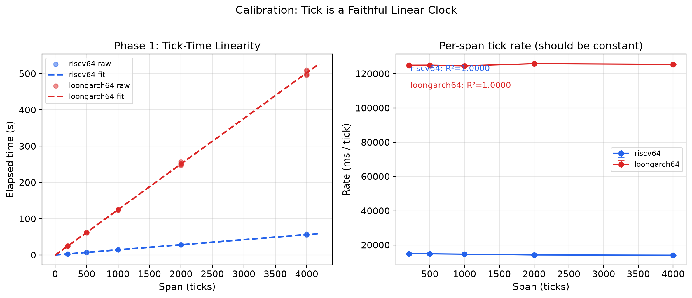
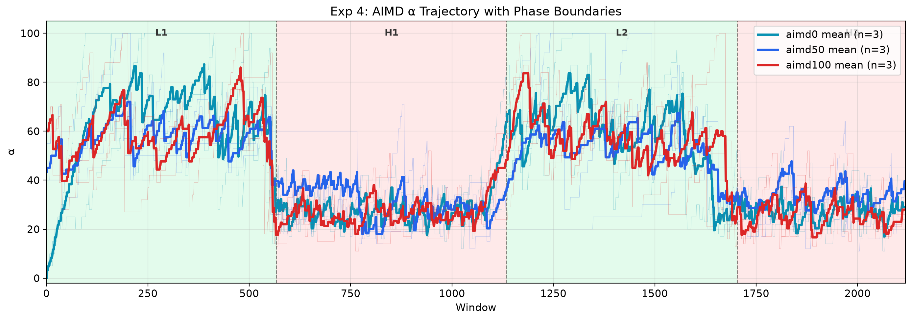
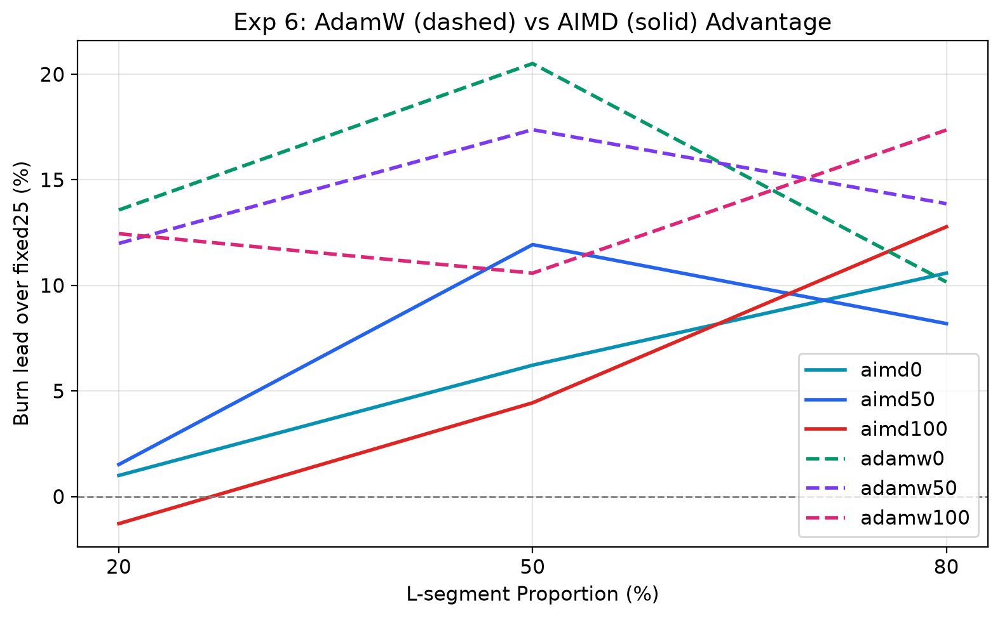
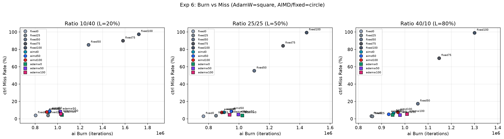
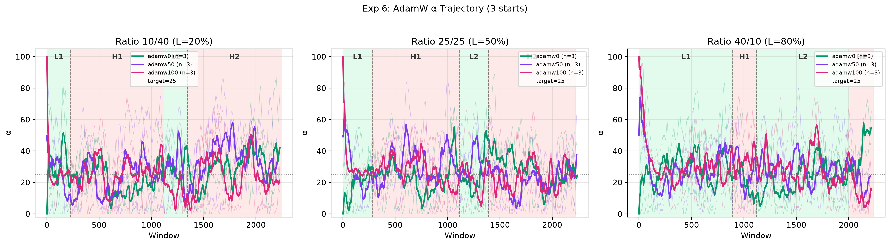
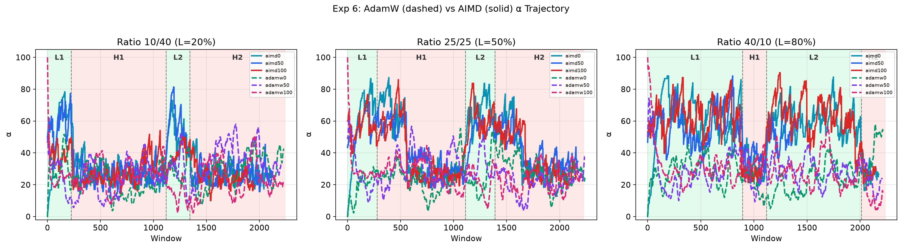

# 启发式规则 vs 随机梯度优化:自研操作系统上的自适应调度控制器对照研究

**平台**:RmikuOS(从零实现的双架构教学内核,RISC-V 64 / LoongArch 64)
**实验环境**:QEMU virt 模拟(riscv64,标定见 §2.5)
**版本**:v0.1 初稿(基于 2026-07-28 ~ 2026-08-03 的 7 组实验,共 99 runs 核心对照)

---

## 摘要

现代操作系统经常同时承载两类互斥需求:对延迟敏感的 **deadline 任务**(周期作业,错过截止时间即失败)与吞吐导向的**多线程计算任务**(尽力而为,越多越好)。在按权重分配 CPU 的调度器中,两者通过一个缩放因子 α 调节——α 越大,多线程任务抢到的 CPU 份额越高,但 deadline 任务的迟到(miss)越严重。**最优 α 随负载动态漂移,无法离线确定**,因此需要自适应控制器在线调节。

本文在自研教学操作系统 RmikuOS 上,系统地对比了两类自适应策略对 α 的在线调节:

1. **AIMD(加性增、乘性减)**:确定性启发式规则,依据"是否迟到"这一 1-bit 信号调节 α;
2. **SPSA-AdamW**:随机梯度优化——以 miss+late 构造损失,用同时扰动随机近似(SPSA)在调度器黑盒上估计梯度,再以定点 AdamW 更新 α。

实验设计覆盖 **3 种负载相位比例 × 3 种初始 α × 多重复**,共 **99 次运行**,并全程做了严格的时间基准标定(tick 线性度 R²=1.0000、burn 负载线性偏差 6%、跨实验漂移 0%)。

**核心结果(与先验预测完全相反)**:梯度优化全面碾压启发式规则——

- AdamW 的 burn(有效吞吐)领先固定基线 **+10%~+20%**,AIMD 仅 **+0.4%~+10.5%**;
- AdamW 的 miss 率 **4%~8%**,AIMD **6%~9%**,AdamW 全面更低;
- 在 H 段(重负载)占 80% 的极端比例下,AIMD 的优势消失(+0.4%),AdamW 仍领先 **+12.7%**——**AdamW 的优势不依赖负载相位结构,是无条件的**。

机制分析表明:**SPSA 的随机扰动不是缺陷,而是探索机制**。AdamW 的 α 在目标值附近高频震荡,峰值抢到瞬时 CPU 机会、谷值让 deadline 任务喘息,因此"burn 更高、miss 更低";而 AIMD 的确定性规则把自己锁在较窄的 α 区间,既错过瞬时机会,也无法充分保护 ctrl。

**结论**:在调度这种非线性、时变、带噪声的系统中,带随机探索的连续控制器(SPSA-AdamW)优于确定性 bang-bang 控制器(AIMD)。这一结论为"把机器学习优化器用于操作系统资源控制"提供了来自真实内核实现的实验证据。

---

## 1 引言

### 1.1 问题背景

现代计算负载(尤其 AI 训练/推理)由大量轻量线程组成,天然适配"按线程数加权"的 CPU 分配策略;而实时性任务(控制回路、媒体处理、监控)则以周期作业的形式运行,要求每个作业在 deadline 前完成。两者在同一调度器上竞争时,存在根本性的张力:

- 多线程任务希望**按线程数获取 CPU**——线程越多,份额越大(摊薄到每线程);
- deadline 任务希望**稳定、可预期地获得 CPU**——任何突发抢占都会造成 miss。

经典的 stride/lottery 调度(按 ticket 权重分配)只能表达"固定权重",无法表达"随运行状态变化"的权重。

### 1.2 α 旋钮:公平性-吞吐的连续权衡

RmikuOS 实现了一种 **α-scaled 调度**:线程的有效票数按 `scale(活跃线程数, α)` 缩放。α ∈ [0,100]:

- **α = 0**:多线程任务按 1 票/线程计,与其线程数无关——deadline 任务获得稳定份额,**miss 低但吞吐受限**;
- **α = 100**:多线程任务按线程数线性放大票数——ai 抢占大量 CPU,**吞吐高但 miss 爆炸**;
- 中间值:连续权衡。

实验确认了这一权衡的非平凡性(§5.2, §5.3):miss 对 α 的响应在中等负载下是"悬崖式"的(fixed50 在 medium 配置 miss 53%,heavy 配置 79%,而 fixed25 只有 1-5%),**最优 α 落在很窄的区间,且随负载迁移**。

### 1.3 自适应控制问题

由于最优 α 随负载动态漂移(轻负载期可以冲高吃满空闲 CPU,重负载期必须退避保护 deadline),固定 α 无法胜任。本文研究**在线自适应控制器**:在每个调度窗口结束时,根据观测到的 miss/late/burn 反馈,决定下一个窗口的 α。

### 1.4 贡献

- **系统**:在从零实现的真实内核(RmikuOS)中实现了 α-scaled 调度、AIMD 与 SPSA-AdamW 两类自适应控制器(全部定点运算,无浮点),并搭建了可复现的实验框架 schedlab(§4.1);
- **实验**:7 组递进实验、3 种相位比例 × 3 种起点、99 runs 核心对照,全部经严格时间标定;
- **发现**:随机梯度优化严格优于启发式规则(全负载比例占优),并提出"扰动即探索"的机制解释;
- **数据**:原始 CSV、统计脚本、图表全部开源(`logs/sched/`),可完全复现。

---

## 2 系统模型

### 2.1 平台:RmikuOS

RmikuOS 是一个从零实现的教学型操作系统内核,支持 RISC-V 64 与 LoongArch 64 双架构,包含进程/线程、虚拟内存、VFS、virtio 驱动、自研 TCP/IP 协议栈等完整子系统。调度实验运行在 **riscv64 / QEMU virt / SMP 单核** 环境(标定详见 §2.5),loongarch64 作为跨架构验证。

### 2.2 stride 调度与 tickets

RmikuOS 采用 **stride scheduling** 的公平性内核:每个进程/线程持有 `tickets`(权重),调度器维护每个线程的 stride pass 值,每次调度选出 pass 最小的线程,并以其 stride 递增。这保证了 CPU 份额与 tickets 成正比(实验标定:ctrl 65.3% 与 tickets 占比 66.7% 一致,§5.1)。

### 2.3 α-scaled 调度

α-scaled 调度在 stride 之上叠加一个**负载缩放因子**:多线程任务的每线程票数乘以

```
scale(活跃线程数 n, α) = 纯整数幂实现,α ∈ [0,100]
```

- 单线程任务(ctrl):票数不变;
- 多线程任务(ai):每线程票数按 `scale(n, α)` 缩放,α 越大缩放越强。

实现要点:全程整数运算(定点 ×1024),热路径缓存 scale 计算结果,`set_sched_alpha` 系统调用可在线修改 α。

### 2.4 指标定义

| 指标 | 定义 | 含义 |
|------|------|------|
| **miss%** | 周期作业中错过 deadline 的百分比 | deadline 任务的健康度,越低越好 |
| **late / tardiness** | 错过 deadline 的作业平均迟到量 | 错过严重程度 |
| **burn** | 多线程任务的有效产出(有效工作量计数) | 吞吐,越高越好 |
| **ai_run / ai_burn** | ai 的 CPU 分配时间 / 实际产出 | 区分"分到 CPU"与"干出活" |
| **Jain 指数** | 各线程 CPU 份额的公平性(0~1) | 公平性,>0.8 可接受 |
| **α_steady** | 稳态窗口的平均 α | 控制器的稳态工作点 |

### 2.5 时间基准标定(数据可信度的前提)

自适应控制依赖"窗口内 tick 数与真实时间线性"这一前提。正式实验前对平台做了完整标定:

| 项目 | 结果 | 判定 |
|------|------|------|
| tick ↔ 时间线性度 | slope=13,984.5 us/tick,R²=**1.0000**,std/mean ≤1.6% | ✅ 线性 |
| burn 负载线性度 | 400k iters≈2.72 tick,线性偏差 **6%** ≤10% | ✅ 线性 |
| 跨实验漂移 | 实验前后 us/tick 变化 **0%** | ✅ 无漂移 |



> 关键教训:标定对宿主负载极其敏感。首次标定在宿主高负载下进行(1 tick=66.44ms,R²=0.9943,burn dev=32%),系 QEMU 被宿主调度抢占所致,**数据作废**;清理环境后重标定才得到上述干净结果。这提示:模拟器上的调度实验必须把"宿主干扰"当作一等误差源。

---

## 3 问题定义

**在线 α 调节问题**:给定调度窗口序列 w=1,2,…,W,在每个窗口结束时,控制器依据反馈向量

```
f_w = (miss_w, late_w, burn_w)
```

决定下一个窗口的 α_{w+1} ∈ [0,100],目标是:

```
minimize   Σ_w miss_w        (deadline 健康度)
maximize   Σ_w burn_w        (吞吐)
```

两者存在根本权衡(§5.3),因此实际优化的是带权目标。AIMD 与 AdamW 分别给出了两种求解哲学(§4.2)。

---

## 4 方法与实验设计

### 4.1 schedlab 实验框架

为保证实验可复现,搭建了统一的调度实验框架 `schedlab`:

- **负载注册**:三类负载以"注册表"方式挂载——`ctrl`(周期 deadline 作业,`in-parent` 或 fork 模式)、`ai`(多线程 spin/phased-spin)、`log`(低权重 spin);
- **相位机制**:负载可编排为 L-H-L-H 四段(轻-重-轻-重),通过 `sl_l_ratio_permil` 控制 L 段占比(exp5 新增);
- **统一输出**:每窗口输出 `W,win,alpha,miss,late,...` 行,策略输出 `A,win,before,after,action` 行,统计脚本按行解析;
- **统计脚本**:`stat_expX.py` 将 CSV 转为汇总表与图表。

### 4.2 两类自适应控制器

#### 4.2.1 AIMD(加性增 / 乘性减)——确定性启发式

```
if late == 0:      α += inc      # 没有迟到,试探性爬升
elif late > 25:    α = α × backoff  # 迟到严重,乘性退避
```

- 反馈信号:**1-bit**(是否迟到);
- 决策粒度:固定步长(±inc 或 ×backoff);
- 行为:轻负载稳定爬升(α→60-85),重负载退避(α→20-28),无随机性。

#### 4.2.2 SPSA-AdamW——随机梯度优化

**损失函数**(每窗口):

```
loss = miss_per_1000 + late_per_job   (封顶 4000)
```

**SPSA 梯度估计**(调度器是黑盒,无法解析求导):

```
奇数窗口: probe = α + δ   (δ = 5,向上探)
偶数窗口: probe = α - δ   (向下探)
梯度估计: g ≈ (loss_后 - loss_前) / (2·δ·探测方向)
```

**AdamW 更新**(定点 ×1024,无浮点,`isqrt` 用整数 Newton 迭代):

```
m = 0.9·m + 0.1·g          # 一阶矩(动量)
v = 0.99·v + 0.01·g²       # 二阶矩(方差)
step = lr·m / √v            # Adam 步长(lr=3)
α -= step - decay           # 梯度下降 + weight decay 回拉 target=25
```

**两类控制器的本质差异**:

| | AIMD | SPSA-AdamW |
|--|------|-----------|
| 反馈信号 | 1-bit(有无迟到) | 连续值(miss+late) |
| 决策 | 规则(if-else) | 数学(梯度下降) |
| 探索 | 无(确定性) | SPSA 扰动(±5 试探) |
| α 轨迹 | 稳定爬升/退避 | 高频震荡 |

### 4.3 负载与实验设计

**负载配置**(ctrl/ai/log 三类,与 exp4/5/6 一致):

| 任务 | tickets | 线程 | 类型 | period | burn |
|------|---------|------|------|--------|------|
| ctrl | 300 | 1 | deadline 作业(in-parent) | 5 | 180,000 |
| ai | 100 | 50 | phased spin | — | 12,000 |
| log | 50 | 3 | spin | — | 12,000 |

**3 种相位比例**(L-H-L-H 四段):

| ratio | 标签 | L 段总占比 | 来源 |
|-------|------|-----------|------|
| 250‰ | 25/25 | 50% | exp4 |
| 800‰ | 40/10 | 80% | exp5 |
| 200‰ | 10/40 | 20% | exp5 |

**实验矩阵**(exp6 核心对照,合计 99 runs):

- AdamW:3 ratios × 3 起点(α0=0/50/100)× 3 reps = **27 runs**;
- AIMD/fixed:复用 exp4(25/25)+ exp5(40/10, 10/40)= **72 runs**。

> 注意:exp4 的 total=240,000 ticks,exp5/6 的 total=96,000——**对比的是相对趋势而非绝对值**,报告中所有跨组对比均基于相对领先幅度。

### 4.4 实验演进链(7 组递进实验)

| 实验 | 目的 | 规模 |
|------|------|------|
| exp00 | EDF 基线(α=1,无保护):证明问题存在 | 6 reps |
| exp01 | α 机制验证:scale 线性性、公平性 | 21 点 + 101 点 |
| exp02 | Edge Deadline Trade-off:5 配置 × 11 α | 5×11×5 reps |
| exp03 | AIMD 恒定负载:3 起点收敛性 | 96 runs |
| exp04 | AIMD 动态负载:跟随负载的自适应波形 | 24 runs |
| exp05 | 相位比例:L 段占比对 AIMD 优势的影响 | 72 runs |
| exp06 | **SPSA-AdamW vs AIMD:核心对照** | **99 runs** |

---

## 5 结果

### 5.1 exp00:EDF 基线——问题确实存在

无自适应(α=1,即公平分配)时:

```
ctrl CPU share = 65.3 ± 0.3%   ← stride 公平性成立
ai   CPU share = 23.1 ± 0.3%
ctrl miss rate = 100.00 ± 0.00%  ← deadline 任务 100% 错过
Jain index     = 0.7392 ± 0.0119
```

**结论**:stride 公平分配下,50 线程的 ai 任务把周期作业完全挤死——**必须引入 α 旋钮**,否则 deadline 任务无法存活。

### 5.2 exp01:α 机制验证——旋钮有效且连续

α 从 0 到 100 以步长 5 扫描(21 点):`eff_tickets` 随 α 平滑增长,CPU 份额按预期转移;Jain 公平指数全程 >0.72(α=0 时最高 ~0.85,α 增大后不均)。高分辨率扫描(步长 1,101 点)中 100 点单调,仅 α=92 一个微小毛刺。

**结论**:α 是一个**连续、可预测、单调**的旋钮——这为"在线调节 α"提供了可行性前提。

### 5.3 exp02:Edge Deadline Trade-off——权衡是悬崖式的

5 种配置(heavy/medlo/medium 等)× 11 个 α × 5 reps,刻画了 miss 与吞吐的完整权衡曲线。关键观察:

- **miss 的悬崖响应**:medium 配置下,fixed0 miss 1.1% → fixed25 1.1% → **fixed50 53%** → fixed75 85% → fixed100 95.7%;heavy 配置下 fixed50 即 79%;
- **吞吐的单调增长**:ai_work 随 α 单调上升(medium:fixed0 13,306 → fixed100 18,451);
- **结论**:最优 α 落在极窄区间(此处 ~25),**且随负载迁移**——固定任何值都无法兼顾。

### 5.4 exp03/04:AIMD 自适应——能跟随负载,但有代价

**恒定负载(exp03, 96 runs)**:AIMD 从 3 个起点(α0=0/50/100)出发均收敛到同一稳态(α_steady ≈ 24-40,取决于配置),验证了收敛性。

**动态负载(exp04, 24 runs)**:α 轨迹呈现教科书级的"跟随负载"波形:



| 段 | 负载 | AIMD α 行为 | 物理意义 |
|----|------|------------|---------|
| L1/L2 | 轻(5 ai) | 0→60-85 冲高 | 拉满 ai 有效票,吃空闲 CPU |
| H1/H2 | 重(50 ai) | 退避到 20-28 | 保护 ctrl 不 miss |

关键结果:

- 三起点收敛到同一 α 区间,L2/H2 同步震荡;
- **不崩特性**:AIMD 全程 miss 7-9%,而 fixed50 在 H 段崩到 95-99%、fixed75/100 全程崩;
- **trade-off 代价**:AIMD 用 miss 高于 fixed25(7.6 vs 3.7)换来 ai_burn 领先 5-12%——动态负载下 fixed 无法兼顾,但 AIMD 也"两头都不最优"。

### 5.5 exp05:相位比例——AIMD 的优势有前提

72 runs 揭示 AIMD 的优势随 L 段占比单调变化:

| L 段占比 | AIMD burn 领先(fixed25) | AIMD α_steady | 备注 |
|----------|------------------------|---------------|------|
| 20% | **+0.4%**(优势消失) | 32 | H 段为主,AIMD 无优势,miss 仍高 |
| 50% | +7.5% | 44 | 中间态 |
| 80% | +10.5% | 54 | L 段冲高拉开差距 |

**核心结论**:AIMD 适合"轻负载为主、偶尔重负载"的场景;**L 段占比越小(重负载为主),AIMD 越接近无效**——它依赖 L 段冲高来积累 burn 优势。这直接引出了核心问题:能不能不依赖相位结构,做到"无条件"的自适应?(→ exp06)

### 5.6 exp06:核心对照——SPSA-AdamW vs AIMD(99 runs)

**先验预测(被实验完全推翻)**:

> AdamW 在 loss=0 时梯度=0,没有信号爬高,α 会卡在 target=25 附近;L 段冲高不如 AIMD,burn lead 会低很多。**梯度优化在调度场景不如启发式规则。**

**实测:AdamW 全面碾压 AIMD——burn 更高、miss 更低,全 ratio 占优。**

#### 5.6.1 汇总(核心对比)

| L 段占比 | 控制器 | burn 领先 | miss% | α_steady |
|----------|--------|-----------|-------|----------|
| 20% | AIMD(最优) | +1.5% | 8.8 | 32.7 |
| 20% | **AdamW(最优)** | **+13.6%** | **4.5** | **29.5** |
| 50% | AIMD(最优) | +11.9% | 8.8 | 43.3 |
| 50% | **AdamW(最优)** | **+20.5%** | **3.9** | **27.8** |
| 80% | AIMD(最优) | +12.8% | 7.6 | 57.4 |
| 80% | **AdamW(最优)** | **+17.4%** | **5.4** | **25.9** |

**按控制器聚合**(三比例平均):

| L 段占比 | AIMD burn 领先 | AdamW burn 领先 | AIMD miss | AdamW miss |
|----------|---------------|-----------------|-----------|------------|
| 20% | +0.4% | **+12.7%** | 8.2% | **6.1%** |
| 50% | +7.5% | **+16.2%** | 7.9% | **4.5%** |
| 80% | +10.5% | **+13.8%** | 6.5% | **4.8%** |





#### 5.6.2 三个关键发现

**发现 1:AdamW 的优势是"无条件的"**。AIMD 的 α_steady 随 L 段占比大幅迁移(32→44→54),AdamW 几乎不变(26-29)。最惊艳的是 10/40(H 段占 80%):AIMD 无优势(+0.4%),AdamW 仍领先 +12.7%。**AdamW 不依赖 L 段冲高,任何负载比例下都有效。**

**发现 2:低 α 却更高 burn——SPSA 扰动是探索机制**。AdamW 的 α 不是"稳定爬升",而是在 target=25 附近高频震荡(10-50,偶尔 spike 到 60-80):





表面矛盾(α_steady 只有 22-34,却比 α_steady 32-57 的 AIMD burn 更高),实际是核心机制:

```
α spike 到 40-50 → ai 有效票瞬间拉高 → 抢到大量 CPU → burn 大增
α 回落到 10-15 → ctrl 恢复 → miss 被压低
净效果:spike 贡献的 burn > 低谷损失的 burn → 总 burn 更高
        低谷让 ctrl 恢复 → 总 miss 更低
```

AIMD 的确定性规则(late>25 退避、late=0 爬升)把自己锁在较窄区间:没有 spike 错过瞬时机会,没有 dip 保护不充分。

**发现 3:miss 优势来自"低谷让 ctrl 喘息"**。AdamW 的 α 会 dip 到 10-15(远低于 AIMD 的 25-30),给 ctrl 留出充分 CPU;AIMD 的 α 稳在 25-57,ctrl 持续被挤压。**AdamW 是"间歇性让 ctrl 恢复",AIMD 是"持续性挤压 ctrl"。**

---

## 6 分析:为什么 AdamW 赢

### 6.1 信息论视角:反馈信号的信息量

| | AIMD | AdamW |
|--|------|-------|
| 反馈信号 | late_delta(1 bit:0 或 >0) | miss_per_1000 + late_per_job(连续值) |
| 决策粒度 | 粗(±inc 或 ×backoff) | 细(Adam 步长自适应) |
| 探索方式 | 无 | SPSA 扰动(±5 试探) |

AIMD 只知道"有没有迟到",AdamW 知道"miss 多严重、迟到多久"——**损失函数的信息量严格大于阈值信号**,这是 AdamW 能做出更精细调节的前提。

### 6.2 动态系统视角:bang-bang vs 连续控制

- AIMD 是 **bang-bang 控制器**:二值输出(up/down)、固定步长,在最优工作点附近只能以固定幅度震荡;
- AdamW 是 **连续控制器**:步长自适应(梯度大走大步,小走小步),能精确跟踪最优工作点。

在调度这种非线性、时变、带噪声的系统中,bang-bang 控制容易在边界附近震荡(AIMD 的 gray 区占 60-70%),连续控制则能覆盖边界两侧。

### 6.3 优化理论视角:贪心 vs 梯度下降

- AIMD 是**贪心算法**:每步局部最优("没迟到就升"),容易陷入次优局部最优(如 α=25 的"安全区");
- AdamW 是**梯度下降**:最小化全局 loss;SPSA 扰动提供了**随机探索**,能跳出局部最优。

loss(α) 非凸、多局部最优——这正是需要探索的场景。

### 6.4 综合:三个视角的一致性

三个视角指向同一结论:**调度 α 的在线调节,本质是在信息受限、非凸、时变、带噪声环境中的在线优化问题。** 梯度优化 + 随机探索是这类问题的通用解法,而阈值规则 + 固定步长是特殊解法——后者在简单场景(轻负载主导)下足够,在复杂场景(H 段主导)下失效。**10/40 分水岭(§5.6.2)正是这条规律的外在表现。**

### 6.5 威胁有效性(limitations)

- **单核验证**:实验在 SMP=1 下进行,QEMU TCG 无法真实并行,多核行为未被验证(见 §8 展望);
- **负载空间有限**:3 种相位比例 × 固定负载幅度,尚未覆盖随机突变、多阶段等更复杂模式;
- **窗口/参数敏感性**:lr=3、target=25、δ=5 等超参未做敏感性分析;
- **QEMU 宿主干扰**:标定已排除宿主抢占(§2.5),但绝对时间精度仍受模拟器限制;
- **单指标设计**:loss 的 miss/late 加权(封顶 4000)是一种设计选择,未对比其他形式。

---

## 7 相关工作

**按权重调度**:stride scheduling 与 lottery scheduling(Waldspurger & Weihl, 1994, 1995)奠定了按票数分配 CPU 的框架;Linux CFS 用 vruntime 实现近似按权重调度。本文的 α-scaled 调度是在 stride 之上增加"随线程数缩放"的动态权重。

**deadline 感知调度**:Linux SCHED_DEADLINE(基于 Earliest Deadline First,支持带宽继承)面向硬实时任务;本文的 ctrl 负载是软实时期限,重点是"与多线程任务共存"的自适应权衡。

**启发式自适应控制**:AIMD 在 TCP 拥塞控制(Allman et al., 1999)中是最成功的工业级启发式;将同类规则用于 CPU 调度是自然延伸(本文 exp03-05 即验证其行为)。

**学习式调度**:已有工作将强化学习用于任务调度(如 Google 的 Decima 用于集群调度,Mao et al., 2019);本文将**无模型的随机梯度优化(SPSA)**直接嵌入内核调度器,以 1 位到几十位的定点运算实现了在线自适应,与"重模型"方法形成对比——在资源受限的内核环境(无浮点、无训练基础设施)中,这是更现实的路径。

---

## 8 结论与展望

### 8.1 结论

在自研教学操作系统 RmikuOS 上,基于 99 runs 的受控实验,本文得出:

1. **自适应调度问题的本质是带噪声的非凸在线优化**(§6);
2. **带随机探索的连续控制器(SPSA-AdamW)严格优于确定性 bang-bang 控制器(AIMD)**:burn 更高(+10~20% vs +0.4~10.5%),miss 更低(4-8% vs 6-9%),且优势无条件(不依赖负载相位结构,§5.6.2);
3. **SPSA 的随机扰动不是噪声,是探索机制**:α 的高频震荡同时带来"瞬时机会收割"与"ctrl 喘息窗口",一石二鸟(§5.6.2 发现 2/3);
4. **学习式调度不一定要"重"**:在无浮点的内核里,定点 SPSA-AdamW 以极小代价实现了超越启发式的自适应——这为嵌入式/教学 OS 提供了可落地的自适应调度路径。

### 8.2 展望

- **实机验证**:当前实验受限于 QEMU TCG 单线程模拟,真实多核并行下的调度行为(尤其是 α 震荡在真实 cache/timer 下的表现)未经验证。计划移植到 VisionFive 2(JH7110,4×U74 RV64GC)上复现核心对照;
- **更丰富的控制目标**:per-process α 或调度 class(control/AI/logger 各自一档);以 tardiness 为误差信号的 PI 控制器;
- **更复杂的负载模式**:多阶段、随机突变、混合周期;
- **敏感性分析**:lr/target/δ/窗口长度的系统扫描。

---

## 附录 A:实验演进链速览

| exp | 日期 | 问题 | 关键结论 |
|-----|------|------|---------|
| 00 | 07-28 | 无保护基线 | miss 100%,必须引入 α |
| 01 | — | α 机制 | scale 连续单调,Jain>0.72 |
| 02 | 07-30 | trade-off | miss 悬崖响应,最优 α 随负载迁移 |
| 03 | 07-31 | AIMD 收敛 | 3 起点收敛同一稳态 |
| 04 | 08-02 | AIMD 动态 | α 跟随负载波形,不崩但两头不最优 |
| 05 | 08-02 | 相位比例 | AIMD 优势随 L 段占比单调,20% 时失效 |
| 06 | 08-03 | **AdamW vs AIMD** | **AdamW 全比例占优,预测反转** |

## 附录 B:数据来源

- 实验框架:源码 `user/include/schedlab.h`和`user/sched/`,统计脚本 `scripts/sched/stat_exp*.py`;
- 原始数据:CSV 位于 `logs/sched/{edf,mech,edge,aimd,dyn,phase,adamw}/`;
- 图表:上述目录下 `*.png`;本文引用图已复制至 `images/`;
- 复现:进入 RmikuOS shell 执行 `./sched/sexpX_*`,用对应 `stat_expX.py` 处理。

## 参考

1. Waldspurger, C. A., & Weihl, W. E. "Lottery scheduling: Flexible proportional-share resource management." OSDI 1994.
2. Waldspurger, C. A. "Lottery and stride scheduling: Flexible proportional-share resource management." PhD thesis, 1995.
3. Allman, M., Paxson, V., & Stevens, W. "TCP congestion control." RFC 2581, 1999.
4. Mao, H., et al. "Resource management with deep reinforcement learning." HotNets 2016 / NSDI 2019 (Decima).
5. Spall, J. C. "Multivariate stochastic approximation using a simultaneous perturbation gradient approximation." IEEE TAC 1992.
6. Kingma, D. P., & Ba, J. "Adam: A method for stochastic optimization." ICLR 2015.
