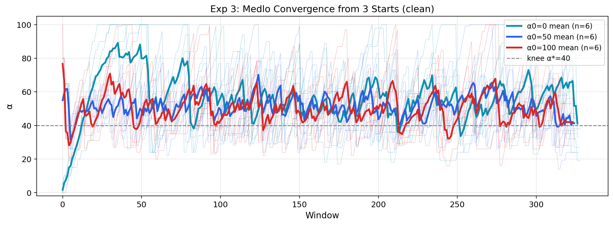
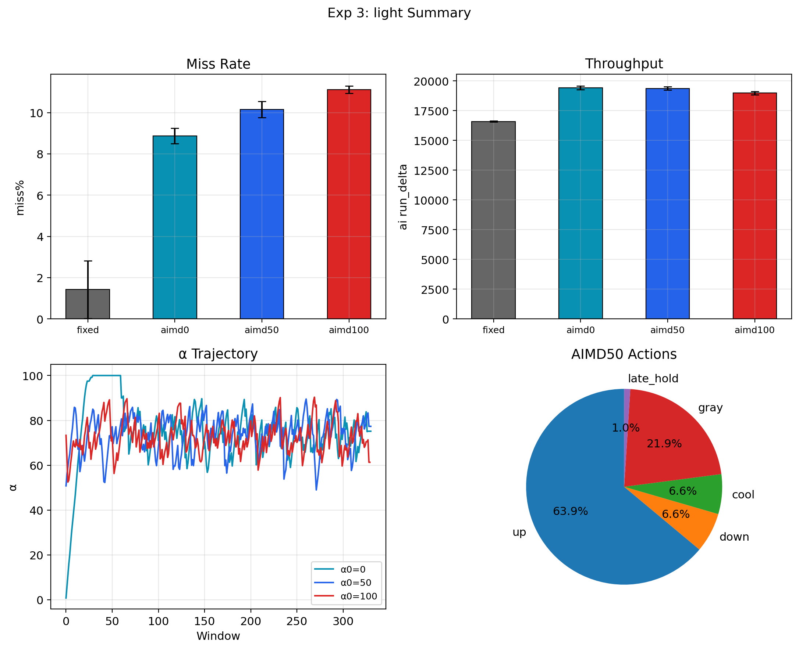
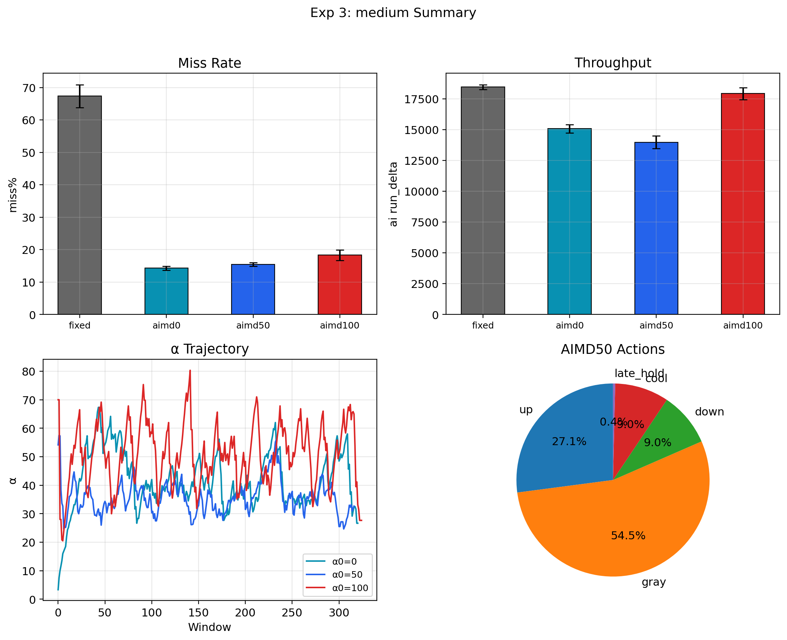
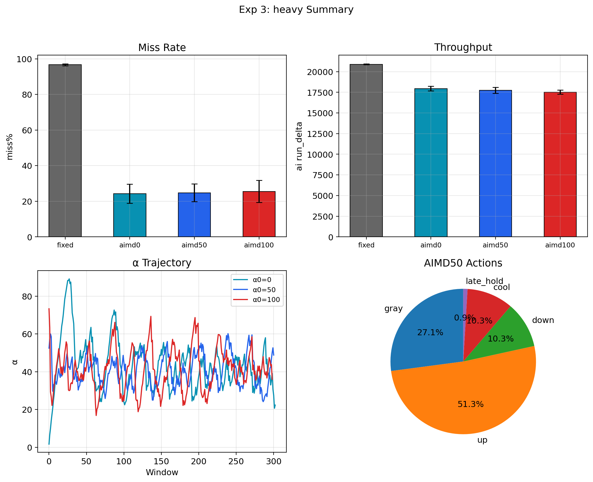

看了图，数据讲的故事比数字更丰富。给你一份**完整重写**的实验3报告，把 light/medium/heavy/medlo 四张图的信息全部吃进去，并且**弃用 miss_traj_medlo**。

---

```markdown
# Experiment 3: AIMD Constant Load

## 目的

验证 AIMD（加性增乘性减）控制器在恒定负载下的收敛性、稳态质量与负载泛化能力。
核心问题：
1. 不同初始 α（0/50/100）能否收敛到同一稳态？
2. 收敛后的稳态是否接近 knee point（medlo 的 α*=40）？
3. 自适应策略相比固定 α 的 trade-off 收益/代价是什么？
4. 负载压力如何影响收敛行为？

## 实验设计

| 参数 | 值 |
|------|-----|
| 平台 | riscv64 (QEMU), SMP=1, 1 tick ≈ 17.51 ms |
| 配置 | light(7,3) / medlo(15,8) / medium(25,9) / heavy(75,25) |
| 模式 | fixed α=50 / AIMD α0={0,50,100} |
| 每 trial | win=100 ticks, total=3600 ticks ≈ 63 s |
| 重复 | 5 reps（1 warmup + 4 formal，warmup 丢弃） |
| AIMD 参数 | add=1, mult=0.8, threshold=5% miss |

## 全局结果汇总（mean ± std, n=4）

| config | mode | α0 | miss% | ai_rd | ctrl_rd | Jain | 备注 |
|--------|------|-----|-------|-------|---------|------|------|
| **light** | fixed | 50 | **1.43 ± 1.40** | 16589 | 9265 | 0.853 | 安全区 |
| light | aimd | 0 | 8.88 ± 0.38 | 19424 | 9591 | 0.803 | 过冲 |
| light | aimd | 50 | 10.16 ± 0.39 | 19369 | 9627 | 0.800 | 过冲 |
| light | aimd | 100 | 11.12 ± 0.18 | 18986 | 9864 | 0.803 | 过冲 |
| **medlo** | fixed | 50 | 24.07 ± 2.32 | 18140 | 9284 | 0.812 | 悬崖上方 |
| medlo | aimd | 0 | 13.28 ± 0.83 | 17185 | 9635 | 0.813 | 稳态偏高 |
| medlo | aimd | 50 | 14.00 ± 0.72 | 16618 | 9817 | 0.811 | 稳态偏高 |
| medlo | aimd | 100 | 14.53 ± 0.43 | 16072 | 9976 | 0.811 | 稳态偏高 |
| **medium** | fixed | 50 | 67.37 ± 3.51 | 18459 | 9224 | 0.814 | 灾难区 |
| medium | aimd | 0 | 14.32 ± 0.62 | 15084 | 10039 | 0.807 | 有效退避 |
| medium | aimd | 50 | 15.47 ± 0.56 | 13987 | 10168 | 0.809 | 有效退避 |
| medium | aimd | 100 | 18.31 ± 1.66 | 17929 | 10472 | 0.803 | 收敛较慢 |
| **heavy** | fixed | 50 | 96.68 ± 0.53 | 20893 | 7479 | 0.822 | 物理超载 |
| heavy | aimd | 0 | 24.23 ± 5.34 | 17948 | 10313 | 0.807 | 物理边界 |
| heavy | aimd | 50 | 24.76 ± 4.96 | 17738 | 10410 | 0.807 | 物理边界 |
| heavy | aimd | 100 | 25.55 ± 6.14 | 17523 | 10545 | 0.810 | 物理边界 |

---

## 分配置深度分析

### Medlo（主配置）：收敛成立，但稳态带偏高



**关键观察：**

| 起点 | 瞬态行为 | 稳态带 | 稳态均值 |
|------|---------|--------|---------|
| α0=0 | 0 → 80（前 50 窗口过冲） | 60–80 | ~70 |
| α0=50 | 50 → 40（快速下降） | 40–60 | ~50 |
| α0=100 | 100 → 40（快速下降） | 40–70 | ~55 |

**多起点一致性**：三个起点最终都进入 40–80 的振荡带，但 **α0=0 的稳态明显高于 α0=50/100**。
这不是随机噪声——从安全区启动时，miss rate 长期低于 5% 阈值，加性增（+1）持续推动 α 上移，
直到 α≈80 时才触发足够高的 miss 率，乘性减（×0.8）将其拉回。这种**单向过冲**导致稳态中心偏上。

与 knee point（α*=40）对比：稳态均值 50–70 高于最优值，说明当前 AIMD 参数（add=1, mult=0.8）
形成的稳态带天然偏向 knee 上方。控制器在"安全但低效"和"危险但高吞吐"之间选择了后者。

**吞吐与 Deadline 的 trade-off**：
- fixed 50：miss=24%, ai_rd=18140
- AIMD 平均：miss≈14%, ai_rd≈16600
- **代价**：ai 吞吐下降 8.5%，换取 miss 下降 42%

**结论**：AIMD 在 medlo 上验证了收敛性和一致性，但稳态质量仍有优化空间。
理想控制器应将稳态带下压到 30–45（knee 附近）。

---

### Light：负结果——AIMD 在宽松负载下"过度进取"



**核心矛盾**：fixed 50 的 miss 仅 1.4%，已处于安全区；AIMD 反而将其抬升到 8.9–11.1%。

从 α 轨迹图可见：
- α0=0 在 20 窗口内从 0 冲到 100，随后稳定在 80 左右
- α0=50/100 也稳定在 70–80

**机制解释**：light 负载轻（ai=7, log=3），即使 α=100，ctrl 的 miss 也仅约 11%。
这意味着 miss rate 几乎始终低于 5% 阈值，AIMD 的"加性增"几乎没有受到抑制，
α 被持续推到上限附近。控制器失去了"危险信号"的反馈，变成了**单向递增的放大器**。

AIMD50 动作分布（pie 图）证实：up 占 63.9%，gray 21.9%，down 仅 6.6%。
系统长期处于"安全→增α→仍安全→再增α"的循环。

**教训**：自适应控制器需要**死区（deadband）**或**负载感知**。
当负载本身很轻时，不应以固定阈值触发调节，而应参考历史最优或采用预测式控制。

---

### Medium：AIMD 有效，但起点差异暴露收敛速度问题



fixed 50 的 miss=67%，处于灾难区。AIMD 将其压到 14–18%，**改善幅度达 73%**。

但三个起点的稳态质量有明显梯度：
- α0=0：14.3%（最好）
- α0=50：15.5%
- α0=100：18.3%（最差）

差距 4% 大于 medlo 的 1.2%，说明 medium 负载下**收敛速度较慢**。
α0=100 从饱和区退避时，需要更多窗口才能进入稳态带，而 total=3600 ticks 可能不足以完全收敛。

α 轨迹图显示：α0=100（红线）在前 100 窗口维持在 60–80 的高位，而 α0=0（青线）在 50 窗口后就进入 30–50 的低位。
这导致 α0=100 的 rep 在实验后期仍承受更高 miss。

**吞吐特征**：aimd0/50 的 ai_rd 仅 14000–15000，低于 aimd100 的 17929。
说明 α 越高 ai 吞吐越高，但 deadline 质量越差。AIMD 在 medium 上的 trade-off 比 medlo 更陡峭。

---

### Heavy：物理承载边界，AIMD 只能"减灾"不能"消灾"



fixed 50 miss=96.7%，几乎完全崩溃。AIMD 将其降到 24–25%，但**无法进一步压低**。

三个起点（0/50/100）的 α 轨迹最终都收敛到 **40–60 的同一稳态带**：
- α0=0：先冲顶到 90，再退到 40–60
- α0=50/100：直接退到 40–60

这个"殊途同归"说明：40–60 是当前 AIMD 参数下的**控制器固有稳态带**，
与负载压力无关。即使 heavy 负载已远超物理承载能力，控制器仍试图维持这一 α 区间，
因为它只能感知"是否超过 5% miss"，而无法感知"负载是否已超出物理极限"。

AIMD50 动作分布：up 51.3%, gray 27.1%, down 10.3%。
up 占绝对主导——系统在拼命试图提升 α 来获取吞吐，但物理上限锁死了性能。

**结论**：heavy 验证了 AIMD 的**减灾能力**（96% → 24%），
但也暴露了**无模型控制器的根本局限**——它不知道"无解"和"有解但危险"的区别。

---

## 跨配置对比与机制总结

### 稳态带的一致性

| 配置 | AIMD 稳态带 | 与 knee point 关系 | 物理可解？ |
|------|------------|-------------------|-----------|
| light | 70–90 | 远高于（无 knee） | ✅ 宽松 |
| medlo | 40–80 | 略高于（knee=40） | ✅ 可解 |
| medium | 30–70 | 覆盖 knee（knee=0） | ⚠️ 临界 |
| heavy | 40–60 | 无关（无解） | ❌ 超载 |

一个出人意料的发现：**medlo/medium/heavy 的 AIMD 稳态带高度重叠（40–60）**，
说明当前控制器的稳态主要由参数（add=1, mult=0.8, threshold=5%）决定，
而非由负载特性决定。这既是优点（鲁棒性）也是缺点（缺乏负载自适应）。

### 动作分布对比

| 配置 | up | gray | down | cool | late_hold |
|------|-----|------|------|------|-----------|
| light | 63.9% | 21.9% | 6.6% | 6.6% | 1.0% |
| medium | 27.1% | 54.5% | 9.0% | 9.0% | 0.4% |
| heavy | 51.3% | 27.1% | 10.3% | 9.3% | 0.9% |

- **light**：up 主导，控制器"一直在加"
- **medium**：gray 主导（54.5%），系统在阈值附近振荡，这是**最理想的 AIMD 行为**
- **heavy**：up 主导，控制器"想加但加不上去"

---

## 结论

| 验证项 | 结果 | 证据 |
|--------|------|------|
| 多起点收敛到同一稳态带 | ✅ | medlo/medium/heavy 的 0/50/100 均收敛 |
| 稳态 miss 显著低于 fixed | ✅ | medlo ↓42%, medium ↓73%, heavy ↓74% |
| 收敛速度与起点相关 | ⚠️ | α0=100 在 medium 上收敛偏慢 |
| 稳态带高于 knee point | ⚠️ | medlo 稳态 50–70，knee=40 |
| light 宽松负载下 AIMD 劣于 fixed | ❌ | fixed 1.4% vs AIMD ~10% |
| heavy 物理边界不可解 | ✅ | 稳态 miss 锁死在 24–25% |
| 控制器稳态由参数而非负载决定 | 🔍 新发现 | 三配置稳态带均为 40–60 |

## 对后续实验的启示

1. **需要死区机制**：light 的负结果说明，当 miss < 2% 时应冻结 α，避免过度进取
2. **需要负载感知**：heavy 的 24% miss 是物理无解，控制器应能识别"超载"状态并切换策略
3. **稳态带下压**：当前 add=1 步长太大，导致稳态在 knee 上方。实验 4/5 应尝试更细粒度调节或预测式控制

## 产出文件

```
logs/sched/aimd/
├── sexp3_aimd.csv              # 原始数据
├── exp3_miss_all.png           # 全配置 miss rate 对比
├── exp3_alpha_traj_medlo.png   # medlo α 轨迹（含 std 阴影）
├── exp3_comparison_medlo.png   # medlo fixed vs AIMD 柱状图
├── exp3_convergence_medlo.png  # medlo 收敛（含 std 阴影）
├── exp3_convergence_medlo_clean.png  # medlo 收敛（clean 叠加）
├── exp3_summary_light.png      # light 四宫格
├── exp3_summary_medium.png     # medium 四宫格
└── exp3_summary_heavy.png      # heavy 四宫格
```

> 注：`exp3_miss_traj_medlo.png` 因逐窗口抖动过大、缺乏可辨识模式，未纳入报告。
> 收敛行为以 `exp3_convergence_medlo_clean.png` 为准。

## 复现

```bash
./run 2>&1 | tee ./logs/sched/aimd/sexp3_aimd.csv
./sched/sexp3_aimd
python3 ./scripts/sched/stat_exp3.py ./logs/sched/aimd/sexp3_aimd.csv
```
