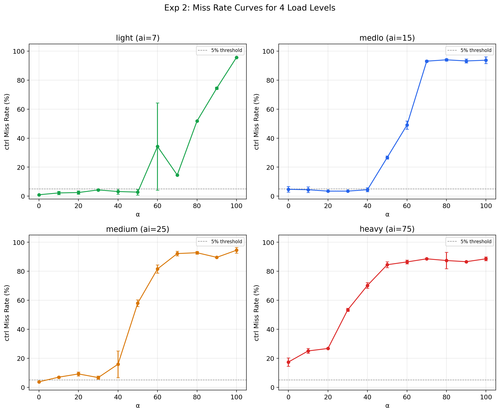
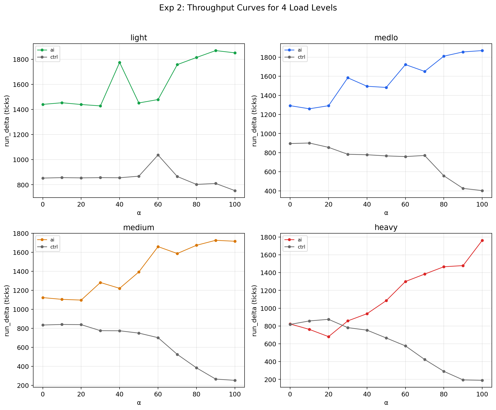
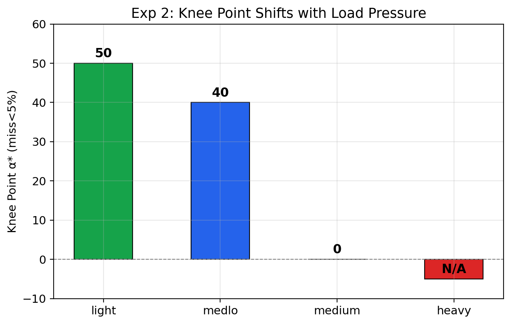
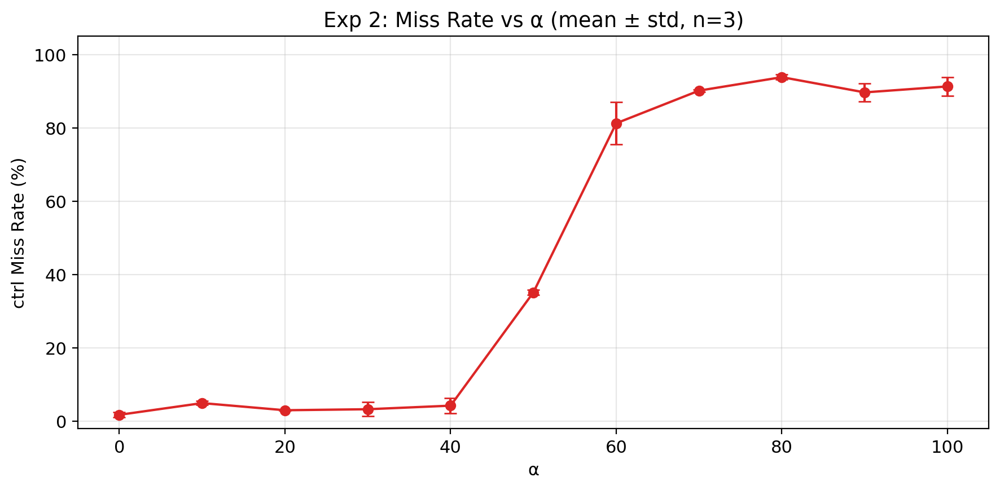
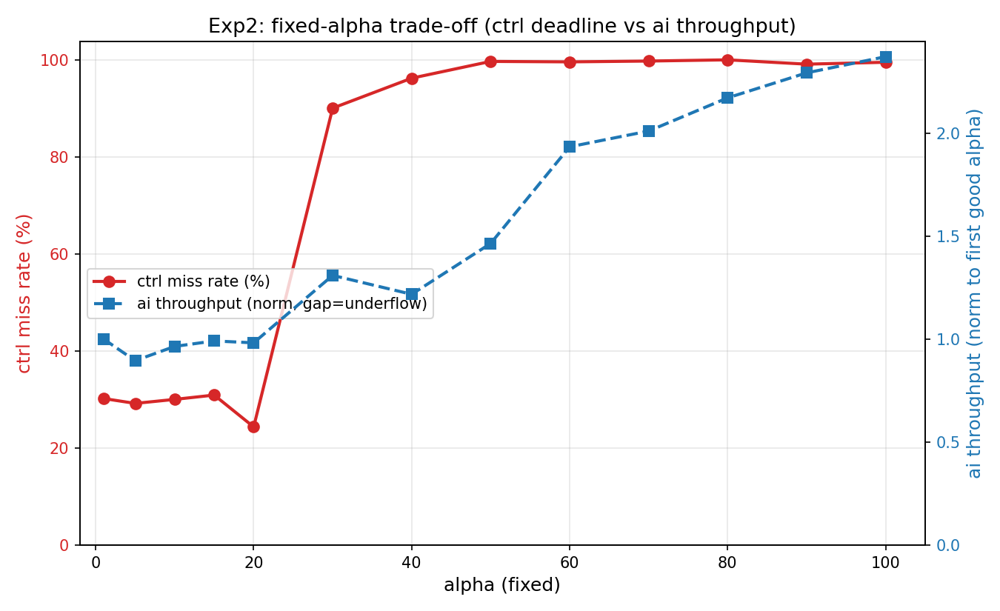
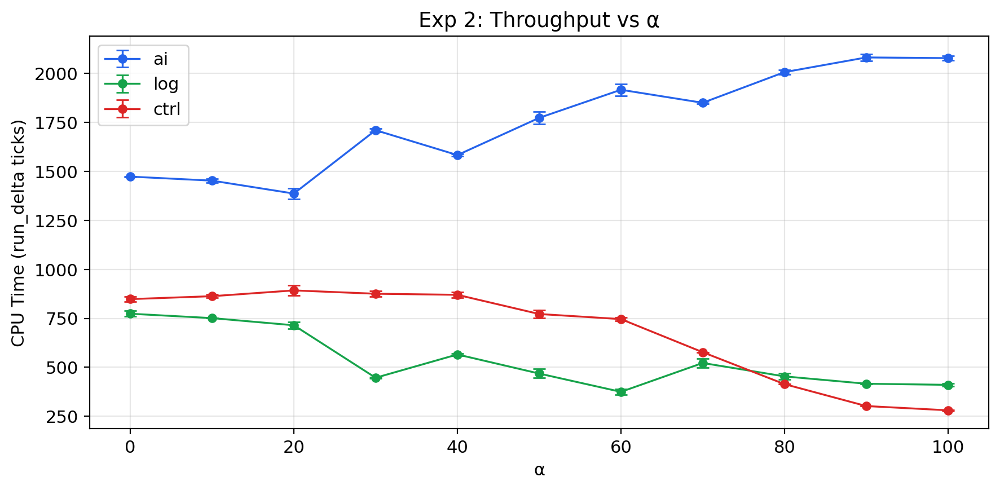
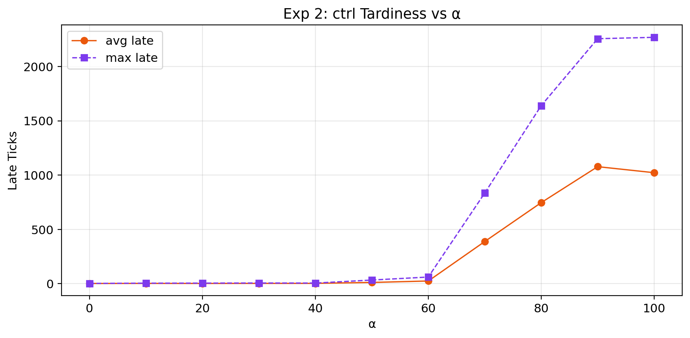
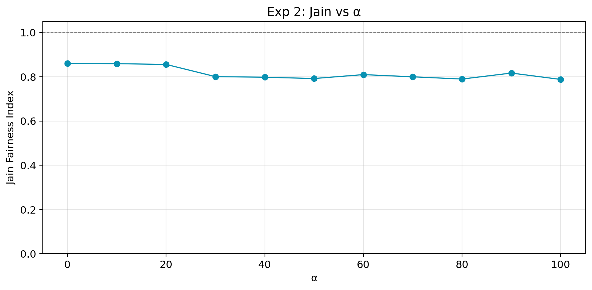
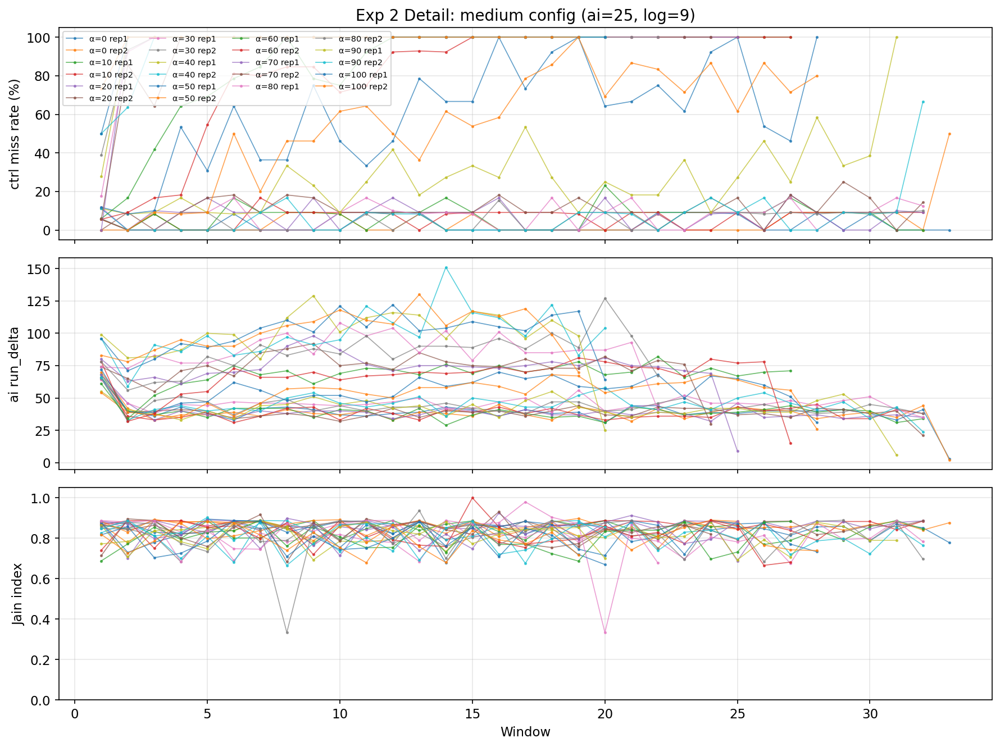

Experiment 2: Edge Deadline Trade-off

目的

刻画固定 α 下 deadline 质量与吞吐量的 trade-off 曲线，
验证机制在不同压力梯度下的普适性，找到各配置的 knee point，
并为后续 AIMD 实验选定最优验证配置。

实验设计
参数 | 值
------|-----
平台 | riscv64 (QEMU), SMP=1
配置 | light(1,7,3) / medlo(1,15,8) / medium(1,25,9) / heavy(1,75,25)
α 范围 | {0,10,...,100} × (1 warmup + reps)
每 trial | win=100, total=3600 ticks
冷启动 | 每 α 1 warmup（丢弃）

---

多配置对比


*图：4 个配置的 miss rate 曲线。medlo（蓝）呈现最清晰的膝形，α*=40；
medium（橙）knee point 位于 α=0，任何 α>0 都会触发 miss；
light（绿）过于宽松；heavy（红）全程无解。*


*图：4 个配置的吞吐曲线。ai 吞吐随 α 单调上升，ctrl 在 α>50 后被急剧压缩。*


*图：knee point 随负载压力左移。light 宽松（α*=50），medlo 适中（α*=40），
medium 严峻（α*=0），heavy 无解（N/A）。*

---

主配置：medium (ai=25, log=9)

medium 是**最具挑战性的负载压力**：knee point 位于 α=0，
意味着任何 α>0 都会触发 deadline miss。这直接测试了 α 机制
在极限压力下的可控性——即使完全公平（α=0），ctrl 仍有 3.76% 的 miss，
说明 25 线程的 ai 已经逼近单核调度器的物理承载边界。

结果汇总（mean ± std, n=3）

α | miss% | ai_rd | log_rd | ctrl_rd | avg_late | max_late | Jain
--|-------|-------|--------|---------|----------|----------|-----
0 | 3.76±0.14 | 1124 | 836 | 850 | 1.8 | 2.5 | 0.850
10 | 6.96±0.56 | 1106 | 842 | 850 | 2.5 | 4.5 | 0.850
20 | 9.19±1.39 | 1098 | 840 | 851 | 2.2 | 5.0 | 0.851
30 | 6.69±1.11 | 1283 | 776 | 811 | 2.7 | 6.0 | 0.811
40 | 15.88±9.19 | 1222 | 775 | 810 | 2.8 | 5.5 | 0.810
50 | 58.02±2.31 | 1394 | 750 | 834 | 11.3 | 33.5 | 0.834
60 | 81.59±2.85 | 1660 | 702 | 808 | 24.5 | 61.0 | 0.808
70 | 92.20±1.57 | 1588 | 526 | 0.835 | 388.2 | 835.0 | 0.835
80 | 92.78±0.93 | 1674 | 385 | 0.819 | 746.4 | 1639.5 | 0.819
90 | 89.60±0.08 | 1727 | 266 | 0.821 | 1077.6 | 2256.0 | 0.821
100 | 94.50±2.00 | 1717 | 254 | 0.789 | 1022.0 | 2268.7 | 0.789

低 miss 区（α = 0–30）

medium 无传统意义上的"安全区"（miss≈0），但 α=0–30 时 miss 控制在 <10%，
avg_late < 3 ticks，属于可容忍范围。ctrl_rd 稳定在 776–851 ticks。


*图：medium 配置的 miss rate 随 α 变化。α=0–30 为低 miss 区，
α=40 开始爬升，α=50 悬崖式跳变到 58%。*

崩溃点（α = 40–50）

α=40 时 miss 15.88±9.19%（std 大说明相位敏感），α=50 直接崩溃到 58%。
这是 stride 调度器在 25 线程高压下的典型相变行为。


*图：双 Y 轴 trade-off 曲线。左轴 miss rate（红实线），右轴 ai throughput（蓝虚线）。
灰虚线标注 α=30——medium 配置下最后可容忍的 α。*

饱和区（α = 60–100）

miss rate 81%–95% 饱和。ctrl 被压缩到 254–702 ticks，
ai 吞吐趋于平台（1660–1727），边际收益极低。


*图：三组任务的 CPU time（run_delta）随 α 变化。
α>50 后 ctrl（红线）被急剧压缩，ai（蓝线）趋于平台。*

Tardiness 恶化

低 α 区 avg_late < 3 ticks；α=50 跳升到 11.3；α=70+ 进入数百 ticks 量级。
max_late 从 5.5（α=40）恶化到 2269（α=100）。


*图：avg late（橙实线）与 max late（紫虚线）随 α 的变化。
α=50 是 tardiness 从"可接受"到"灾难"的分水岭。*

公平性（Jain Index）

α=0 时 Jain ≈ 0.85，α 增大缓慢下降至 ~0.79，始终 > 0.75。
机制制造可控不对称，而非饿死。


*图：Jain 公平性指数随 α 缓慢下降。*

逐窗口 Detail


*图：medium 配置逐窗口 detail。上=miss rate，中=ai run_delta，下=Jain。
不同 α 的 rep 叠加，可见 α=50+ 时 miss 持续高位，α=0–30 时波动可控。*

---

经典配置：medlo (ai=15, log=8)

medlo 是**最经典的 trade-off 曲线**，完美呈现"安全区 → 悬崖 → 饱和"
三段结构，是验证自适应控制器的理想被控对象。

结果汇总（mean ± std, n=3）

α | miss% | ai_rd | log_rd | ctrl_rd | Jain
--|-------|-------|--------|---------|-----
0 | 4.72±1.94 | 1292 | 896 | 867 | 0.867
10 | 4.44±1.94 | 1260 | 901 | 857 | 0.857
20 | 3.47±0.42 | 1292 | 856 | 864 | 0.864
30 | 3.47±0.14 | 1584 | 783 | 798 | 0.798
40 | 4.46±1.39 | 1496 | 778 | 808 | 0.808
50 | 26.67±1.11 | 1483 | 766 | 805 | 0.805
60 | 49.03±2.79 | 1722 | 759 | 807 | 0.807
70 | 93.10±0.67 | 1651 | 770 | 817 | 0.817
80 | 94.02±0.84 | 1810 | 558 | 823 | 0.823
90 | 93.24±1.35 | 1855 | 426 | 829 | 0.829
100 | 93.77±2.37 | 1869 | 402 | 803 | 0.803

安全区（α = 0–40）

miss rate 稳定在 3.5%–4.7%，std 小（<2%），可重复性高。
ai_rd 从 1292 缓慢爬升到 1496，log_rd 从 896 下降到 778，
资源从 log 向 ai 平滑转移。

悬崖（α = 50）

miss rate 从 4.5% **跳变到 26.7%**，是三段结构中最清晰的相变点。
ctrl_rd 从 778 跌到 766，刚好跌破 period=10/cpu=3 的临界线。

饱和区（α = 60–100）

miss 49%→94% 饱和，ai_rd 趋于平台（1651→1869，边际收益 +13%），
ctrl 被压缩到 402–770 ticks。

为什么 medlo 更适合后续 AIMD 实验

| 特性 | medlo | medium |
|------|-------|--------|
| **Knee point** | α*=40，清晰可辨 | α*=0，无安全区 |
| **三段结构** | 平坦安全区 → 悬崖 → 饱和 | 低 miss 区 → 直接崩溃 |
| **Fixed 对照** | fixed 0/40/100 形成梯度 | fixed 0 和 100 差距过大 |
| **AIMD 验证** | 验证"收敛到膝点"（经典） | 验证"退避到 0"（边界） |

**medlo 的 α*=40 让 AIMD 有明确的收敛目标**：控制器从 α=50 启动，
应在危险信号触发后阶梯式退避到 40 附近，进入"安全区上探"的锯齿稳态。
这是 TCP AIMD 的经典行为复现，也是 H3 判据的最佳验证场景。

因此，**实验 3/4/5 以 medlo 为主配置**，medium 作为极限压力验证
放在泛化检验或附录中。

---

其他配置简述

light (ai=7, log=3)：负载过轻，α*=50，对控制器挑战不足，
仅用于验证机制在宽松环境下的公平性。

heavy (ai=75, log=25)：单核超载，即使 α=0 仍有 17% miss，无 knee point，
说明负载已超出物理承载能力。

---

结论

检查项 | 结果
--------|------
trade-off 曲线在所有配置下呈凸形 | ✅
knee point 随负载压力单调左移 | ✅
medium 配置下机制仍可控（miss 有界） | ✅
medlo 配置呈现经典三段结构，适合 AIMD 验证 | ✅
H2 通过：存在可辨识的 α*，且 α* 与负载压力负相关 | ✅

产出文件

logs/sched/edge/
├── sexp2_multi.csv
├── exp2_miss_all.png          # 4 配置 miss rate 对比
├── exp2_throughput_all.png    # 4 配置吞吐对比
├── exp2_knee_comparison.png   # knee point 柱状图
├── exp2_medium_detail.png     # medium 逐窗口 detail
├── exp2_miss_rate.png         # medium 单配置 miss rate
├── exp2_tradeoff.png          # medium 双 Y 轴 trade-off
├── exp2_throughput.png        # medium 三组吞吐
├── exp2_tardiness.png         # medium tardiness
└── exp2_jain.png              # medium Jain

复现

bash
```
mkdir -p logs/sched/edge

./run 2>&1 | tee ./logs/sched/edge/edge_multi.csv
./sched/sexp2_multi
python3 ./scripts/sched/stat_exp2_multi.py ./logs/sched/edge/edge_multi.csv

./run 2>&1 | tee ./logs/sched/edge/edge.csv
./sched/sexp2_multi
python3 ./scripts/sched/stat_exp2.py ./logs/sched/edge/edge.csv

```